# 营小助智能体对话整体架构设计

## 1. 背景

营小助需要支撑“自然语言驱动本地业务操作”的桌面智能体场景。用户既可以通过助手子窗体发起人工对话，也可以通过本地定时任务按计划触发业务执行。页面打开、字段填写、按钮点击和页面结构读取等本地操作由开阳提供能力支撑。

本次方案聚焦于 `3040` 菜单的“当日查询”能力，即：

- 打开 `3040`
- 读取页面结构
- 填入当天日期
- 点击查询

当前已知技术约束如下：

- 开阳通过 `SSE/HTTP` 提供 MCP 能力
- DCF 子进程初始化时需要向开阳授权获取 `accessToken`
- `accessToken` 存在有效期，需要刷新
- 开阳提供 `eventHook` 订阅能力
- 助手子窗体与 DCF 子进程之间已有 `JSBridge` 通信能力
- DCF 子进程与后端 Agent Gateway 采用 `HTTP + SSE`
- 定时任务由本地预置配置提供，通过 `cron-parser` 进行调度
- 本次定时任务不提供任务列表，仅提供固定入口 `定时任务`

本方案的建设目标如下：

1. 明确助手子窗体、DCF 子进程、后端 Agent 和开阳的职责边界。
2. 建立统一的初始化链路，完成授权、订阅、工具加载与状态就绪。
3. 建立统一的执行链路，复用同一套页面结构解析和页面命令执行机制。
4. 统一承接人工触发和定时触发两类入口。
5. 建立统一自动执行授权机制。

## 2. 产品架构

### 2.1 总体架构

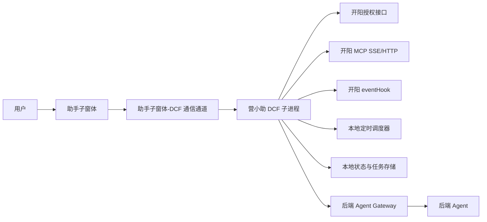

### 2.2 分层架构

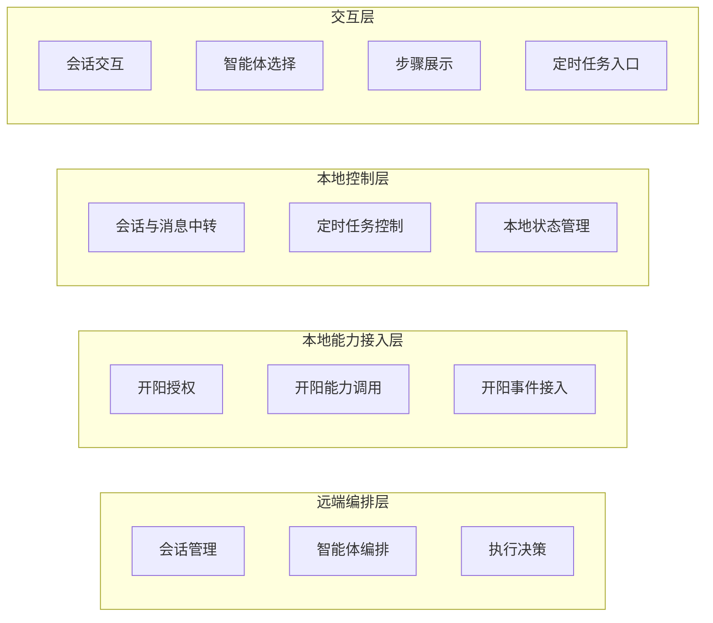

各层功能定位如下：

- 交互层
  - 面向用户提供会话、智能体、步骤和定时任务入口交互
  - 会话交互
  - 智能体选择
  - 步骤展示
  - 定时任务入口

- 本地控制层
  - 负责本地消息承接、任务控制和状态维护
  - 会话与消息中转
  - 定时任务控制
  - 本地状态管理

- 本地能力接入层
  - 负责与开阳建立授权、能力调用和事件接入能力
  - 开阳授权
  - 开阳能力调用
  - 开阳事件接入

- 远端编排层
  - 负责会话管理、智能体编排和执行决策
  - 会话管理
  - 智能体编排
  - 执行决策

### 2.3 分层职责说明

#### 2.3.1 交互层

定位：

- 面向用户提供统一的对话交互入口和执行结果展示界面。

核心能力：

- 展示单主对话区、历史对话栏、步骤区和左下角智能体列表
- 发起会话创建、人工对话和运行取消
- 提供固定入口“定时任务”及启用、关闭、授权交互
- 展示执行过程、执行结果和失败状态

主要输入：

- DCF 子进程转发的智能体数据、会话数据、运行事件和定时任务状态

主要输出：

- 用户创建会话、发送消息、切换历史会话、取消运行、启用或关闭定时任务等操作指令

#### 2.3.2 本地控制层

定位：

- 作为本地控制中枢，承接助手子窗体请求并协调后端通信、定时任务控制和本地状态管理。

核心能力：

- 管理助手子窗体与 DCF 子进程之间的消息通道
- 将会话请求、运行控制请求转发至后端，并将定时任务请求转发至本地调度组件
- 维护定时任务的启用授权、本地调度、skill 执行和状态持久化
- 管理本地会话状态、运行状态和定时任务状态

主要输入：

- 助手子窗体发起的会话、消息、取消和定时任务操作
- 后端通过 SSE 下发的运行事件和执行指令

主要输出：

- 面向后端的 HTTP 请求
- 面向助手子窗体的标准化状态事件
- 面向本地能力接入层的开阳调用请求

#### 2.3.3 本地能力接入层

定位：

- 统一接入开阳本地能力，向上提供稳定的授权、工具调用、资源读取和事件接入能力。

核心能力：

- 初始化时向开阳授权并获取 `accessToken`
- 在令牌过期前 5 分钟主动刷新，失败后重新授权
- 建立开阳健康检查、MCP 接入和 `eventHook` 订阅
- 执行工具调用、资源读取和本地持久化操作

主要输入：

- 本地控制层下发的工具调用、资源读取和持久化请求

主要输出：

- 面向本地控制层的工具结果、资源结果和事件通知

#### 2.3.4 远端编排层

定位：

- 负责远端会话管理、智能体编排和执行决策，是整体流程的业务编排中心。

核心能力：

- 提供智能体列表、会话创建、会话摘要和会话详情能力
- 进行自然语言理解、上下文组织和执行编排
- 根据页面结构组装开阳命令
- 输出步骤流、执行指令和最终回复

主要输入：

- DCF 子进程上送的用户消息、工具结果和资源结果

主要输出：

- 面向 DCF 子进程的运行事件、执行指令和会话数据

### 2.4 核心链路

整体方案围绕三条核心链路展开：

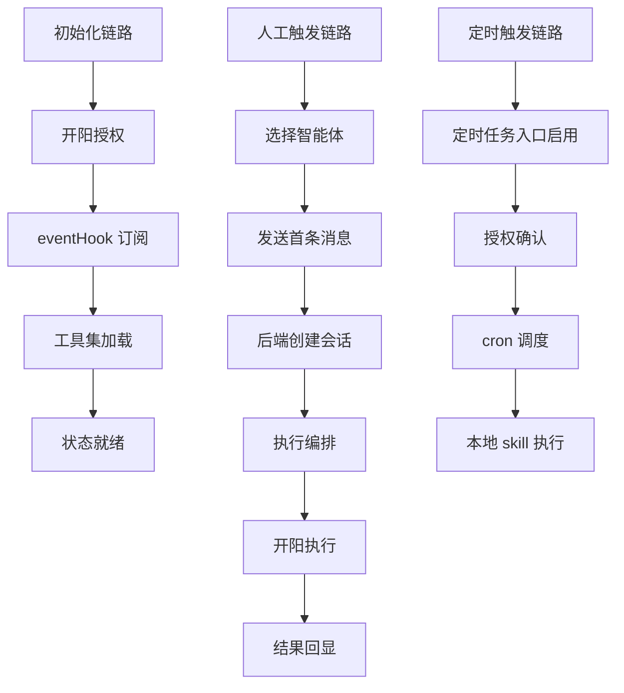

### 2.5 会话与状态模型

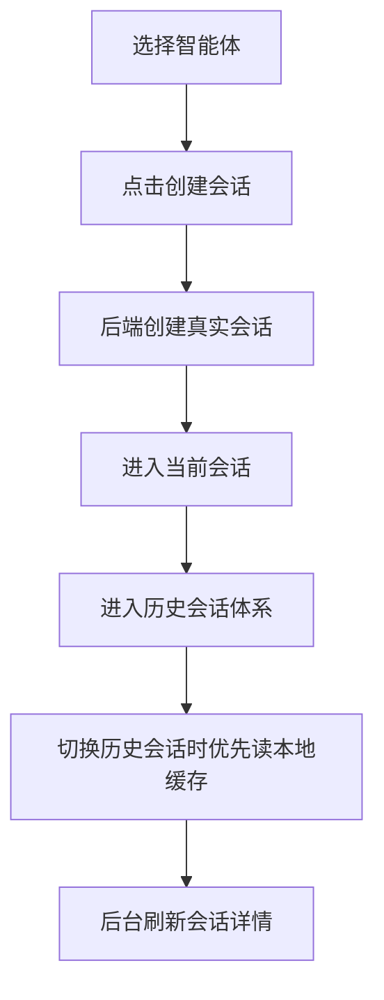

会话规则如下：

- 助手子窗体采用“单主对话区 + 历史对话栏”模型
- 一会话绑定一个智能体
- 点击创建会话时即创建真实会话
- 历史会话可后台继续执行，并在历史对话栏显示 `running`

前端状态拆分如下：

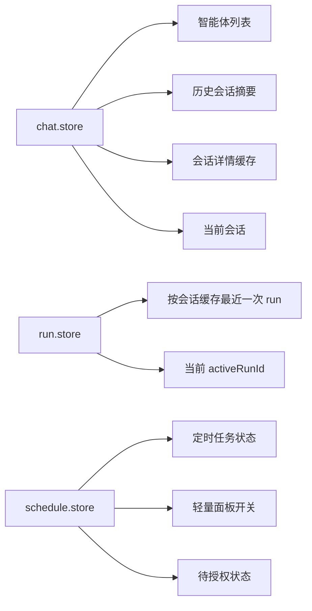

### 2.6 通信架构

助手子窗体与 DCF 子进程通过 `JSBridge` 通信，DCF 子进程与后端通过 `HTTP + SSE` 通信。

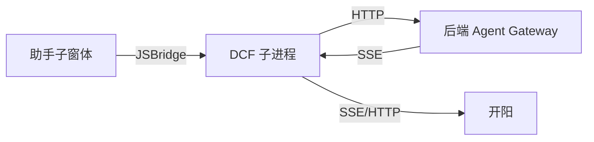

通信关系说明如下：

- 助手子窗体不直接连接后端
- 所有本地执行请求先到 DCF，再由 DCF 转发到后端或开阳
- 后端通过 SSE 单通道向 DCF 回推运行事件和工具调用请求
- 开阳相关请求统一由 DCF 携带 `accessToken` 发起

## 3. 功能说明

### 3.1 初始化功能

初始化目标是将 DCF 子进程从“未就绪”推进到“可承接助手子窗体与后端请求”的状态。

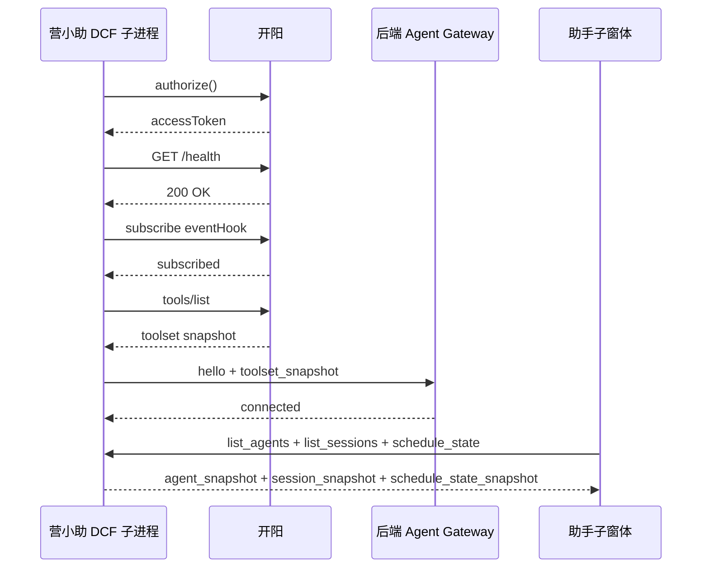

初始化完成后，系统具备以下能力：

- 可展示智能体和历史会话
- 可发起人工对话
- 可展示定时任务入口
- 可承接后端工具执行请求

### 3.2 人工对话功能

人工触发以“点击创建会话即创建真实会话”为核心规则。用户先在助手子窗体中选择智能体，再点击创建会话，后端返回 `sessionId`，随后用户在该会话中发送消息。

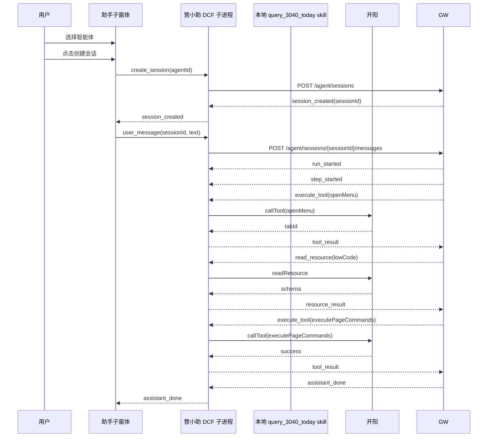

人工对话功能包含以下能力：

- 左下角智能体选择
- 创建空白会话
- 历史会话摘要展示
- 历史会话详情回填
- 最近一次 run 的步骤展示
- 当前 run 取消

### 3.3 定时任务功能

本次迭代中，定时任务不通过任务列表管理，而是通过固定入口 `定时任务` 进入轻量面板进行启用、关闭。

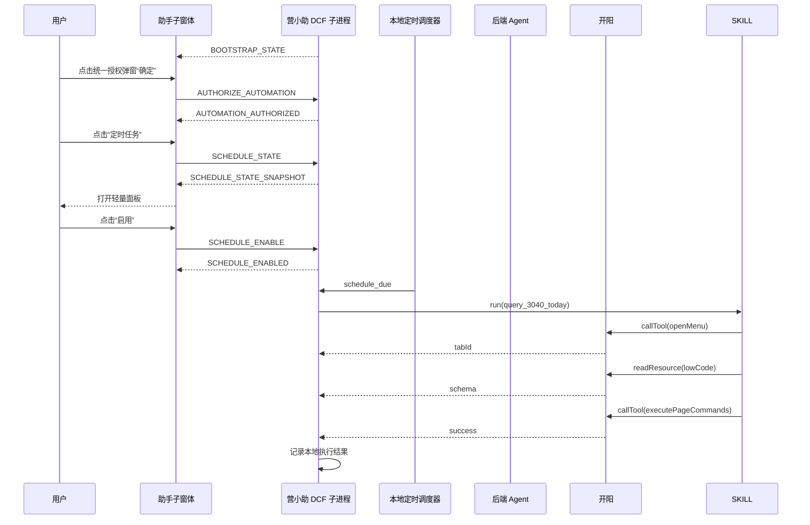

定时任务功能包含以下能力：

- 固定入口 `定时任务`
- 轻量面板展示定时任务信息
- 首次打开子窗体时统一自动执行授权确认
- 关闭时注销本地调度
- 已启用任务按 `cron` 自动触发

### 3.4 3040 场景功能

3040 场景的统一执行步骤如下：

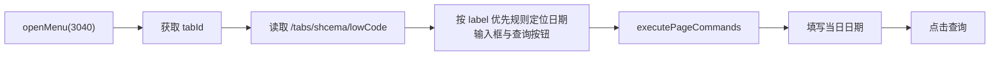

3040 场景的核心特点如下：

- 每次执行都以 `openMenu` 作为起点
- 后续操作均严格绑定当前返回的 `tabId`
- 页面组件定位通过 `/tabs/shcema/lowCode` 动态解析
- 人工触发和定时触发共用同一套页面执行逻辑

### 3.5 定时调度功能

定时调度由 DCF 子进程内部维护，采用 `cron-parser` 进行触发时间计算。

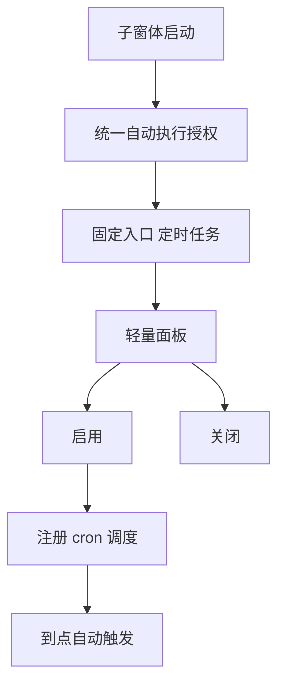

调度策略如下：

- 任务定义为本地内置配置
- 启用状态和统一自动执行授权状态通过本地 JSON 持久化
- 仅已启用且统一自动执行已授权任务进入调度
- 关闭任务时注销调度
- DCF 重启后恢复启用状态
- 执行失败后不自动重试

### 3.6 风险与控制措施

| 风险项 | 影响 | 控制措施 |
| --- | --- | --- |
| 开阳授权失败或 `accessToken` 失效 | DCF 无法调用本地能力 | 建立授权刷新机制、失效重授权机制和异常上报 |
| `eventHook` 订阅异常 | 无法及时感知工具集变化和执行辅助事件 | 建立订阅状态监测、断线重订阅和异常告警 |
| 页面结构变化 | 无法正确解析 `componentId` | 通过页面结构 schema 解析执行，避免写死组件 ID |
| DCF 重启或异常退出 | 定时任务状态丢失 | 通过开阳持久化 API 保存本地 JSON，启动后恢复 |
| 人工对话与定时触发并行 | 可能产生页面上下文混用 | 每次执行均基于新的 `tabId` 独立运行 |
| 助手子窗体与 DCF 通信异常 | 无法回显运行过程 | 通过统一通道封装和事件分发机制降低耦合 |

## 4. 参考文档

- 详细设计：[assistant-window-dcf-formal-design.md](C:/dev/projects/work/yxz-agent/docs/assistant-window-dcf-formal-design.md)
- 设计稿：[dcf-frontend-detailed-design.md](C:/dev/projects/work/yxz-agent/docs/dcf-frontend-detailed-design.md)
- 模块拆分：[module-breakdown.md](C:/dev/projects/work/yxz-agent/docs/module-breakdown.md)
- 开发任务清单：[dev-task-list.md](C:/dev/projects/work/yxz-agent/docs/dev-task-list.md)
- 协议定义：[protocol.ts](C:/dev/projects/work/yxz-agent/share/protocol.ts)
