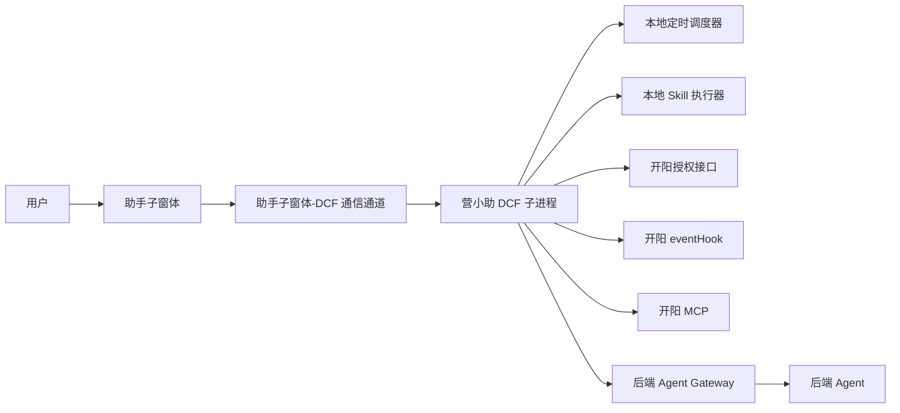
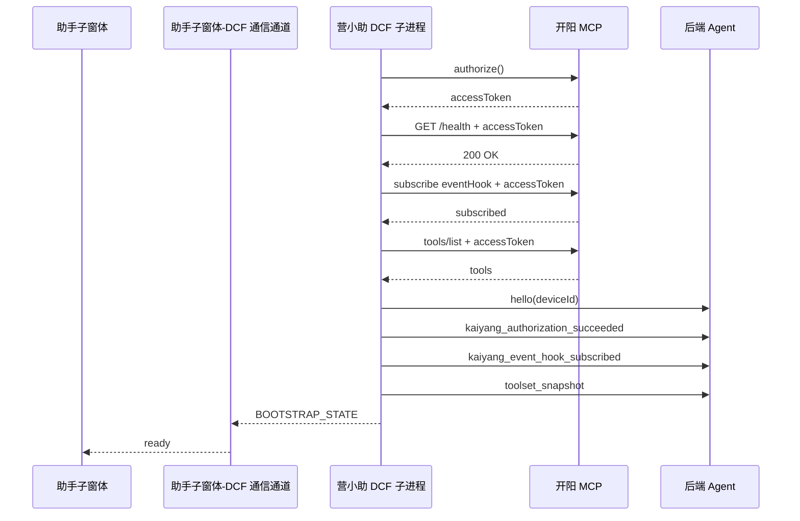

# 营小助智能体对话方案设计

## 一、背景

本方案用于支撑“人工对话触发”和“本地定时任务触发”两类桌面执行场景。系统需通过开阳完成页面打开、字段填写、按钮点击等本地操作，并在对话界面中展示执行过程与结果。

本次迭代的重点是：

- 支持人工对话触发 3040 当日查询。
- 支持定时任务触发 3040 当日查询。
- 用户首次打开助手子窗体时，需完成一次统一自动执行授权；授权成功后，后续按 `cron` 自动执行。

本方案中的关键规则和版本性取舍优先从讨论记录文档提取并沉淀，讨论源文档见：

- [discussion-decisions.md](C:/dev/projects/work/yxz-agent/docs/discussion-decisions.md)

## 二、现状

当前已知条件如下：

- 开阳通过 `SSE/HTTP` 提供 MCP 服务。
- DCF 子进程初始化时需先向开阳授权，获取后续调用所需的 `accessToken`。
- DCF 子进程初始化完成后，需订阅开阳 `eventHook`。
- 本地定时任务使用 `cron` 解析器进行触发时间计算与调度。
- 开阳当前已提供 `openMenu`、`executePageCommands` 和 `/tabs/shcema/lowCode`。
- 本次迭代中，定时任务由本地预置配置提供，助手子窗体支持查看、启用、关闭和统一自动执行授权，不支持新增和编辑。

当前需要解决的核心问题是：在职责边界清晰的前提下，统一承接人工触发与定时触发，并将授权、编排、执行、回显串成一条稳定链路。

## 三、目标

- 明确助手子窗体、DCF 子进程、后端 Agent、开阳 MCP 的职责边界。
- 建立统一的初始化链路，包括开阳授权、`accessToken` 使用和 `eventHook` 订阅。
- 建立人工对话与定时任务两条执行链路，复用同一套开阳接入能力。
- 建立统一自动执行授权机制，确保用户完成首次授权后方可启用定时任务并进入自动调度。
- 支撑 3040 当日查询场景落地。

## 四、解决方案

### 4.1 总体架构

### 4.2 关键职责

- 助手子窗体
  - 发起人工对话请求。
  - 展示执行步骤和执行结果。
  - 在首次打开子窗体时承接统一自动执行授权确认。
  - 提供定时任务启用和关闭入口。

- 营小助 DCF 子进程
  - 初始化时向开阳授权并获取 `accessToken`。
  - 在后续健康检查、SSE、`tools/list`、`eventHook` 订阅等请求中统一携带 `accessToken`。
  - 加载本地定时任务定义，并基于 `cron` 解析器负责本地调度。
  - 在统一自动执行授权完成后，支持启用任务并注册调度任务。
  - 在任务关闭时取消调度。
  - 在人工触发时承接后端下发的工具调用并操作开阳。
  - 在定时任务触发时直接执行本地 skill，并调用开阳完成页面操作。

- 后端 Agent
  - 承接人工触发。
  - 读取页面结构 schema，解析 `componentId`，组装 `executePageCommands`。
  - 输出步骤状态和最终结果。

- 开阳 MCP
  - 提供授权接口，返回 `accessToken`。
  - 提供 `eventHook` 订阅能力。
  - 提供工具与资源能力，并执行页面操作。

### 4.3 初始化流程

1. DCF 子进程启动并加载本地配置。
2. DCF 向开阳授权，获取 `accessToken`。
3. DCF 携带 `accessToken` 调用健康检查。
4. DCF 携带 `accessToken` 建立 SSE 连接。
5. DCF 携带 `accessToken` 订阅开阳 `eventHook`。
6. DCF 携带 `accessToken` 拉取 `tools/list`。
7. DCF 连接后端，并上报基础状态。
8. DCF 加载本地定时任务。
9. 助手子窗体展示“本地能力已就绪”。

初始化时序如下：

### 4.4 执行链路

人工对话触发链路：

`用户发起对话 -> DCF 中转到后端 Agent -> DCF 调用开阳 -> DCF 转发结果给助手子窗体`

定时任务启用链路：

`用户首次打开子窗体完成统一授权 -> 用户启用定时任务 -> DCF 注册 cron 调度`

定时任务触发链路：

`cron 到点触发 -> DCF 调用本地 skill -> skill 调用开阳 -> DCF 记录执行结果`

两条链路共用同一套开阳接入能力：

`openMenu -> 读取 /tabs/shcema/lowCode -> 解析 componentId -> executePageCommands`

### 4.5 3040 场景

人工触发场景：

- 用户在助手子窗体界面发起“打开3040，查询当日数据”。
- 后端按设备时区解析“当日”。
- 后端调用 `openMenu({ menuShortCode: "3040" })`。
- 后端读取 `/tabs/shcema/lowCode`，解析日期输入框与查询按钮的 `componentId`。
- 后端组装 `executePageCommands`，由 DCF 调用开阳执行。

定时触发场景：

- 用户先在助手子窗体中启用预置定时任务“3040 当日查询”。
- 用户已在首次打开子窗体时完成统一自动执行授权。
- DCF 注册 `cron` 调度。
- 后续到点触发时，DCF 直接运行本地 `query_3040_today` skill。
- `query_3040_today` skill 内部读取 schema、定位组件并生成原子命令，再调用 `executePageCommands`。

### 4.6 关键事件

- 助手子窗体 -> DCF
  - `bootstrap_state`
  - `authorize_automation`
  - `user_message`
  - `cancel_run`
  - `schedule_state`
  - `schedule_enable`
  - `schedule_disable`

- DCF -> 助手子窗体
  - `automation_authorized`
  - `run_started`
  - `step_started`
  - `step_finished`
  - `assistant_delta`
  - `assistant_done`
  - `run_failed`
  - `schedule_state_snapshot`
  - `schedule_enabled`
  - `schedule_disabled`

- DCF -> 后端
  - `hello`
  - `kaiyang_authorization_succeeded`
  - `kaiyang_authorization_failed`
  - `kaiyang_event_hook_subscribed`
  - `kaiyang_event_hook_subscription_failed`
  - `toolset_snapshot`
  - `tool_result`
  - `resource_result`

- 后端 -> DCF
  - `run_started`
  - `step_started`
  - `step_finished`
  - `assistant_delta`
  - `assistant_done`
  - `run_failed`
  - `execute_tool`
  - `read_resource`

详细类型定义见：[shared/protocol.ts](C:/dev/projects/work/yxz-agent/shared/protocol.ts)

助手子窗体与 DCF 子进程详细设计见：[dcf-frontend-detailed-design.md](C:/dev/projects/work/yxz-agent/docs/dcf-frontend-detailed-design.md)

## 五、风险

| 风险项 | 影响 | 控制措施 |
| --- | --- | --- |
| `accessToken` 失效或授权失败 | DCF 无法调用开阳能力 | 建立 token 刷新、失效重试和失败告警机制 |
| `eventHook` 订阅异常 | 无法及时感知关键状态变化 | 建立订阅状态监测、断线重订阅和事件缺失告警 |
| 用户未完成统一自动执行授权 | 定时任务无法进入启用与调度 | 在首次打开子窗体时强制完成统一授权 |
| 页面结构 schema 变更 | 定时 skill 或后端编排定位组件失败，执行中断 | 通过 label 优先的定位规则并保留失败兜底 |
| 并发触发冲突 | 同一业务场景可能重复提交 | 建立场景级互斥和排队策略 |

异常展示原则：

- 面向用户仅展示友好的状态提示和操作引导
- 底层技术错误细节通过埋点与后台日志排查
- DCF 初始化异常必须记录埋点，便于后台定位故障阶段
