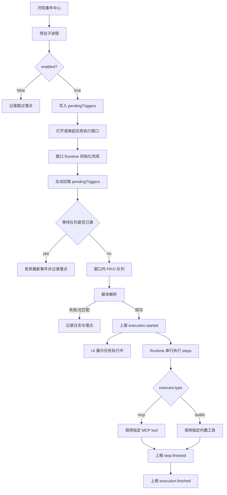
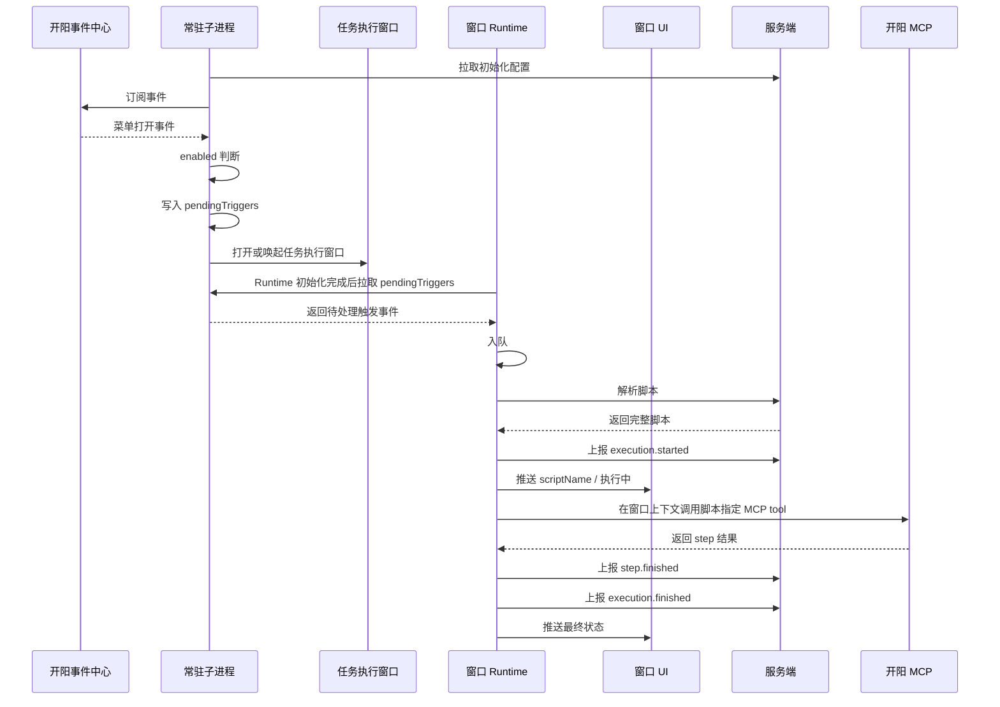

# 事件触发任务执行架构设计

## 1. 背景

当前系统已具备本地定时任务执行能力，但定时任务只能基于时间触发，无法响应外部系统的实时状态变化。

开阳侧提供了事件中心，子进程可以在常驻运行期间订阅事件。当用户在开阳侧打开特定业务菜单时，事件中心会通知子进程。系统需要基于这类事件触发一次任务执行，并通过结构化脚本完成自动化操作、状态展示和执行结果上报。

本期优先落地的业务场景是：

- 用户打开开阳侧养老金菜单。
- 开阳事件中心通知常驻子进程。
- 子进程在配置启用时按需显示任务执行窗口。
- 任务执行窗口实时向服务端解析脚本。
- 任务执行窗口通过开阳 MCP 和内置工具串行执行脚本。
- 执行过程实时上报服务端。

## 2. 目标

### 2.1 业务目标

- 支持由开阳事件中心触发任务执行。
- 当前优先支持养老金菜单打开场景。
- 后续可扩展到其他事件类型，不把能力绑定死在菜单事件上。
- 用户能在任务执行窗口看到当前任务名称、执行状态，并可中止任务。

### 2.2 技术目标

- 子进程保持常驻，负责初始化配置、事件订阅和按需拉起任务执行窗口。
- 任务执行窗口按需显示，承载任务执行上下文和开阳 MCP 调用上下文。
- 服务端负责事件到脚本的匹配，子进程不维护事件和脚本的绑定规则。
- 脚本使用结构化步骤，开发态直接确认具体 MCP 工具或内置工具。
- 运行态不做业务 action 到底层 tool 的映射，只按 `executor.type` 分发执行通道。
- 执行过程可观测，包括开始、步骤完成、结束、失败、中止和关键异常埋点。

## 3. 设计原则

### 3.1 子进程常驻，窗口按需

子进程是常驻服务，负责订阅事件和拉起执行窗口。任务执行窗口不是随子进程启动常驻显示，而是在存在有效任务执行请求时打开或显示。

任务执行窗口关闭后，窗口内当前任务和等待队列中的任务全部终止，但子进程不退出，仍继续订阅后续事件。

### 3.2 执行流程在窗口 Runtime 内

任务执行流程放在任务执行窗口内，但不直接耦合到 UI 组件。任务执行窗口内部拆分为 Runtime 和 UI：

- Runtime 负责队列、脚本解析、脚本执行、工具调用、上报和中止控制。
- UI 负责展示 Runtime 状态，并把用户中止、关闭等操作转发给 Runtime。

这样既满足开阳 MCP 必须绑定窗口上下文的要求，又避免把执行编排逻辑塞进页面组件。

### 3.3 服务端决定脚本

子进程只透传事件上下文，服务端根据上下文解析并返回脚本。事件与脚本的绑定关系在服务端维护，避免客户端固化业务规则。

### 3.4 开发态确认工具

脚本配置平台在开发态提供 MCP 和工具选择能力。脚本中直接保存 `mcpName`、`toolName` 和工具参数。

运行态只负责调用脚本指定的工具，不再维护类似 `click -> kaiyang.click` 的业务动作映射。

### 3.5 简化一期可靠性

本期以可落地和行为清晰为优先：

- 不做脚本缓存。
- 不做执行重试。
- 不做条件分支。
- 不做并发执行。
- 不做队列持久化。
- 不做 SDK 自动重连。
- 不做运行时完整 schema 校验。

## 4. 总体方案

### 4.1 架构角色

| 角色 | 职责 |
|---|---|
| 常驻子进程 | 拉取初始化配置、订阅事件中心、接收事件、判断配置开关、暂存触发事件、按需打开任务执行窗口 |
| 任务执行窗口 Runtime | 承载任务队列、脚本解析、脚本执行、MCP 窗口上下文、执行上报和中止控制 |
| 任务执行窗口 UI | 展示当前任务名称、执行状态和中止按钮，将用户操作转发给 Runtime |
| 执行记录展示组件 | 独立展示历史执行记录，由需要的页面或窗口按需引入 |
| 服务端 | 管理配置、校验脚本、根据事件上下文解析脚本、接收执行上报 |
| 开阳事件中心 | 推送开阳状态变更等外部事件 |
| 开阳 MCP | 提供窗口内自动化操作能力 |
| 内置工具 | 提供 `wait`、`request` 等非 MCP 工具能力 |

### 4.2 逻辑架构



### 4.3 执行时序



## 5. 核心设计

### 5.1 初始化配置

子进程启动后通过现有初始化配置接口拉取事件触发任务执行配置。

```json
{
  "eventTaskExecution": {
    "enabled": true,
    "maxQueueSize": 10
  }
}
```

配置说明：

| 字段 | 说明 |
|---|---|
| `enabled` | 是否启用事件触发任务执行 |
| `maxQueueSize` | 等待队列最大长度，不包含当前 running 任务 |

`enabled=false` 时：

- 子进程仍然订阅事件中心。
- 收到可触发事件后不打开任务执行窗口。
- 不入队、不解析脚本、不上报 execution。
- 记录 `event_task_trigger_skipped`，原因 `DISABLED`。

### 5.2 事件触发模型

当前场景来自开阳事件中心的菜单打开事件，但架构不限定只支持菜单事件。

事件适配规则：

- 不同事件由不同 `EventAdapter` 适配。
- 适配器将原始事件转换为 `eventContext`。
- `eventContext` 允许原样透传。
- 服务端根据 `eventContext` 决定返回哪个脚本。
- 子进程不维护事件到脚本的绑定规则。

脚本解析请求示例：

```json
{
  "triggerSource": "kaiyang_event",
  "eventType": "menu.opened",
  "eventContext": {
    "menuCode": "开阳侧标准菜单编码",
    "rawEvent": {}
  }
}
```

### 5.3 事件暂存与窗口拉取

为避免“先打开窗口、再发送事件”时窗口 Runtime 尚未初始化导致事件丢失，本期采用子进程暂存、窗口 Runtime 主动拉取的机制。

处理流程：

```text
常驻子进程收到事件
  -> enabled 判断
  -> 生成 triggerId
  -> 写入 pendingTriggers
  -> 打开或唤起任务执行窗口

任务执行窗口 Runtime 初始化完成
  -> 主动向常驻子进程拉取 pendingTriggers
  -> 子进程返回当前暂存事件
  -> 子进程移除已返回事件
  -> Runtime 按 FIFO 将事件写入窗口内执行队列
```

`pendingTriggers` 说明：

- 位于常驻子进程内。
- 只用于任务执行窗口未初始化或未拉取前的触发事件暂存。
- 不是执行队列。
- 不做持久化。
- 真正的执行队列仍位于任务执行窗口 Runtime 内。

窗口已打开时：

- 子进程收到新事件后仍先写入 `pendingTriggers`。
- 子进程必须发送轻量通知 `TRIGGER_AVAILABLE`。
- 任务执行窗口 Runtime 收到通知后主动拉取。
- `TRIGGER_AVAILABLE` 不携带完整事件，只表示有新触发事件可拉取。
- Runtime 拉取到多条触发事件时，仍按 `maxQueueSize` 逐条入队；超出容量的触发事件按队列满策略丢弃并记录埋点。

投递语义：

- 子进程成功返回 `pendingTriggers` 后，即视为投递成功。
- 子进程会移除已返回的触发事件。
- 如果 Runtime 拉取成功后、写入窗口内执行队列前发生异常，本期接受该批触发事件丢失。

容量限制：

- `pendingTriggers` 设置固定最大容量，不使用配置项。
- 超出固定容量时丢弃最新触发事件。
- 丢弃时记录本地日志和埋点。

这样所有事件进入任务执行窗口的路径统一为：

```text
任务执行窗口 Runtime -> 拉取 pendingTriggers -> 写入窗口内执行队列
```

### 5.4 任务执行窗口

任务执行窗口是执行容器，不只是展示层。它独立于养老金菜单窗口。

打开时机：

- 子进程启动时不打开。
- 无任务执行时不显示。
- 收到有效触发事件且 `enabled=true` 后，打开或唤起。
- 后续事件先暂存在常驻子进程，任务执行窗口 Runtime 主动拉取。

窗口 Runtime 承载：

- 等待执行队列。
- 当前 running 任务。
- 脚本解析。
- 脚本执行。
- 开阳 MCP 调用所需窗口上下文。
- 执行上报。
- 中止控制。

窗口 UI 展示：

- 当前任务名称，来自 `scriptName`。
- 执行状态。
- 中止按钮。

窗口 UI 不直接执行脚本，也不直接调用服务端解析脚本。UI 只订阅 Runtime 状态，并把用户点击中止、关闭窗口等操作转发给 Runtime。

窗口状态：

```text
执行中
执行成功
执行失败
中止
```

窗口不展示：

- 队列长度。
- 历史执行记录。
- 脚本解析失败。
- 无匹配脚本。
- 队列满丢弃事件。

窗口关闭行为：

- 用户关闭任务执行窗口时，等同于终止所有任务。
- 当前 running execution 按中止处理。
- 等待队列中的任务全部丢弃。
- 关闭后不继续后台执行。
- 子进程不退出，继续订阅事件。
- 后续再次收到有效触发事件时，可以重新打开或唤起任务执行窗口。

任务完成行为：

- 当前任务执行成功、失败或中止后，任务执行窗口展示最终状态。
- 如果窗口内等待队列为空，任务执行窗口自动关闭。
- 如果窗口内仍有等待任务，Runtime 继续执行下一个任务，并刷新窗口展示状态。

### 5.5 执行队列

队列位于任务执行窗口内。

队列策略：

- 内存 FIFO。
- 同一任务执行窗口只允许一个任务 running。
- `maxQueueSize` 只统计等待队列，不包含当前 running 任务。
- 队列达到 `maxQueueSize` 后丢弃最新事件。
- 被丢弃事件不展示任务状态，不上报 execution。
- 任务执行窗口关闭时，当前执行中任务和等待队列中的所有任务统一终止。
- 子进程退出时，窗口内未执行和执行中的任务不恢复。

队列满埋点：

```text
event_task_enqueue_failed
reason = QUEUE_FULL
queueSize = 当前等待队列长度
maxQueueSize = 配置值
```

### 5.6 脚本解析

脚本解析实时请求服务端，不使用缓存。

成功响应示例：

```json
{
  "scriptId": "pension-menu-open",
  "scriptName": "养老金任务",
  "menuCode": "开阳侧标准菜单编码",
  "scriptVersion": "1.0.0",
  "steps": [
    {
      "stepId": "click-query",
      "executor": {
        "type": "mcp",
        "mcpName": "kaiyang",
        "toolName": "click"
      },
      "params": {
        "componentId": "pension.queryButton"
      }
    },
    {
      "stepId": "read-result",
      "executor": {
        "type": "mcp",
        "mcpName": "kaiyang",
        "toolName": "read"
      },
      "params": {
        "componentId": "pension.resultPanel"
      }
    }
  ]
}
```

解析失败分两类：

| 错误码 | 说明 |
|---|---|
| `NO_MATCHED_SCRIPT` | 服务端未匹配到脚本 |
| `SCRIPT_RESOLVE_FAILED` | 服务端异常、网络异常或接口异常 |

脚本解析失败或无匹配时：

- 不展示任务执行状态。
- 不上报 `execution.started`。
- 不上报 `execution.finished`。
- 只记录日志和埋点。

### 5.7 脚本执行

服务端负责配置校验，只发布并下发校验通过的脚本。运行态不做完整 schema 校验。

step 基本结构：

```json
{
  "stepId": "click-query",
  "executor": {
    "type": "mcp",
    "mcpName": "kaiyang",
    "toolName": "click"
  },
  "params": {
    "componentId": "pension.queryButton"
  }
}
```

执行通道：

| executor.type | 执行通道 | 说明 |
|---|---|---|
| `mcp` | McpToolExecutor | 在任务执行窗口上下文中调用指定 MCP 的指定 tool |
| `builtin` | BuiltinToolExecutor | 调用子进程内置工具 |

MCP 工具示例：

```json
{
  "stepId": "read-result",
  "executor": {
    "type": "mcp",
    "mcpName": "kaiyang",
    "toolName": "read"
  },
  "params": {
    "componentId": "pension.resultPanel"
  }
}
```

内置工具示例：

```json
{
  "stepId": "wait-page-ready",
  "executor": {
    "type": "builtin",
    "toolName": "wait"
  },
  "params": {
    "durationMs": 1000
  }
}
```

执行规则：

- steps 严格按顺序串行执行。
- 任一步失败，立即停止后续步骤。
- 每个 step 都需要上报 `step.finished`。
- 不支持 retry。
- 不支持 continueOnError。
- 不支持条件分支。
- 不设置脚本级总超时。
- step 可传 `timeoutMs`，未传时交给底层工具自己的超时逻辑。

变量规则：

- 支持 `params` 内的字符串字段。
- 来源包括事件上下文和前置步骤输出。
- 缺失变量替换为空字符串。
- 不支持表达式、计算、条件。

### 5.8 上报机制

统一上报接口，通过 `eventType` 区分事件。

上报类型：

| eventType | 时机 |
|---|---|
| `execution.started` | 脚本解析成功，准备执行第一步前 |
| `step.finished` | 每个 step 执行完成后 |
| `execution.finished` | 脚本成功、失败或中止后 |

`execution.started` 示例：

```json
{
  "eventType": "execution.started",
  "executionId": "uuid",
  "scriptId": "pension-menu-open",
  "scriptVersion": "1.0.0",
  "menuCode": "开阳侧标准菜单编码",
  "triggerSource": "kaiyang_event",
  "timestamp": "2026-05-26T10:00:00+08:00",
  "payload": {
    "scriptName": "养老金任务"
  }
}
```

`step.finished` 成功示例：

```json
{
  "eventType": "step.finished",
  "executionId": "uuid",
  "scriptId": "pension-menu-open",
  "scriptVersion": "1.0.0",
  "menuCode": "开阳侧标准菜单编码",
  "triggerSource": "kaiyang_event",
  "timestamp": "2026-05-26T10:00:03+08:00",
  "payload": {
    "stepId": "read-result",
    "status": "success",
    "startTime": "2026-05-26T10:00:01+08:00",
    "endTime": "2026-05-26T10:00:03+08:00",
    "output": {
      "amount": "1234.56"
    },
    "error": null
  }
}
```

`step.finished` 失败示例：

```json
{
  "eventType": "step.finished",
  "executionId": "uuid",
  "scriptId": "pension-menu-open",
  "scriptVersion": "1.0.0",
  "menuCode": "开阳侧标准菜单编码",
  "triggerSource": "kaiyang_event",
  "timestamp": "2026-05-26T10:00:05+08:00",
  "payload": {
    "stepId": "click-query",
    "status": "failed",
    "startTime": "2026-05-26T10:00:04+08:00",
    "endTime": "2026-05-26T10:00:05+08:00",
    "output": null,
    "error": {
      "code": "MCP_CALL_FAILED",
      "message": "开阳 MCP 调用失败",
      "detail": {
        "rawError": {}
      }
    }
  }
}
```

`execution.finished` 示例：

```json
{
  "eventType": "execution.finished",
  "executionId": "uuid",
  "scriptId": "pension-menu-open",
  "scriptVersion": "1.0.0",
  "menuCode": "开阳侧标准菜单编码",
  "triggerSource": "kaiyang_event",
  "timestamp": "2026-05-26T10:00:10+08:00",
  "payload": {
    "status": "failed",
    "startTime": "2026-05-26T10:00:00+08:00",
    "endTime": "2026-05-26T10:00:10+08:00",
    "failedStepId": "click-query",
    "error": {
      "code": "USER_CANCELED",
      "message": "用户中止任务执行",
      "detail": {}
    }
  }
}
```

上报失败时：

- 本地记录日志。
- 记录 `report_event_failed` 埋点。
- 不影响脚本继续执行。

### 5.9 中止策略

用户点击中止按钮时：

- 只中止当前 running execution，采用软中止策略。
- 等待队列中的任务保留。
- 如果当前 step 底层工具支持取消，则尝试取消当前 step。
- 如果当前 step 底层工具不支持取消，则等待当前 step 返回后停止后续步骤。
- 当前 step 需要上报 `step.finished failed`。
- execution 上报 `execution.finished failed`。
- 错误码为 `USER_CANCELED`。
- 本地窗口状态展示为“中止”。
- 中止完成后 worker 自动处理队列中的下一个任务。

用户关闭任务执行窗口时：

- 终止当前 running execution。
- 清空等待队列中的所有任务。
- 当前 running execution 按 `USER_CANCELED` 上报。
- 等待队列中未开始的任务不上报 execution。
- 子进程继续常驻，不退出。

### 5.10 执行记录回显

执行记录回显不属于任务执行窗口职责。任务执行窗口只展示当前任务的实时执行状态，不展示历史执行记录，也不负责在任务完成后刷新历史记录列表。

执行记录回显作为独立展示能力提供：

- 数据来源为服务端。
- 展示组件独立封装。
- 由需要展示执行记录的页面或窗口按需引入。
- 不耦合任务执行窗口 Runtime。
- 不影响事件触发任务执行主链路。

本期事件触发任务执行只负责实时上报执行过程和最终结果，服务端如何沉淀执行记录、执行记录展示组件如何查询和展示，由执行记录展示能力独立设计。

## 6. 可观测性

### 6.1 埋点

本期埋点：

```text
kaiyang_event_subscribe_success
kaiyang_event_subscribe_failed
kaiyang_menu_event_received
event_task_trigger_skipped
event_task_enqueue_success
event_task_enqueue_failed
script_resolve_no_match
script_resolve_failed
execution_started
execution_finished
execution_canceled
report_event_failed
```

### 6.2 错误码

关键错误码：

```text
DISABLED
QUEUE_FULL
NO_MATCHED_SCRIPT
SCRIPT_RESOLVE_FAILED
USER_CANCELED
MCP_CALL_FAILED
REQUEST_FAILED
REQUEST_METHOD_NOT_SUPPORTED
EXECUTOR_TYPE_NOT_SUPPORTED
```

## 7. 异常处理

| 场景 | 处理策略 |
|---|---|
| 订阅失败 | 子进程继续运行，记录日志和埋点 |
| SDK 连接中断 | 本期不考虑自动重连 |
| `enabled=false` | 收到事件后跳过触发，记录埋点 |
| `pendingTriggers` 满 | 丢弃最新触发事件，记录日志和埋点 |
| 队列满 | 丢弃最新事件，记录日志和埋点 |
| 脚本解析失败 | 不进入执行，不展示任务状态，只记日志和埋点 |
| 无匹配脚本 | 不进入执行，不展示任务状态，只记日志和埋点 |
| 任务执行窗口打开失败 | 清空本次相关 `pendingTriggers`，记录日志和埋点，不上报 execution |
| 未知 `executor.type` | 当前 step failed，快速失败 |
| 内置 request 非 GET/POST | 当前 step failed，快速失败 |
| step 执行失败 | 快速失败，停止后续步骤 |
| 上报失败 | 记录日志和埋点，继续执行 |
| 用户点击中止 | 中止当前任务，队列保留 |
| 用户关闭任务执行窗口 | 终止当前任务并清空等待队列 |
| 任务完成且队列为空 | 展示最终状态后自动关闭任务执行窗口 |
| 子进程退出 | 窗口内队列和当前任务不恢复 |

## 8. 风险与应对

### 8.1 事件订阅失败导致无法触发任务

风险：子进程订阅开阳事件中心失败后，菜单打开事件无法触发任务。

应对：

- 子进程不退出，保留其他能力。
- 记录 `kaiyang_event_subscribe_failed`。
- 本期不做自动重连，后续可引入订阅恢复机制。

### 8.2 任务执行窗口关闭导致任务丢失

风险：用户关闭任务执行窗口会终止当前任务并清空等待队列。

应对：

- 文档明确关闭窗口等同于终止所有任务。
- 当前 running execution 按 `USER_CANCELED` 上报。
- 未开始任务不做 execution 上报，仅记录本地日志。

### 8.3 队列过长导致执行滞后

风险：事件触发频繁时，等待队列堆积，任务执行滞后。

应对：

- 通过 `maxQueueSize` 限制等待队列长度。
- 队列满时丢弃最新事件，不破坏 FIFO。
- 记录 `event_task_enqueue_failed` 和 `QUEUE_FULL`。

### 8.4 pendingTriggers 丢失

风险：`pendingTriggers` 位于常驻子进程内且不持久化，子进程退出、任务执行窗口打开失败或窗口长时间无法初始化时，暂存触发事件可能丢失。

应对：

- 本期明确 `pendingTriggers` 只是投递缓冲，不是可靠队列。
- `pendingTriggers` 设置固定最大容量，超出容量时丢弃最新触发事件并记录日志。
- 子进程成功返回 `pendingTriggers` 后即视为投递成功，后续 Runtime 异常导致的触发事件丢失本期可接受。
- 窗口打开失败时记录日志和埋点。
- 后续如需要更高可靠性，可考虑持久化投递缓冲或由服务端补偿触发。

### 8.5 脚本与工具 schema 绑定

风险：脚本在开发态直接选择 MCP tool，MCP 工具名或参数 schema 变化可能影响已发布脚本。

应对：

- 服务端发布前校验工具存在和参数 schema。
- 工具变更需要考虑兼容策略。
- 必要时引入工具版本或脚本批量迁移机制。

### 8.6 上报失败导致服务端记录不完整

风险：执行已经发生，但服务端缺少 started、step 或 finished 记录。

应对：

- 上报失败不阻塞本地执行。
- 本地记录日志。
- 记录 `report_event_failed` 便于排查。

## 9. 本期不做

- 不做脚本缓存。
- 不做脚本执行重试。
- 不做条件分支。
- 不做并发执行。
- 不做队列持久化。
- 不做 SDK 自动重连。
- 不做运行时完整 schema 校验。
- 不在任务执行窗口展示队列长度。
- 不在任务执行窗口展示历史执行记录。
- 不展示脚本解析失败或无匹配脚本。
