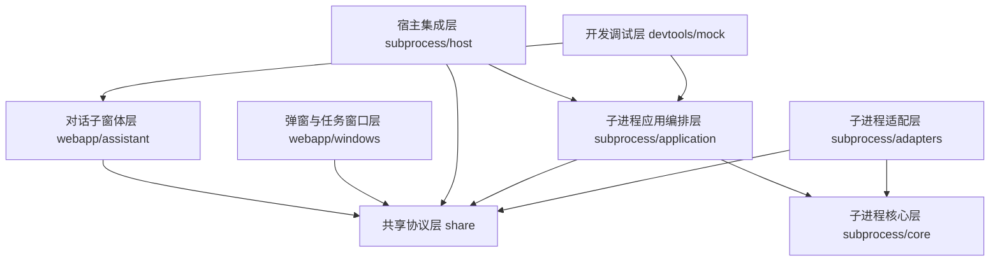

# 营小助项目分层重构历史草案

更新时间：2026-06-03

> 状态说明：本文是早期分层拆解草案，保留用于追溯问题来源和迁移思路，不作为当前正式口径。当前正式术语以 [terminology.md](C:/dev/projects/work/yxz-agent/docs/terminology.md) 为准，当前架构方向以 [thin-subprocess-window-agent-architecture.md](C:/dev/projects/work/yxz-agent/docs/thin-subprocess-window-agent-architecture.md) 为准。本文中出现的 `DCF`、`Runtime`、`Channel`、`对话子窗体`、`后台任务` 等旧口径，后续重写时应统一替换为“子进程”“执行层”“开阳基座通信”“主窗体”“一次任务/并发运行提示”等规范术语。

## 1. 文档目的

本文档用于重构当前 `yxz-agent` 项目的整体设计，重点解决两个问题：

- 分离子进程核心功能，避免核心运行时与宿主窗口、页面、测试 demo 直接耦合。
- 分离主窗体功能，避免展示层、状态管理、开阳基座通信和执行层逻辑混在一起。

> 设计方向更新：当前采用“子进程 + 业务窗体执行层 + 业务窗体展示层”。本文保留作为分层拆解草案，其中“子进程核心层”相关内容后续需要按新口径收缩。

本文先定义分层、职责边界、依赖方向和迁移顺序。涉及产品语义或运行时策略不明确的内容，统一列入“待确认问题”，不在本文中直接拍板。

相关文档：

- 正式设计：[assistant-window-dcf-formal-design.md](C:/dev/projects/work/yxz-agent/docs/assistant-window-dcf-formal-design.md)
- 模块拆分：[module-breakdown.md](C:/dev/projects/work/yxz-agent/docs/module-breakdown.md)
- 接口报文：[interface-and-payloads.md](C:/dev/projects/work/yxz-agent/docs/interface-and-payloads.md)
- 前端整合：[webapp-design-integration.md](C:/dev/projects/work/yxz-agent/docs/webapp-design-integration.md)
- 协议定义：[protocol.ts](C:/dev/projects/work/yxz-agent/share/protocol.ts)

## 2. 当前问题

当前项目已经具备定时任务、弹窗确认、skill 执行和基础子窗体通信能力，但模块边界还不够稳定：

- `bootstrap.ts` 同时承担配置加载、服务组装、调度恢复、skill 注册、通道绑定等职责。
- `ChannelService.ts` 同时承担协议接收、事件分发、业务处理和事件发布。
- 调度、待确认执行、skill 执行、运行记录已经拆分，但仍直接互相持有具体服务。
- 子进程核心能力和宿主能力没有明确分层，例如打开弹窗、按 `requestEvent` 暴露接口、向窗口发事件等都靠近运行时。
- 对话子窗体设计已在文档中规划，但当前实现主要是授权和定时任务面板，还没有完整对话工作台。
- `yxz-agent-webapp` 中的对话体验、状态机、事件总线与当前 DCF 运行时还未形成正式边界。
- 事件触发任务执行设计引入了“常驻子进程 + 任务执行窗口 Runtime”，与现有定时任务弹窗、对话子窗体之间的边界需要进一步确认。

重构目标不是一次性重写代码，而是先把设计边界拆清楚，再按层迁移。

## 3. 重构目标

### 3.1 架构目标

- 子进程核心层不依赖具体宿主 API、窗口 API、React、DOM 或 mock server。
- 对话子窗体不直接调用开阳、后端 Agent 或 MCP。
- 所有跨边界通信通过共享协议、端口接口或标准事件完成。
- 运行时核心能力可以被宿主环境、测试环境和 demo 环境分别适配。
- 定时触发、人工对话触发、事件触发任务都能复用同一套核心能力，但保持入口和用户体验独立。

### 3.2 实施目标

- 先重构文档和模块边界。
- 再抽出稳定端口和服务接口。
- 最后迁移代码目录和依赖关系。

## 4. 总体分层

建议将项目拆为 7 层：



依赖方向：

- 上层可以依赖下层的公开接口。
- 下层不能反向依赖上层。
- 核心层不能依赖宿主环境、窗口 API、React 或 mock。
- UI 层不能依赖子进程内部实现，只依赖共享协议和前端通信客户端。

## 5. 分层职责

### 5.1 共享协议层

建议目录：

```text
share/
  protocol.ts
  hostTypes.ts
  hostRoutes.ts
  dateTime.ts
```

职责：

- 定义跨层通信事件。
- 定义共享领域 DTO。
- 定义宿主集成的路由常量和初始化数据结构。
- 提供跨端一致的时间格式工具。

不能承担：

- 不能包含业务服务实现。
- 不能依赖子进程、React 或宿主 API。
- 不能放 demo 数据。

当前保留：

- `share/protocol.ts`
- `share/hostTypes.ts`
- `share/hostRoutes.ts`
- `share/dateTime.ts`

待重构：

- 协议中 `Session` 与产品语义 `Conversation` 的命名关系需要统一说明，但短期不建议直接改字段名。

### 5.2 子进程核心层

建议目录：

```text
subprocess/core/
  runtime/
  kaiyang/
  scheduler/
  execution/
  skill/
  events/
  storage/
```

职责：

- DCF 运行状态机。
- 开阳授权、token 刷新、健康检查。
- 开阳 MCP 工具调用和资源读取。
- eventHook 订阅与标准化。
- 定时调度计算、注册、注销。
- 待确认执行项、执行记录、运行状态。
- skill 加载、解析和执行。
- 本地持久化端口。

不能承担：

- 不打开窗口。
- 不调用 `window.BridgeJs`。
- 不使用 `requestEvent` 装饰器。
- 不知道 React 页面路由。
- 不直接展示用户文案。

核心层应该通过端口表达外部能力：

```ts
interface ToolTransport {
  callTool(name: string, args: Record<string, unknown>): Promise<unknown>
  readResource?(uri: string, params?: Record<string, unknown>): Promise<unknown>
}

interface RuntimeStore<T> {
  read(): Promise<T>
  write(value: T): Promise<void>
}

interface DomainEventPublisher {
  publish(event: DomainEvent): Promise<void>
}
```

当前可归入核心层的文件：

- `subprocess/service/scheduler/ScheduleStateService.ts`
- `subprocess/service/scheduler/SchedulerService.ts`
- `subprocess/service/execution/ToolRuntimeService.ts`
- `subprocess/service/execution/mcpToolClient.ts`
- `subprocess/service/SkillService.ts`
- `subprocess/service/LocalSkillLoader.ts`
- `subprocess/service/common/rumJsJsonStore.ts`
- `subprocess/service/common/id.ts`

### 5.3 子进程应用编排层

建议目录：

```text
subprocess/application/
  DcfApplication.ts
  FrontendCommandHandlers.ts
  PopupCommandHandlers.ts
  ScheduleUseCases.ts
  ConversationUseCases.ts
  EventTaskUseCases.ts
```

职责：

- 组合核心服务形成用例。
- 处理前端命令，例如授权、启用定时任务、关闭定时任务、触发任务。
- 处理弹窗命令，例如确认全部执行、忽略全部执行。
- 处理后端 Agent 事件，例如 run、step、assistant delta、工具请求。
- 处理事件触发任务的入队、窗口唤起、执行窗口拉取。

不能承担：

- 不直接依赖宿主窗口 API。
- 不直接依赖 React。
- 不直接持有 demo 传输实现。
- 不把协议 switch 散落在 UI 或宿主服务里。

应用层建议对外暴露明确入口：

```ts
interface DcfApplication {
  start(): Promise<void>
  stop(): Promise<void>
  handleFrontendCommand(event: FrontendToDcfEvent): Promise<void>
  handlePopupCommand(event: PopupToDcfEvent): Promise<void>
  handleBackendEvent(event: BackendToDcfEvent): Promise<void>
}
```

当前需要从 `bootstrap.ts` 和 `ChannelService.ts` 中逐步抽出。

### 5.4 子进程适配层

建议目录：

```text
subprocess/adapters/
  kaiyang/
  backend/
  storage/
  bridge/
  mcp/
  config/
```

职责：

- 把核心层端口适配到真实外部系统。
- 对接开阳授权、MCP、eventHook、持久化 API。
- 对接后端 Agent Gateway HTTP + SSE。
- 对接本地 JSON 或 RUM JS cache。
- 对接配置加载。

不能承担：

- 不处理 UI 状态。
- 不决定业务流程。
- 不直接修改 schedule store 或 chat store。

典型适配：

| 端口 | 适配实现 |
| --- | --- |
| `ToolTransport` | 开阳 MCP JSON-RPC / SSE transport |
| `RuntimeStore` | RUM JS cache JSON store |
| `BackendGateway` | HTTP + SSE client |
| `ConfigProvider` | 本地配置 + 后端初始化配置 |
| `DomainEventPublisher` | 转换为前端、弹窗、任务窗口事件 |

### 5.5 宿主集成层

建议目录：

```text
subprocess/host/
  DcfRuntimeHostController.ts
  HostWindowService.ts
  HostBridgeEventPublisher.ts
  HostRequestRoutes.ts
```

职责：

- 接入宿主框架提供的 `ControllerAbstract`。
- 使用 `requestEvent` 暴露宿主 HTTP/事件入口。
- 打开或唤起助手窗口、右下角弹窗、任务执行窗口。
- 通过宿主窗口桥发送事件。
- 将宿主请求转换为应用层命令。

不能承担：

- 不执行业务用例。
- 不直接修改定时任务状态。
- 不直接运行 skill。
- 不处理后端 Agent 编排。

当前可归入宿主集成层：

- `subprocess/service/DcfRuntimeService.ts`

当前应拆出：

- `initializeDcfRuntime` 更像应用组装入口，应迁移到应用编排层。
- `openPendingOverview` 属于宿主窗口适配，应保留在宿主集成层。
- `@requestEvent(...)` handler 只负责命令转换，不应访问核心服务内部。

### 5.6 对话子窗体层

建议目录：

```text
webapp/src/assistant/
  app/
  components/
  stores/
  services/
  events/
  routes/
```

职责：

- 展示对话工作台。
- 展示历史 Conversation、当前消息流、步骤区、智能体区、定时任务入口。
- 管理前端本地 UI 状态和展示状态。
- 通过 `assistant-window-channel-client` 与 DCF 通信。
- 把 DCF 事件分发到 `chat.store`、`run.store`、`schedule.store`。

不能承担：

- 不调用开阳。
- 不直接调用后端 Agent。
- 不直接调用 MCP。
- 不执行 skill。
- 不保存定时任务定义。

建议拆分：

```text
webapp/src/assistant/
  components/
    ChatWorkspace/
    HistoryConversationList/
    AgentPicker/
    RunStepPanel/
    ScheduleEntry/
    SchedulePanel/
    AutomationAuthorizationModal/
    BackgroundTaskBubble/
  stores/
    chat.store.ts
    run.store.ts
    schedule.store.ts
    backgroundTask.store.ts
  services/
    assistant-window-channel-client.ts
    event-dispatcher.ts
  events/
    local-agent-event-bus.ts
    local-agent-events.ts
```

当前可吸收 `yxz-agent-webapp` 的内容：

- `AppShell`
- `DashboardPage`
- `ChatWorkspace`
- `useChatStore` 中的会话、运行、后台任务体验
- `LocalAgentEventBus` 设计

但正式运行时必须替换：

- `chatClient`
- `localMcpClient`
- mock server 相关逻辑

### 5.7 弹窗与任务窗口层

建议目录：

```text
webapp/src/windows/
  schedule-confirmation-popup/
  event-task-window/
```

职责：

- 右下角定时任务确认弹窗。
- 事件触发任务执行窗口。
- 任务执行窗口 Runtime 与 UI 的前端部分。

不能承担：

- 不直接访问子进程核心服务。
- 不直接调用开阳。
- 不持久化任务定义。

当前确定：

- `ScheduleConfirmationPopup` 保留独立窗口语义。
- 弹窗只消费待确认概览，不维护完整定时任务状态。

待确认：

- 事件触发任务执行窗口是否与右下角弹窗同属 `windows` 层。
- 事件触发任务窗口 Runtime 是前端 Runtime，还是子进程应用层 Runtime。
- 定时任务确认后是否进入对话子窗体的后台任务气泡。

### 5.8 开发调试层

建议目录：

```text
devtools/
  mock-backend/
  mock-mcp/
  simulators/
  fixtures/
```

职责：

- mock 后端 Agent。
- mock MCP。
- demo schedule。
- 本地联调脚本。

不能承担：

- 不作为正式运行时依赖。
- 不被核心层 import。
- 不进入生产构建路径。

当前候选：

- `subprocess/schedule/mock-mcp-server.js`
- `subprocess/schedule/examples/*`
- `yxz-agent-webapp/server/mock-chat-server.cjs`
- `yxz-agent-webapp/server/mock-mcp-sse-server.cjs`
- `yxz-agent-webapp/server/standalone-mcp-simulator.cjs`

## 6. 子进程核心能力拆分

子进程核心能力建议拆成 6 个核心域。

### 6.1 Runtime Core

职责：

- DCF 启动状态机。
- 启动、停止、恢复。
- 运行态快照。
- 初始化期间的错误收敛。

核心输出：

- `BOOTSTRAP_STATE`
- runtime health event
- telemetry event

待确认：

- 是否把 `kaiyangStatus`、`eventHookStatus`、`scheduleSubsystemReady` 全部纳入统一 runtime state。

### 6.2 Kaiyang Core

职责：

- 授权。
- token 刷新。
- 健康检查。
- MCP transport。
- eventHook 订阅。
- 工具集缓存。

对外端口：

- `KaiyangClient`
- `ToolTransport`
- `ResourceReader`
- `EventHookSubscriber`

待确认：

- 当前 `mcpBaseUrl` 是短期配置，还是未来统一从宿主/后端初始化配置获取。

### 6.3 Conversation Core

职责：

- 承接人工对话命令。
- 将前端 `USER_MESSAGE` 转为后端请求。
- 接收后端 SSE 运行事件。
- 将后端运行事件标准化为前端事件。
- 处理中止。

当前状态：

- 正式协议已有 `FrontendUserMessageEvent`、`FrontendCancelRunEvent`、`FrontendRunStartedEvent` 等定义。
- 当前代码里尚未完整实现人工对话链路。

待确认：

- 本期是否立即纳入完整人工对话链路，还是先保持定时任务链路为主。
- 后端 Agent Gateway 是否已经具备正式接口，还是继续使用 mock 作为过渡。

### 6.4 Schedule Core

职责：

- 定时任务定义。
- 统一自动执行授权。
- cron 调度。
- 待确认执行项。
- 执行记录。
- 定时任务启用、关闭、恢复。

当前状态：

- 已有较完整实现。

需要重构：

- 将业务用例从 `FrontendChannelService` 中抽出。
- 将 `ScheduleExecutionService` 对事件发布函数的依赖改为领域事件或应用层回调。
- 将 storage、timer、skill runner 之间依赖进一步抽象。

### 6.5 Skill Execution Core

职责：

- 加载 skill。
- 解析结构化 step。
- 调用工具。
- 聚合执行结果。
- 快速失败。

当前状态：

- 已有 `DirectMcpSkillEngine`、`ScheduleSkillExecutionService`。

待确认：

- 人工对话触发与定时触发是否共用同一个 skill engine。
- 事件触发任务脚本是否也复用同一个 skill engine，还是独立 script runner。

### 6.6 Event Task Core

职责：

- 接收开阳事件中心事件。
- 适配为 trigger。
- 暂存 pending triggers。
- 唤起任务执行窗口。
- 任务窗口 Runtime 拉取并执行。

当前状态：

- 已有架构设计，但当前代码中未完全落地。

待确认：

- 事件触发任务是否属于本次整体重构的第一阶段。
- 任务执行窗口 Runtime 放在子进程应用层，还是前端窗口层。
- 事件触发任务是否与定时任务共享待确认弹窗模型。

## 7. 对话子窗体功能拆分

对话子窗体建议拆成 5 个功能域。

### 7.1 Conversation UI

职责：

- 当前对话消息流。
- 输入框。
- 快捷提问。
- 发送、取消。

输入：

- `chat.store`
- `run.store`

输出：

- `CREATE_SESSION`
- `USER_MESSAGE`
- `CANCEL_RUN`

### 7.2 Conversation State

职责：

- 智能体列表。
- 历史 Conversation 摘要。
- Conversation 详情缓存。
- 当前激活 Conversation。
- 消息状态。

事件来源：

- `AGENT_SNAPSHOT`
- `SESSION_SNAPSHOT`
- `SESSION_DETAIL`
- `SESSION_CREATED`
- `ASSISTANT_DELTA`
- `ASSISTANT_DONE`
- `RUN_FAILED`
- `RUN_CANCELLED`

### 7.3 Run State

职责：

- 当前 run。
- 步骤流。
- 工具执行结果卡片。
- 人工接管状态。

事件来源：

- `RUN_STARTED`
- `STEP_STARTED`
- `STEP_FINISHED`
- `RUN_FAILED`
- `RUN_CANCELLED`
- `HumanTakeoverReceived`

### 7.4 Schedule UI State

职责：

- 自动执行授权弹窗。
- 定时任务入口。
- 定时任务轻量面板。
- 启用、关闭状态。

事件来源：

- `BOOTSTRAP_STATE`
- `AUTOMATION_AUTHORIZED`
- `SCHEDULE_STATE_SNAPSHOT`
- `SCHEDULE_ENABLED`
- `SCHEDULE_DISABLED`

### 7.5 Background Execution Experience

职责：

- 后台任务气泡。
- 并发状态提示。
- 执行中/排队中展示。
- 停止所有后台任务入口。

待确认：

- 是否允许用户在 UI 上配置最大并发数。
- 后台气泡是否展示定时任务、事件触发任务和人工对话后台执行三类任务。
- `停止所有后台任务` 是否只停止前端发起的后台任务，还是也能请求 DCF 停止定时/事件任务。

## 8. 通信边界

### 8.1 对话子窗体到 DCF

对话子窗体只通过 `assistant-window-channel-client` 发送命令：

```text
UI action
  -> store action
  -> assistant-window-channel-client
  -> JSBridge
  -> host integration
  -> DcfApplication
```

组件不直接发送原始 `BridgeJs` 消息。

### 8.2 DCF 到对话子窗体

DCF 只发布标准事件：

```text
DcfApplication
  -> FrontendEventPublisher
  -> HostBridgeEventPublisher
  -> JSBridge
  -> assistant-window-channel-client
  -> event-dispatcher
  -> stores
```

事件发布不应知道具体 React 组件。

### 8.3 弹窗到 DCF

右下角弹窗只发送：

- `CONFIRM_ALL_SCHEDULE_EXECUTIONS`
- `DISMISS_ALL_SCHEDULE_EXECUTIONS`

弹窗只接收：

- `SCHEDULE_EXECUTION_OVERVIEW_UPDATED`

### 8.4 任务执行窗口到 DCF

待确认通信模型：

方案 A：任务执行窗口通过独立 channel 与 DCF 通信。

方案 B：任务执行窗口通过宿主 `requestEvent` 拉取 pending triggers。

方案 C：任务执行窗口 Runtime 放在子进程侧，窗口只展示状态和确认操作。

当前不确定，需确认后再进入正式分层。

## 9. 推荐目录结构

建议目标目录如下：

```text
yxz-agent/
  share/
    protocol.ts
    hostTypes.ts
    hostRoutes.ts
    dateTime.ts

  subprocess/
    core/
      runtime/
      kaiyang/
      scheduler/
      execution/
      skill/
      events/
      storage/
    application/
      DcfApplication.ts
      FrontendCommandHandlers.ts
      PopupCommandHandlers.ts
      ScheduleUseCases.ts
      ConversationUseCases.ts
      EventTaskUseCases.ts
    adapters/
      kaiyang/
      backend/
      storage/
      mcp/
      config/
    host/
      DcfRuntimeHostController.ts
      HostBridgeEventPublisher.ts
      HostWindowService.ts

  webapp/
    src/
      assistant/
        app/
        components/
        stores/
        services/
        events/
      windows/
        schedule-confirmation-popup/
        event-task-window/

  devtools/
    mock-backend/
    mock-mcp/
    fixtures/
```

短期迁移时不必一次性改到目标目录，可以先通过文件命名和接口抽离完成逻辑分层。

## 10. 迁移顺序

### 阶段 1：设计与协议收敛

- 确认本文待确认问题。
- 明确 `Conversation`、`sessionId`、`Run`、`MCP Session` 的术语关系。
- 更新 `module-breakdown.md`，使其与本文分层一致。
- 标注哪些协议已确定，哪些协议暂不实现。

### 阶段 2：子进程核心服务抽离

- 从 `bootstrap.ts` 中抽出应用组装。
- 从 `ChannelService.ts` 中抽出 command handler。
- 将 schedule use case 与 channel 接收逻辑分离。
- 将事件发布改为应用层端口。

### 阶段 3：宿主适配抽离

- 将 `DcfRuntimeService` 限制为宿主 controller。
- requestEvent handler 只转换命令。
- 打开窗口、发送窗口事件统一进入 host adapter。

### 阶段 4：对话子窗体重构

- 引入完整工作台结构。
- 建立 `chat.store`、`run.store`、`schedule.store`。
- 建立前端 event dispatcher。
- 用 DCF 标准事件替换 demo API。

### 阶段 5：弹窗与任务窗口分离

- 右下角定时任务确认弹窗保持独立。
- 事件触发任务窗口按确认后的方案进入 `windows` 层。
- 弹窗、任务窗口、对话子窗体之间不互相 import。

### 阶段 6：开发调试隔离

- mock server、simulator 和 demo fixture 移入 `devtools`。
- 正式运行时不依赖 devtools。
- 测试通过端口注入 mock，而不是 import demo 实现。

## 11. 待确认问题

以下问题需要你确认后再进入代码设计或正式文档固化。

### 11.1 范围确认

1. 这次“整个项目分层重构”是否包含事件触发任务执行能力，还是先只覆盖定时任务 + 对话子窗体？
2. 是否要把 `yxz-agent-webapp` 的完整对话工作台纳入第一阶段，还是先只更新文档和目标架构？
3. 后端 Agent Gateway 是否作为本项目内适配层设计，还是只保留外部接口定义？

### 11.2 子进程核心确认

1. 子进程核心是否应完全不感知宿主窗口，所有开窗、发窗口事件都放入 host adapter？
2. 定时任务、事件触发任务和人工对话是否共用同一个 `SkillExecutionCore`？
3. 当前 `ScheduleExecutionService` 的执行队列是否需要推广为通用 execution queue？
4. 是否需要引入统一 `DomainEvent`，由应用层再转成 frontend/popup/backend event？

### 11.3 对话子窗体确认

1. 正式 UI 是否使用 `Conversation` 文案，还是继续使用“会话”？
2. 是否保留用户可配置“最大并发任务数”的入口？
3. 后台任务气泡是否展示定时任务和事件触发任务，还是只展示人工对话后台任务？
4. 人工接管是否必须进入正式 Conversation 状态，而不是只展示系统消息？

### 11.4 任务窗口确认

1. 事件触发任务执行窗口是否与定时任务确认弹窗合并为同一类窗口？
2. 事件触发任务执行窗口 Runtime 放在前端窗口内，还是放在子进程应用层？
3. 用户关闭任务执行窗口时，是否终止全部等待队列？
4. 定时任务确认后是否直接执行，还是也进入统一任务执行窗口？

### 11.5 目录与迁移确认

1. 是否接受目标目录从 `subprocess/service/*` 调整为 `subprocess/core`、`subprocess/application`、`subprocess/adapters`、`subprocess/host`？
2. 是否接受把 mock 和 demo 代码迁到 `devtools`？
3. 是否需要保持当前路径兼容一段时间，避免一次性改动测试和引用？

## 12. 本文已确定的设计约束

在待确认问题得到回答前，以下约束可以先作为重构基线：

- `share/protocol.ts` 是跨层通信标准。
- 子进程核心不直接依赖宿主窗口和 React。
- 对话子窗体不直接调用开阳、后端或 MCP。
- 宿主集成层只做适配，不做业务编排。
- 右下角定时任务确认弹窗继续保持独立入口。
- mock、simulator、demo server 不进入正式运行链路。
- 分层迁移优先于功能扩展。
