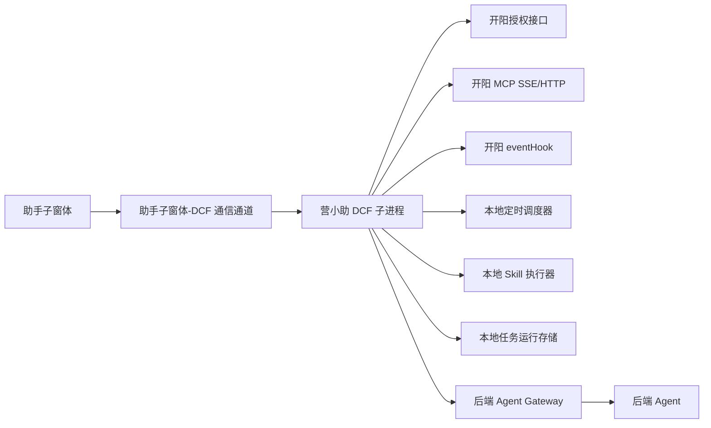
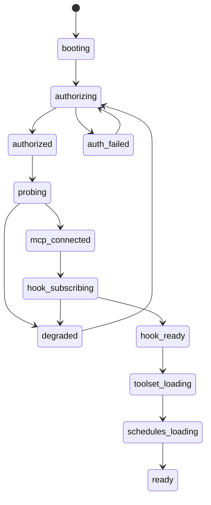
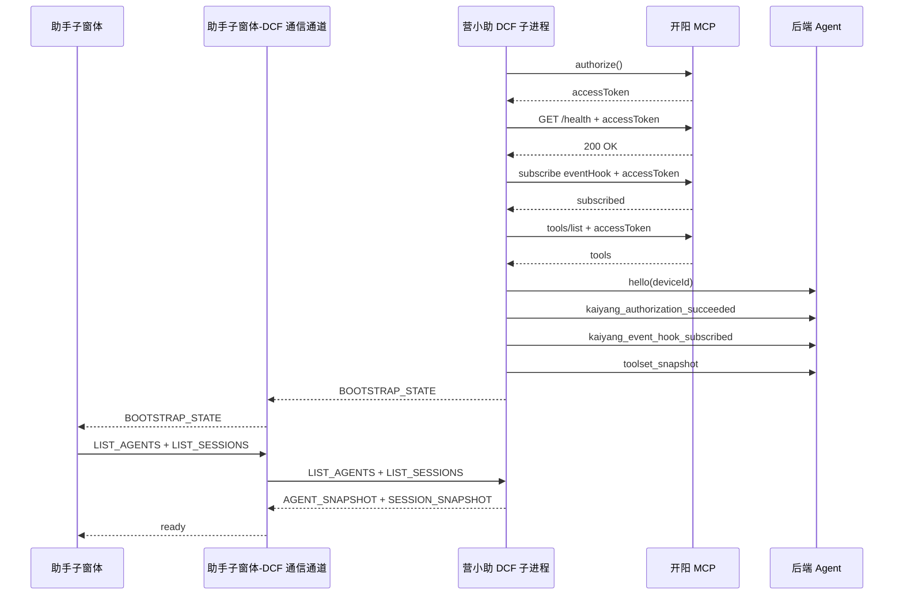
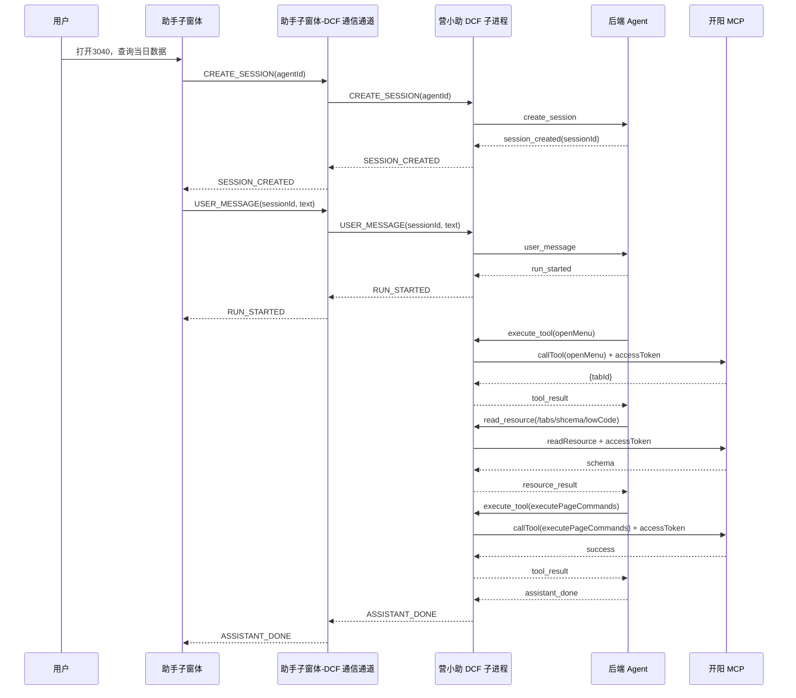
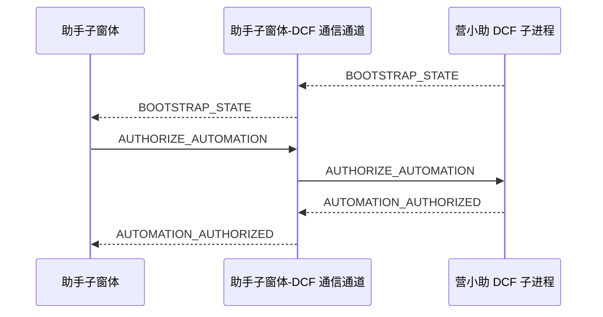
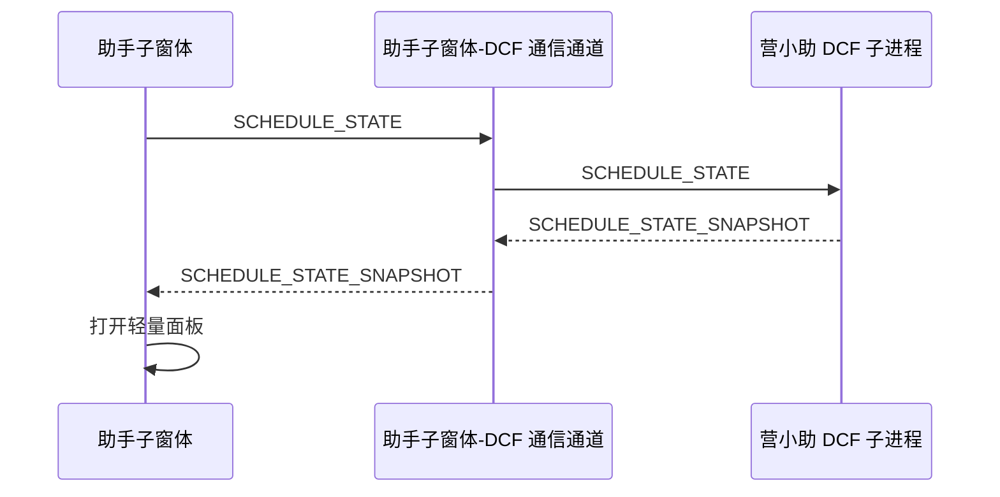
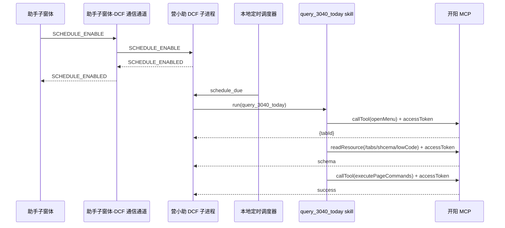

# 营小助助手子窗体与 DCF 子进程正式设计文档

## 1. 文档目的

本文档用于明确营小助助手子窗体与 DCF 子进程的正式设计方案，作为前端实现、DCF 子进程实现、联调和评审的统一依据。

本文档覆盖以下内容：

- 助手子窗体交互与状态管理设计
- DCF 子进程初始化、开阳接入、调度与执行设计
- 助手子窗体与 DCF 子进程的本地通信设计
- DCF 子进程与后端 Agent Gateway 的通信设计
- 关键数据结构、状态模型、异常处理与关键时序

本文档不展开后端 Agent 内部编排实现，仅定义其对外接口与交互边界。

相关文档：

- 总体方案：[agent-chat-architecture.md](C:/dev/projects/work/yxz-agent/docs/agent-chat-architecture.md)
- 详细设计稿：[dcf-frontend-detailed-design.md](C:/dev/projects/work/yxz-agent/docs/dcf-frontend-detailed-design.md)
- 模块拆分：[module-breakdown.md](C:/dev/projects/work/yxz-agent/docs/module-breakdown.md)
- 开发任务清单：[dev-task-list.md](C:/dev/projects/work/yxz-agent/docs/dev-task-list.md)
- 协议定义：[protocol.ts](C:/dev/projects/work/yxz-agent/shared/protocol.ts)

## 2. 设计范围

本次迭代设计范围如下：

- 支持人工对话触发 3040 当日查询
- 支持定时任务触发 3040 当日查询
- 定时任务通过固定入口 `定时任务` 进入轻量面板并执行启用、关闭操作
- 用户首次打开子窗体时需要完成统一自动执行授权，授权成功后按 `cron` 自动执行
- 助手子窗体支持多智能体对象展示与会话绑定
- 点击创建会话时即创建真实会话，`sessionId` 由后端生成
- 助手子窗体与 DCF 子进程通过 `JSBridge` 通信
- DCF 子进程与后端 Agent Gateway 通过 `HTTP + SSE` 通信承接人工对话链路
- DCF 子进程初始化时向开阳授权获取 `accessToken`
- DCF 子进程初始化完成后订阅开阳 `eventHook`
- DCF 子进程通过开阳持久化 API 将定时任务状态保存为本地 JSON

本次迭代不包含以下内容：

- 定时任务列表页
- 定时任务新增、编辑、删除
- 会话删除
- 会话内多 run 历史切换
- 后端 Agent 内部编排细节

## 3. 设计原则

- 助手子窗体只负责展示与用户交互，不直接连接开阳
- 助手子窗体不直接连接后端，所有会话消息和执行事件均通过 DCF 子进程中转
- DCF 子进程负责本地授权、事件订阅、定时调度、skill 执行与本地状态持久化
- 后端 Agent 只负责会话管理、意图编排和工具调用决策，不持有本地开阳连接
- 人工触发与定时触发共享开阳接入能力，但执行编排链路分离
- 本次迭代失败策略统一为“展示失败并停止调用”，不做自动重试

## 4. 总体架构



## 5. 角色与职责

### 5.1 助手子窗体

助手子窗体承担以下职责：

- 展示历史会话摘要、主对话区、步骤区、定时任务入口与智能体列表
- 提供人工对话输入与取消当前运行能力
- 承接定时任务的启用、关闭与授权交互
- 维护前端本地状态并根据 DCF 事件刷新视图

助手子窗体不承担以下职责：

- 不直接调用开阳 MCP
- 不直接连接后端 Agent Gateway
- 不负责本地调度、工具执行和令牌管理

### 5.2 DCF 子进程

DCF 子进程承担以下职责：

- 初始化时向开阳授权并获取 `accessToken`
- 在令牌过期前 5 分钟主动刷新，刷新失败后重新授权
- 订阅开阳 `eventHook`
- 拉取工具集并缓存
- 承接助手子窗体请求并转发至后端
- 承接后端工具调用与资源读取请求并调用开阳
- 执行定时任务的本地调度
- 加载并执行本地 skill，生成页面原子命令并调用开阳
- 通过开阳持久化 API 读写本地 JSON 状态

### 5.3 后端 Agent Gateway

后端对本方案承担以下职责：

- 提供智能体列表、会话列表、会话详情和会话创建接口
- 接收用户消息与取消请求
- 通过 SSE 向 DCF 子进程推送运行事件和工具调用请求
- 接收 DCF 子进程回传的工具结果与资源结果

### 5.4 开阳

开阳承担以下职责：

- 提供授权接口
- 提供 MCP SSE/HTTP 能力
- 提供 `eventHook`
- 提供持久化 API
- 执行 `openMenu`、`executePageCommands` 和资源读取

## 6. 助手子窗体设计

### 6.1 界面结构

助手子窗体由以下区域组成：

- 历史对话栏
  - 展示真实历史会话摘要
  - 显示会话标题、智能体名称、时间和 `running / idle / failed` 状态
- 主对话区
  - 展示当前会话的用户消息和助手消息
- 步骤区
  - 展示当前会话最近一次 run 的步骤
  - 步骤主标题展示业务步骤名
  - 步骤详情展示工具名与入参摘要
- 定时任务入口区
  - 固定入口名称为 `定时任务`
  - 点击后打开轻量面板
- 智能体区
  - 位于左下角
  - 展示智能体列表
  - 用于选择智能体并创建会话

### 6.2 会话模型

会话设计采用“单主对话区 + 历史对话栏”模型：

- 主窗体同一时间仅显示一个当前会话
- 历史对话栏展示其他真实会话摘要
- 用户切换到历史会话时，原当前会话如仍在执行，则继续后台执行，并在历史对话栏中显示 `running`

会话行为约束如下：

- 一会话绑定一个智能体
- 会话创建后不支持切换智能体
- 点击创建会话时即创建真实会话
- 历史会话可重新打开，打开时优先显示本地缓存，同时异步刷新详情

### 6.3 智能体模型

智能体列表由后端接口提供。创建会话时必须先确定智能体。

智能体摘要结构如下：

```ts
type AgentSummary = {
  agentId: string
  agentName: string
  agentType: string
  description?: string
  avatar?: string
  enabled: boolean
}
```

### 6.4 会话与消息模型

会话摘要结构如下：

```ts
type SessionSummary = {
  sessionId: string
  title: string
  createTime: string
  updateTime: string
  agent: AgentSummary
  lastMessagePreview?: string
  lastRunStatus: "idle" | "running" | "failed"
}
```

会话详情结构如下：

```ts
type SessionDetail = {
  sessionId: string
  title: string
  createTime: string
  updateTime: string
  agent: AgentSummary
  messages: ChatMessage[]
  lastRun?: RunDetail
}
```

消息结构如下：

```ts
type ChatMessage = {
  messageId: string
  sessionId: string
  role: "user" | "assistant"
  content: string
  status?: "sending" | "sent" | "failed" | "streaming" | "done" | "cancelled"
  createTime: string
}
```

消息状态规则如下：

- 用户消息使用 `sending / sent / failed`
- 助手消息使用 `streaming / done / failed / cancelled`
- 失败消息重发时新建一条重复消息，原失败消息保留

### 6.5 步骤模型

步骤区仅展示当前会话最近一次 run 的步骤流，不保留更早 run 的切换能力。

运行详情与步骤结构如下：

```ts
type RunDetail = {
  runId: string
  sessionId: string
  status: "running" | "completed" | "failed" | "cancelled"
  steps: RunStepView[]
  createTime: string
  updateTime: string
}

type RunStepView = {
  stepId: string
  runId: string
  title: string
  toolName?: string
  status: "running" | "success" | "failed" | "cancelled"
  input?: Record<string, unknown>
  errorMessage?: string
  startTime?: string
  endTime?: string
}
```

步骤区展示规则如下：

- 列表主标题展示业务步骤名
- 详情展示原始工具名和入参摘要
- 入参保留完整数据，界面默认进行摘要化展示
- 失败步骤展示错误摘要
- 取消时，已完成步骤保持原状态，当前步骤标记为 `cancelled`

### 6.6 定时任务入口设计

本次迭代不提供定时任务列表，仅提供固定入口 `定时任务`。

入口交互如下：

- 点击入口后请求定时任务状态，再打开轻量面板
- 面板展示定时任务名称、当前状态
- 面板提供 `启用`、`关闭` 操作
- 定时任务启用不再单独授权；统一自动执行授权在用户首次打开子窗体时完成

本次不展示以下内容：

- 任务列表
- 最近执行结果
- 下次执行时间
- 失败原因详情

### 6.7 状态管理设计

前端状态管理采用 `React + Zustand`。状态按职责拆分为三个 store。

```ts
type ChatStore = {
  agents: AgentSummary[]
  selectedAgentId?: string
  sessionSummaries: SessionSummary[]
  sessionDetails: Record<string, SessionDetail>
  activeSessionId?: string
}

type RunStore = {
  activeRunId?: string
  runBySessionId: Record<string, RunDetail>
}

type ScheduleStore = {
  automationAuthorization: {
    authorized: boolean
    authorizedAt?: string
  }
  bootstrapState?: {
    dcfStatus: "starting" | "online" | "error"
    kaiyangStatus?: "disconnected" | "connecting" | "connected" | "reconnecting" | "degraded"
    kaiyangAuthorizationStatus?: "authorizing" | "authorized" | "failed"
    kaiyangEventHookStatus?: "subscribing" | "subscribed" | "failed"
    scheduleSubsystemReady: boolean
  }
  schedule?: ScheduleSummary
  panelVisible: boolean
}
```

#### ChatStore 更新规则

- `LIST_AGENTS` 返回后整体覆盖 `agents`
- 用户选择智能体后更新 `selectedAgentId`
- `LIST_SESSIONS` 返回后整体覆盖 `sessionSummaries`
- `SESSION_CREATED` 返回后：
  - 写入 `sessionDetails[sessionId]`
  - 插入或更新 `sessionSummaries`
  - 将 `activeSessionId` 切换到新会话
- `SESSION_DETAIL` 返回后：
  - 覆盖 `sessionDetails[sessionId]`
  - 若当前主会话为该 `sessionId`，立即刷新主视图
  - 同步更新 `sessionSummaries` 对应摘要字段
- 切换历史会话时：
  - 优先读取 `sessionDetails` 中的本地缓存
  - 再异步刷新详情并覆盖缓存

#### RunStore 更新规则

- `RUN_STARTED` 到达后：
  - 创建或覆盖 `runBySessionId[sessionId]`
  - 初始化 `status = running`
  - 初始化 `steps = []`
  - 若当前主会话为该 `sessionId`，同步更新 `activeRunId`
- `STEP_STARTED` 到达后追加步骤
- `STEP_FINISHED` 到达后更新对应步骤状态和结束时间
- `ASSISTANT_DONE` 到达后将 `RunDetail.status` 更新为 `completed`
- `RUN_FAILED` 到达后将 `RunDetail.status` 更新为 `failed`
- `RUN_CANCELLED` 到达后将 `RunDetail.status` 更新为 `cancelled`
- 同一会话收到新的 `RUN_STARTED` 时，直接覆盖旧 run，不保留更早的 run 历史

#### ScheduleStore 更新规则

- `BOOTSTRAP_STATE` 到达后更新 `automationAuthorization` 与 `bootstrapState`
- `AUTOMATION_AUTHORIZED` 到达后更新 `automationAuthorization.authorized = true`
- `SCHEDULE_STATE_SNAPSHOT` 到达后写入 `schedule`
- 点击固定入口 `定时任务` 时设置 `panelVisible = true`
- 关闭轻量面板时设置 `panelVisible = false`
- `SCHEDULE_ENABLED` 到达后：
  - 更新 `schedule.enabled = true`
  - 更新 `nextTriggerAt`
- `SCHEDULE_DISABLED` 到达后：
  - 更新 `schedule.enabled = false`
  - 清空 `nextTriggerAt`

### 6.8 助手子窗体模块划分

```text
frontend/
  app/
    bootstrap.ts
    router.ts
  modules/
    history-session-list/
    agent-list/
    chat-message-panel/
    run-step-panel/
    schedule-entry/
    schedule-panel/
    automation-authorization-modal/
  stores/
    chat.store.ts
    run.store.ts
    schedule.store.ts
  services/
    assistant-window-channel-client.ts
    event-dispatcher.ts
  shared/
    event-mappers.ts
    formatters.ts
```

### 6.9 本地通信封装

助手子窗体与 DCF 子进程通过 `JSBridge` 通信，调用方式如下：

- 监听：`window.BridgeJs.listen(channel, listener)`
- 发送：`window.BridgeJs.sendToWindow(windowId, channel, data)`
- `windowId` 通过 `window.getWinidsMap()` 获取
- `listener` 入参为 `message: { data: string[] }`
- 业务消息从 `message.data[0]` 中读取并反序列化

建议封装接口如下：

```ts
interface AssistantWindowChannelClient {
  bindEvents(listener: (event: DcfToFrontendEvent) => void): void
  authorizeAutomation(): void
  requestAgentList(): void
  requestSessionList(): void
  requestSessionDetail(sessionId: string): void
  createSession(agentId: string): void
  sendUserMessage(sessionId: string, text: string): void
  cancelRun(sessionId: string, runId: string): void
  requestScheduleState(): void
  enableSchedule(scheduleId: string): void
  disableSchedule(scheduleId: string): void
}
```

封装原则如下：

- 组件层不直接调用 `window.BridgeJs`
- `assistant-window-channel-client.ts` 负责序列化、反序列化和 `windowId` 缓存
- `event-dispatcher.ts` 负责按 `type` 将事件更新到各 store
- `event-dispatcher.ts` 不负责 DOM 操作、弹窗控制和文案格式化
- 助手子窗体与 DCF 的通信事件名统一使用全大写、下划线分隔，例如 `LIST_AGENTS`、`SESSION_CREATED`、`SCHEDULE_ENABLED`

## 7. DCF 子进程设计

### 7.1 模块划分

```text
dcf-subprocess/
  runtime/
    bootstrap.ts
    config-loader.ts
    runtime-state.ts
  kaiyang/
    auth-manager.ts
    kaiyang-client.ts
    healthcheck.ts
    toolset-cache.ts
    event-hook-subscriber.ts
    event-hook-normalizer.ts
  scheduler/
    scheduler-manager.ts
    schedule-loader.ts
    schedule-runtime-store.ts
    schedule-run-record-store.ts
    schedule-skill-registry.ts
    schedule-skill-runner.ts
  gateway/
    backend-gateway-client.ts
  channel/
    frontend-channel-server.ts
    frontend-event-publisher.ts
    frontend-event-handler-registry.ts
  execution/
    tool-executor.ts
    resource-reader.ts
    run-guard.ts
```

### 7.2 启动状态机



约束如下：

- `accessToken` 未获取前不得进入真实开阳调用阶段
- `eventHook` 未订阅成功前不得进入完整 `ready`
- 进入 `degraded` 状态时，禁止继续高风险执行

### 7.3 开阳授权与令牌管理

`auth-manager` 负责：

- 启动授权
- 缓存当前 `accessToken`
- 记录过期时间
- 过期前 5 分钟主动刷新
- 在 401 或刷新失败后重新授权
- 对外提供统一授权能力

建议接口如下：

```ts
interface AuthManager {
  authorize(): Promise<{ accessToken: string; expiresAt?: string }>
  refresh(): Promise<{ accessToken: string; expiresAt?: string }>
  getAccessToken(): string | undefined
  ensureAuthorized(): Promise<string>
  invalidate(reason: string): void
}
```

实现要求如下：

- `accessToken` 仅保存在 DCF 内存，不落日志
- 所有开阳调用统一经过 `kaiyang-client`
- 刷新与重新授权期间暂停新请求
- 若刷新和重新授权均失败，则当前调用链失败并停止

### 7.4 eventHook 订阅与处理

`event-hook-subscriber` 负责：

- 初始化订阅
- 断线重订阅
- 心跳检测
- 原始事件接收

`event-hook-normalizer` 负责：

- 将原始事件转换为内部标准事件
- 分发给 `runtime-state`、`toolset-cache`、`frontend-event-publisher`、`backend-gateway-client`

本次至少消费以下事件类别：

- 授权状态变化
- 页面或页签状态变化
- 工具集变化
- 执行辅助提示事件

说明：

- `openMenu` 的打开完成以工具返回结果为准，不依赖 `eventHook`
- 收到工具集变更事件后，DCF 应主动重新拉取 `tools/list`

### 7.5 本地定时调度器

定时调度器设计基于 `cron-parser`，采用“一次触发、一次重算”的模式。

#### 任务定义与运行时状态

```ts
type ScheduleDefinition = {
  scheduleId: string
  name: string
  cronExpression: string
  timezone: string
  skillId: string
}

type ScheduleRuntimeState = {
  scheduleId: string
  enabled: boolean
  nextTriggerAt?: string
  lastTriggeredAt?: string
  lastCompletedAt?: string
  lastStatus?: "idle" | "enabled" | "running" | "completed" | "failed" | "disabled"
  lastRunId?: string
  lastError?: {
    code: string
    message: string
  }
}
```

#### 调度职责

`scheduler-manager` 负责：

- 读取 `cronExpression` 与 `timezone`
- 计算 `nextTriggerAt`
- 为已启用任务注册 `setTimeout`
- 到点后触发本地 `schedule-skill-runner`
- 触发后重新计算下一次触发时间

#### 恢复逻辑

DCF 启动后恢复流程如下：

1. 读取内置任务定义
2. 读取统一自动执行授权状态
3. 读取持久化运行时 JSON
4. 合并任务视图
5. 过滤 `enabled = true` 且统一自动执行已授权的任务
6. 重新注册调度
7. 将新的 `nextTriggerAt` 写回本地状态

#### 调度规则

- 仅已启用且统一自动执行已授权任务进入调度
- 关闭任务时注销调度
- 执行失败仅记录失败结果，不自动重试
- DCF 重启后保留启用状态

### 7.6 本地存储

本次本地存储仅保存：

- 内置定时任务定义加载结果
- 统一自动执行授权状态
- 定时任务启用状态
- 定时任务最近执行状态

存储方式如下：

- 通过开阳持久化 API 读写本地 JSON
- 状态变化后立即写入

不持久化以下内容：

- `accessToken`
- 开阳敏感响应明文

## 8. 通信设计

### 8.1 助手子窗体与 DCF 子进程

DCF 对助手子窗体提供以下能力：

- 请求响应
  - `BOOTSTRAP_STATE`
  - `LIST_AGENTS -> AGENT_SNAPSHOT`
  - `LIST_SESSIONS -> SESSION_SNAPSHOT`
  - `GET_SESSION_DETAIL -> SESSION_DETAIL`
  - `SCHEDULE_STATE -> SCHEDULE_STATE_SNAPSHOT`
- 会话上行
  - `AUTHORIZE_AUTOMATION`
  - `CREATE_SESSION`
  - `USER_MESSAGE`
  - `CANCEL_RUN`
- 主动推送
  - `AUTOMATION_AUTHORIZED`
  - `SESSION_CREATED`
  - `RUN_STARTED`
  - `STEP_STARTED`
  - `STEP_FINISHED`
  - `ASSISTANT_DELTA`
  - `ASSISTANT_DONE`
  - `RUN_FAILED`
  - `RUN_CANCELLED`
  - `SCHEDULE_ENABLED`
  - `SCHEDULE_DISABLED`

DCF 侧事件处理约束如下：

- `frontend-channel-server.ts` 只负责接收、反序列化和分发事件，不直接处理业务逻辑
- DCF 入站事件处理函数统一使用装饰器风格注册，不使用大 `switch(type)` 分发
- 推荐由 `frontend-event-handler-registry.ts` 在启动时扫描并注册 handler
- handler 方法只处理单一事件类型，并接收已经过类型收窄的事件对象

建议风格如下：

```ts
function FrontendEventHandler<TType extends FrontendToDcfEvent["type"]>(type: TType) {
  return function (
    _target: object,
    _propertyKey: string,
    _descriptor: TypedPropertyDescriptor<(event: Extract<FrontendToDcfEvent, { type: TType }>) => Promise<void> | void>
  ) {}
}

class FrontendEventController {
  @FrontendEventHandler("LIST_AGENTS")
  async handleListAgents(event: Extract<FrontendToDcfEvent, { type: "LIST_AGENTS" }>) {}

  @FrontendEventHandler("CREATE_SESSION")
  async handleCreateSession(event: Extract<FrontendToDcfEvent, { type: "CREATE_SESSION" }>) {}
}
```

### 8.2 DCF 子进程与后端

通信方式如下：

- 上行使用 `HTTP`
- 下行使用单一 `SSE` 事件流

DCF -> 后端：

- `POST /agent/sessions`
- `GET /agent/sessions`
- `GET /agent/sessions/{sessionId}`
- `POST /agent/sessions/{sessionId}/messages`
- `POST /agent/runs/{runId}/cancel`
- `POST /agent/tool-results`

DCF 初始化与状态上报：

- `hello`
- `kaiyang_authorization_succeeded`
- `kaiyang_authorization_failed`
- `kaiyang_event_hook_subscribed`
- `kaiyang_event_hook_subscription_failed`
- `toolset_snapshot`

后端 -> DCF 的 SSE 事件：

- `run_started`
- `step_started`
- `step_finished`
- `assistant_delta`
- `assistant_done`
- `run_failed`
- `run_cancelled`
- `execute_tool`
- `read_resource`

SSE 约定如下：

- 单一事件流通道
- SSE `event` 固定为 `message`
- 业务类型通过 `data.type` 区分
- DCF 侧消费后端 SSE 时同样采用装饰器风格注册 handler，不使用大 `switch(type)`

示例：

```text
event: message
data: {"type":"run_started","sessionId":"sess-1001","runId":"run-2001","status":"running"}
```

## 9. 关键时序

### 9.1 初始化



### 9.2 人工对话触发



### 9.3 统一自动执行授权



### 9.4 打开定时任务弹窗并获取状态



### 9.5 定时任务启用与触发



## 10. 异常处理

助手子窗体至少覆盖以下异常：

- `create_session` 失败
- `user_message` 失败
- 历史会话详情刷新失败
- 运行执行失败
- 运行取消
- 定时任务执行失败仅记录本地状态，不在本次界面中展示详情

界面处理要求如下：

- 失败步骤保留在步骤区
- 用户消息需体现 `sending / sent / failed`
- 助手消息需体现 `streaming / done / failed / cancelled`
- 当前会话运行中不得继续发送新消息，仅允许取消当前 run
- 定时任务轻量面板仅展示当前定时任务状态，不展示任务列表
- 启动阶段与定时任务相关异常仅展示用户友好的提示文案，不展示底层技术错误详情
- 具体错误原因通过埋点与后台日志查看，前端不直接展示 `errorCode`、原始异常信息或技术阶段名

用户提示原则如下：

- 优先告诉用户“当前是否可继续操作”
- 优先使用“请稍后重试”“本地能力暂时不可用”这类产品化表述
- 不暴露 `eventHook`、授权刷新、调度恢复等内部实现名词

DCF 初始化异常要求如下：

- DCF 初始化失败必须记录埋点
- 埋点至少覆盖授权失败、健康检查失败、`eventHook` 订阅失败、工具集加载失败、调度子系统恢复失败
- 埋点用于后台诊断，不直接暴露给用户

## 11. 开发顺序建议

建议按以下顺序推进：

1. 完成共享协议定义对齐
2. 完成助手子窗体骨架与 `JSBridge` 封装
3. 完成智能体列表、历史会话摘要和会话详情加载
4. 完成 DCF 启动状态机、开阳授权、令牌刷新和 `eventHook` 订阅
5. 完成 DCF 与后端 `HTTP + SSE` 通信
6. 完成定时任务本地 JSON 持久化与 `cron-parser` 调度
7. 完成助手子窗体 `定时任务` 固定入口、轻量面板和统一自动执行授权弹窗
8. 完成人工对话消息流与步骤流展示
9. 联调 3040 人工触发链路
10. 联调 3040 定时任务启用与自动执行链路
