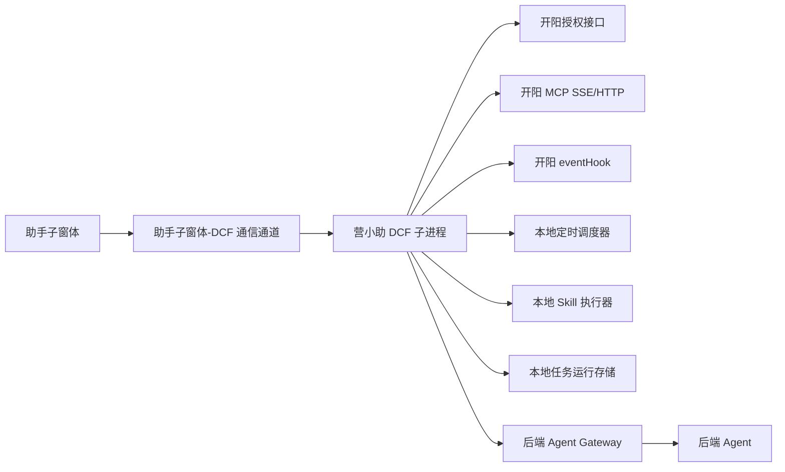
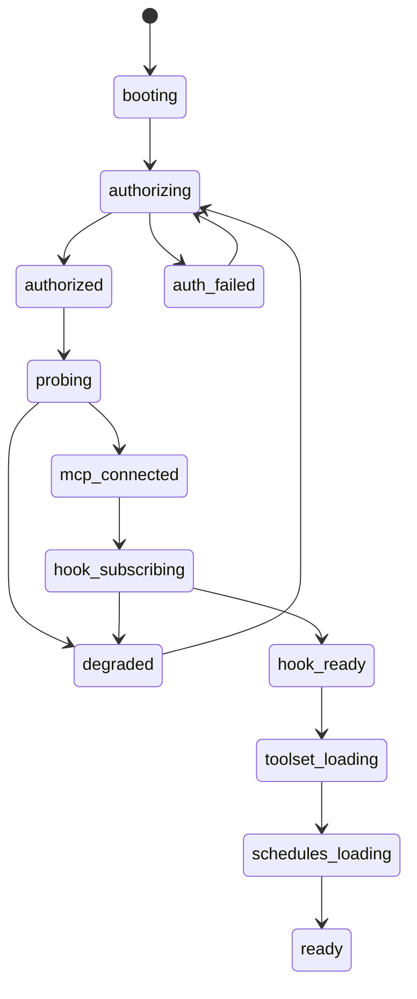
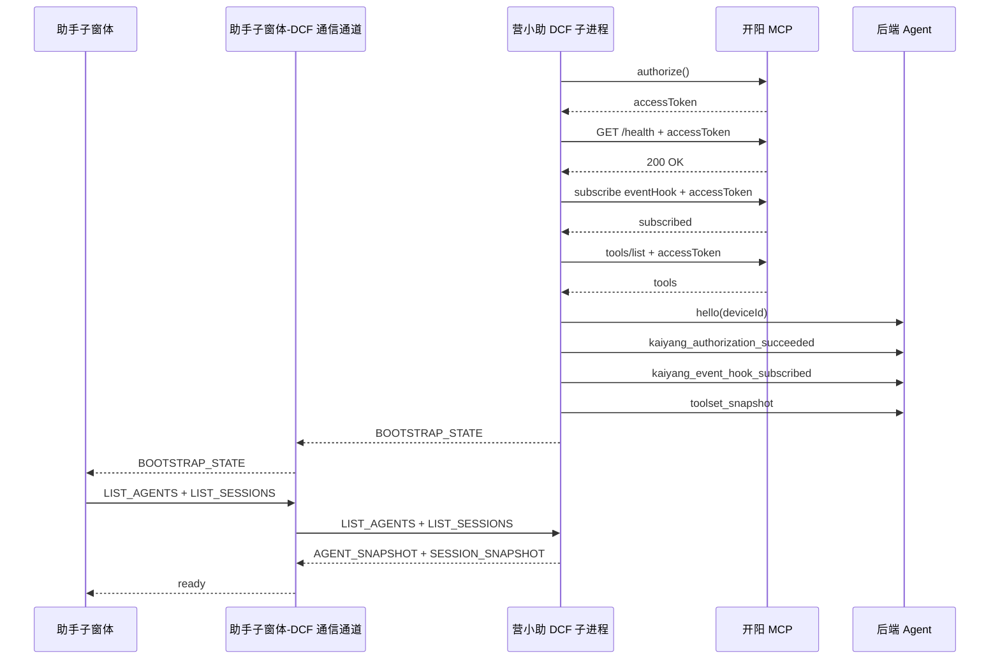
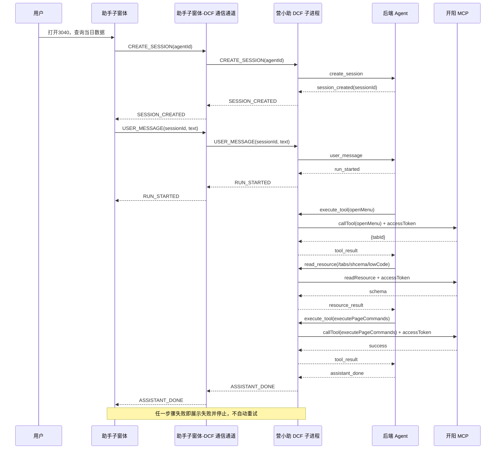
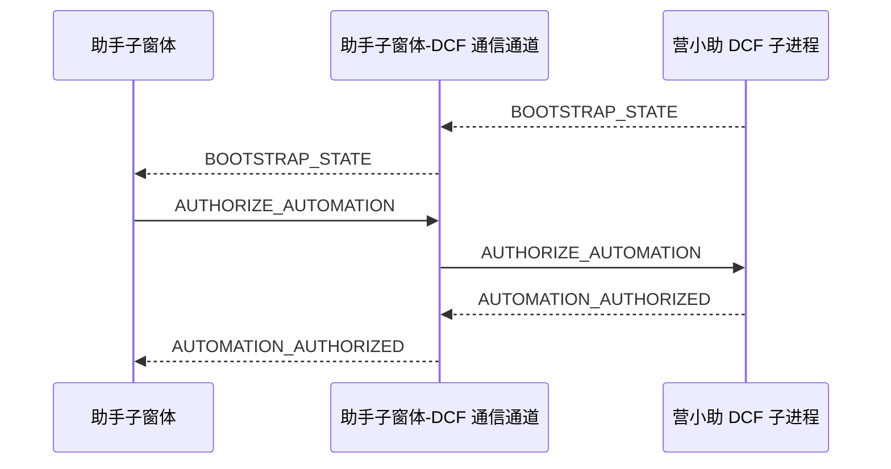
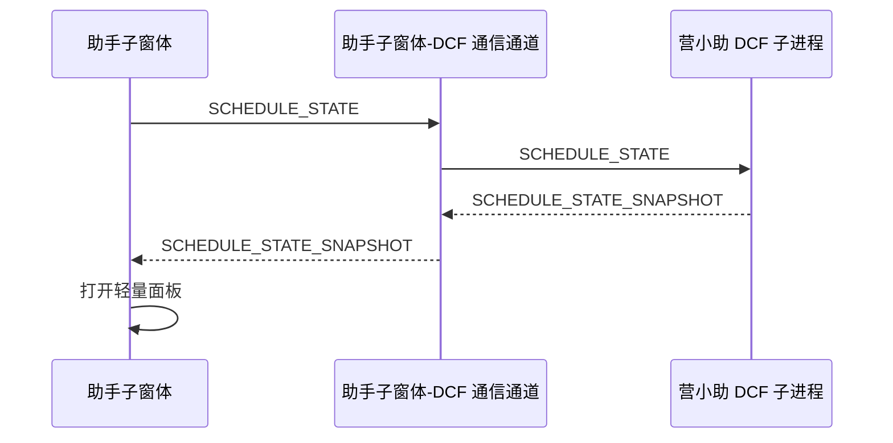
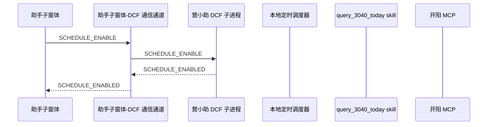
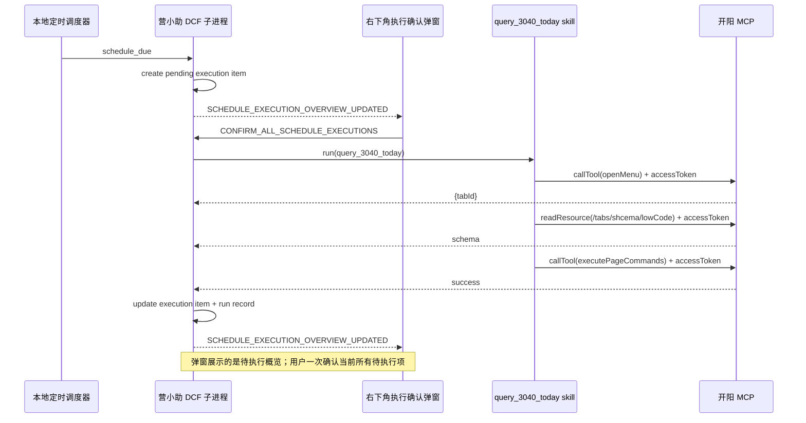

# 营小助 DCF 子进程与助手子窗体详细设计

## 一、范围

本文档用于指导以下两部分的开发：

- 助手子窗体
- 营小助 DCF 子进程

后端部分不展开内部实现，仅保留：

- 与助手子窗体的会话通信协议
- 与 DCF 子进程的通信协议
- 关键时序图中的交互角色

总方案见：[agent-chat-architecture.md](C:/dev/projects/work/yxz-agent/docs/agent-chat-architecture.md)

## 二、实现边界

本次迭代边界如下：

- 支持人工对话触发 3040 当日查询
- 支持定时任务触发 3040 当日查询
- 定时任务启用时需在助手子窗体中弹出授权提示，用户确认后方可进入自动执行
- 助手子窗体支持通过固定入口“定时任务”启用和关闭当前预置的定时任务，不支持任务列表、新增和编辑
- 助手子窗体主窗体同一时间只显示 1 个当前对话，其他真实会话显示在历史对话栏
- 助手子窗体左下角展示智能体列表，用于发起新会话
- 一会话绑定一个智能体，会话创建后不支持切换智能体
- 点击创建会话时即创建真实会话，`sessionId` 由后端接口生成
- 助手子窗体技术栈采用 `React + Zustand`
- 助手子窗体与 DCF 子进程通过 `JSBridge` 通信
- DCF 子进程与后端 Agent Gateway 采用 `HTTP + SSE` 承接人工对话链路
- DCF 子进程初始化时必须先向开阳授权，获取 `accessToken`
- `accessToken` 过期前需主动刷新，过期后需调用刷新接口恢复
- DCF 子进程初始化完成后必须订阅开阳 `eventHook`
- 定时任务定义与运行状态通过开阳提供的持久化 API 以本地 JSON 形式保存
- 定时任务启用状态在 DCF 重启后需要保留
- 人工对话会话与定时任务执行记录分开展示，不合并为同一会话流
- 助手子窗体启动时并行加载智能体列表、历史会话摘要列表和定时任务状态，且不自动打开最近会话
- 3040 场景中的“查询当日数据”包含“填写日期并点击查询”
- 本次迭代失败策略为“展示失败并停止调用”，不做自动重试
- 定时任务到点后由独立右下角弹窗提示用户确认执行
- 独立右下角弹窗支持一次确认多条待执行定时任务

## 三、总体设计



关键原则：

- 助手子窗体负责展示和用户交互，不直接调用开阳
- 助手子窗体不直接连接后端，所有会话消息和执行事件统一经 DCF 中转
- 助手子窗体与 DCF 的所有请求和事件统一经 `JSBridge` 收发
- DCF 子进程负责本地授权、事件订阅、任务调度和 skill 执行
- DCF 与后端之间使用 `HTTP` 发送请求，使用 `SSE` 接收流式事件
- 后端只负责编排，不持有本地开阳连接
- 人工触发和定时触发共享开阳接入能力，但执行编排链路分离

## 四、助手子窗体详细设计

### 4.1 页面信息架构

建议对话界面分为 5 个区域：

- 历史对话栏
  - 历史会话摘要列表
  - 会话标题
  - 智能体名称
  - `running / idle / failed` 状态
- 消息区
  - 用户消息
  - 助手消息
  - 流式回复
- 步骤区
  - 最近一次 run 的步骤
  - 步骤标题、状态、时间、入参摘要
- 定时任务入口区
  - 固定入口“定时任务”
  - 轻量面板
  - 定时任务名称
  - 当前状态
  - 启用/关闭按钮
- 独立执行确认弹窗
  - 位于右下角
  - 展示当前待确认执行概览
  - 支持一次确认多条待执行任务
- 智能体区
  - 位于左下角
  - 展示智能体列表
  - 用于发起新会话

定时任务授权采用弹窗或固定浮层，不建议埋在普通消息流中。

### 4.2 助手子窗体状态模型

助手子窗体建议至少拆成 3 个 store。

```ts
type ChatStore = {
  agents: AgentSummary[]
  sessionSummaries: SessionSummary[]
  sessionDetails: Record<string, SessionDetail>
  activeSessionId?: string
  selectedAgentId?: string
}

type RunStore = {
  activeRunId?: string
  runBySessionId: Record<string, RunDetail>
}

type ScheduleStore = {
  automationAuthorization: {
    authorized: boolean
    authorizedAt?: string
  }
  bootstrapState?: {
    dcfStatus: "starting" | "online" | "error"
    kaiyangStatus?: "disconnected" | "connecting" | "connected" | "reconnecting" | "degraded"
    kaiyangAuthorizationStatus?: "authorizing" | "authorized" | "failed"
    kaiyangEventHookStatus?: "subscribing" | "subscribed" | "failed"
    scheduleSubsystemReady: boolean
  }
  schedule?: ScheduleSummary
  panelVisible: boolean
}
```

状态拆分原则：

- 定时任务与统一自动执行授权提示分离
- 流式消息和步骤流分离
- 人工会话与定时任务执行结果分离
- 历史会话摘要与当前会话详情分离
- 定时任务仅维护当前任务状态和轻量面板状态

建议的核心结构如下：

```ts
type AgentSummary = {
  agentId: string
  agentName: string
  agentType: string
  description?: string
  avatar?: string
  enabled: boolean
}

type SessionSummary = {
  sessionId: string
  title: string
  createTime: string
  updateTime: string
  agent: AgentSummary
  lastMessagePreview?: string
  lastRunStatus: "idle" | "running" | "failed"
}

type ChatMessage = {
  messageId: string
  sessionId: string
  role: "user" | "assistant"
  content: string
  status?: "sending" | "sent" | "failed" | "streaming" | "done" | "cancelled"
  createTime: string
}

type RunStepView = {
  stepId: string
  runId: string
  title: string
  toolName?: string
  status: "running" | "success" | "failed" | "cancelled"
  input?: Record<string, unknown>
  errorMessage?: string
  startTime?: string
  endTime?: string
}

type RunDetail = {
  runId: string
  sessionId: string
  status: "running" | "completed" | "failed" | "cancelled"
  steps: RunStepView[]
  createTime: string
  updateTime: string
}

type SessionDetail = {
  sessionId: string
  title: string
  createTime: string
  updateTime: string
  agent: AgentSummary
  messages: ChatMessage[]
  lastRun?: RunDetail
}
```

store 更新规则建议如下：

- `chat.store`
  - 收到 `LIST_AGENTS` 后整体覆盖 `agents`
  - 用户选择智能体后更新 `selectedAgentId`
  - 收到 `LIST_SESSIONS` 后整体覆盖 `sessionSummaries`
  - 收到 `SESSION_CREATED` 后：
    - 写入 `sessionDetails[sessionId]`
    - 插入或更新 `sessionSummaries`
    - 将 `activeSessionId` 切换到新会话
  - 收到 `SESSION_DETAIL` 后：
    - 覆盖 `sessionDetails[sessionId]`
    - 若当前会话为该 `sessionId`，立即刷新主窗体
    - 同步更新 `sessionSummaries` 中对应摘要字段
  - 切换历史会话时：
    - 优先从 `sessionDetails` 读取本地缓存
    - 再异步刷新详情并覆盖缓存

- `run.store`
  - 收到 `RUN_STARTED` 后：
    - 以 `sessionId` 创建或覆盖 `runBySessionId[sessionId]`
    - `status = running`
    - `steps = []`
    - 若当前主窗体会话为该 `sessionId`，同步更新 `activeRunId`
  - 收到 `STEP_STARTED` 后，向对应 `RunDetail.steps` 追加步骤
  - 收到 `STEP_FINISHED` 后，更新对应步骤的 `status`、`errorMessage`、`endTime`
  - 收到 `ASSISTANT_DONE` 后，将对应 `RunDetail.status` 更新为 `completed`
  - 收到 `RUN_FAILED` 后，将对应 `RunDetail.status` 更新为 `failed`
  - 收到 `RUN_CANCELLED` 后，将对应 `RunDetail.status` 更新为 `cancelled`
  - 收到新的 `RUN_STARTED` 后，直接覆盖该会话旧的 `RunDetail`，不保留更早的 run 历史

- `schedule.store`
  - 收到 `BOOTSTRAP_STATE` 后，更新 `automationAuthorization` 与 `bootstrapState`
  - 收到 `AUTOMATION_AUTHORIZED` 后，更新 `automationAuthorization.authorized = true`
  - 收到 `SCHEDULE_STATE_SNAPSHOT` 后，写入 `schedule`
  - 点击固定入口“定时任务”后，`panelVisible = true`
  - 关闭轻量面板后，`panelVisible = false`
  - 收到 `SCHEDULE_ENABLED` 后：
    - 更新 `schedule.enabled = true`
    - 更新 `nextTriggerAt`
  - 收到 `SCHEDULE_DISABLED` 后：
    - 更新 `schedule.enabled = false`
    - 清空 `nextTriggerAt`

技术实现建议：

- 使用 `React` 组织界面模块
- 使用 `Zustand` 管理 `chat.store`、`run.store`、`schedule.store`
- 不在组件内直接处理 `JSBridge` 原始事件，统一通过 `event-dispatcher` 分发
- `JSBridge` 在项目中的调用形式统一为 `window.BridgeJs.xx`

### 4.3 助手子窗体模块拆分

建议模块如下：

```text
frontend/
  app/
    bootstrap.ts
    router.ts
  modules/
    history-session-list/
    agent-list/
    chat-message-panel/
    run-step-panel/
    schedule-entry/
    schedule-panel/
    automation-authorization-modal/
  stores/
    chat.store.ts
    run.store.ts
    schedule.store.ts
  services/
    assistant-window-channel-client.ts
    event-dispatcher.ts
  shared/
    event-mappers.ts
    formatters.ts
```

模块职责：

- `chat-message-panel`
  - 输入消息
  - 展示用户消息和助手消息
- `history-session-list`
  - 展示历史会话摘要
  - 支持切换历史会话
- `agent-list`
  - 展示左下角智能体列表
  - 用于创建新会话
- `run-step-panel`
  - 展示 `step_started`、`step_finished`
- `schedule-entry`
  - 展示固定入口“定时任务”
  - 打开轻量面板
- `schedule-panel`
  - 展示定时任务名称和当前状态
  - 提供启用和关闭操作
- `automation-authorization-modal`
  - 接收统一自动执行授权状态
  - 调用 `authorizeAutomation`

`assistant-window-channel-client` 建议封装如下：

- 监听 DCF 事件：`window.BridgeJs.listen`
- 向 DCF 发送消息：`window.BridgeJs.sendToWindow`
- 对外屏蔽 `BridgeJs` 原始调用细节，仅暴露领域方法，例如：
  - `requestAgentList`
  - `requestSessionList`
  - `requestSessionDetail`
  - `createSession`
  - `sendUserMessage`
  - `cancelRun`
  - `requestScheduleState`
  - `enableSchedule`
  - `disableSchedule`

建议接口风格如下：

```ts
interface AssistantWindowChannelClient {
  bindEvents(listener: (event: DcfToFrontendEvent) => void): void
  authorizeAutomation(): void
  requestAgentList(): void
  requestSessionList(): void
  requestSessionDetail(sessionId: string): void
  createSession(agentId: string): void
  sendUserMessage(sessionId: string, text: string): void
  cancelRun(sessionId: string, runId: string): void
  requestScheduleState(): void
  enableSchedule(scheduleId: string): void
  disableSchedule(scheduleId: string): void
}
```

### 4.4 助手子窗体启动流程

助手子窗体启动时执行以下动作：

1. 初始化 `JSBridge` 通道
2. 建立助手子窗体-DCF 通信事件监听
3. 接收 DCF 主动推送的 `BOOTSTRAP_STATE`
4. 根据 `BOOTSTRAP_STATE` 判断是否展示统一自动执行授权弹窗
5. 并行向 DCF 请求 `LIST_AGENTS`、`LIST_SESSIONS`
6. 将返回结果写入 `chat.store`
7. 初始化主窗体空态，不自动打开最近会话

建议实现：

- 在 `bootstrap.ts` 中通过 `window.getWinidsMap()` 获取 DCF 对应 `windowId`
- 在 `bootstrap.ts` 中完成一次性 `window.BridgeJs.listen(channel, listener)` 注册
- 在 `assistant-window-channel-client.ts` 中封装 `window.BridgeJs.sendToWindow(windowId, channel, data)`
- `event-dispatcher.ts` 只消费标准事件对象，不直接依赖全局 `window`
- `event-dispatcher.ts` 只负责根据 `type` 更新 `chat.store`、`run.store`、`schedule.store`
- `event-dispatcher.ts` 不负责 DOM 操作、弹窗控制和文案格式化
- 助手子窗体与 DCF 的通信事件名统一使用全大写、下划线分隔，例如 `LIST_AGENTS`、`RUN_STARTED`、`SCHEDULE_ENABLED`
- `BOOTSTRAP_STATE` 只返回统一自动执行授权状态与 DCF 就绪状态，不返回定时任务详情

### 4.5 助手子窗体关键交互

人工对话触发：

1. 用户在左下角选择智能体并点击创建会话
2. 助手子窗体向 DCF 发送 `CREATE_SESSION`
3. DCF 通过 HTTP 转发给后端，后端返回 `sessionId`
4. 助手子窗体切换到新会话
5. 用户输入消息并点击发送
6. 助手子窗体向 DCF 发送 `USER_MESSAGE`
7. DCF 将请求转发给后端
8. DCF 接收后端返回的 `run_started`、`step_started`、`assistant_delta` 后，将其映射为 `RUN_STARTED`、`STEP_STARTED`、`ASSISTANT_DELTA` 再转发给助手子窗体
9. 助手子窗体更新消息区和步骤区
10. 若任一步骤失败，则展示失败信息并停止后续调用

历史会话切换：

1. 用户点击历史对话栏中的某个会话
2. 助手子窗体优先显示本地缓存的会话详情
3. 同时向 DCF 发送 `GET_SESSION_DETAIL`
4. DCF 通过 HTTP 转发给后端获取最新详情
5. 返回后覆盖当前主窗体视图
6. 若原主窗体会话仍在运行，则其摘要在历史对话栏中显示 `running`

统一自动执行授权：

1. DCF 在子窗体启动后主动推送 `BOOTSTRAP_STATE`
2. 若 DCF 已就绪且 `automationAuthorization.authorized = false`，子窗体展示统一自动执行授权弹窗
3. 用户点击“确定”
4. 助手子窗体向 DCF 发送 `AUTHORIZE_AUTOMATION`
5. DCF 持久化全局授权状态
6. DCF 返回 `AUTOMATION_AUTHORIZED`

打开定时任务面板：

1. 用户点击固定入口“定时任务”
2. 助手子窗体先向 DCF 发送 `SCHEDULE_STATE`
3. DCF 返回 `SCHEDULE_STATE_SNAPSHOT`
4. 助手子窗体基于返回结果打开轻量面板

定时任务启用：

1. 用户点击固定入口“定时任务”
2. 助手子窗体打开轻量面板，展示定时任务信息
3. 用户点击“启用”
4. 助手子窗体向 DCF 发送 `SCHEDULE_ENABLE`
5. DCF 校验统一自动执行已授权
6. DCF 返回 `SCHEDULE_ENABLED`
7. 助手子窗体更新视图

定时任务关闭：

1. 用户点击固定入口“定时任务”
2. 助手子窗体打开轻量面板
3. 用户点击“关闭”
4. 助手子窗体向 DCF 发送 `SCHEDULE_DISABLE`
5. DCF 取消调度并清除授权状态
6. DCF 返回 `SCHEDULE_DISABLED`

建议的通信封装示例：

```ts
type DcfEventHandler = (event: DcfToFrontendEvent) => void

export function bindDcfEvents(handler: DcfEventHandler) {
  window.BridgeJs.listen("assistant_window", (message: { data: string[] }) => {
    const raw = message?.data?.[0]
    if (!raw) return
    handler(JSON.parse(raw) as DcfToFrontendEvent)
  })
}

export function sendToDcf(dcfWindowId: string, event: FrontendToDcfEvent) {
  window.BridgeJs.sendToWindow(
    dcfWindowId,
    "assistant_window",
    JSON.stringify(event)
  )
}
```

### 4.6 助手子窗体异常态

助手子窗体至少要覆盖以下异常态：

- 运行执行失败
- 定时任务执行失败仅记录本地状态，不在本次界面中展示详情
- `create_session` 失败
- `user_message` 失败
- 历史会话详情刷新失败

界面要求：

- 失败步骤需要保留在步骤区
- 用户消息需体现 `sending / sent / failed`
- 助手消息需体现 `streaming / done / failed / cancelled`
- 定时任务轻量面板仅展示当前定时任务信息，不展示任务列表
- 启动阶段与定时任务相关异常仅展示友好提示，不展示底层技术错误细节
- 技术错误详情通过埋点和后台日志查看，前端不直接展示原始异常信息

建议文案方向：

- `本地能力正在初始化，请稍候。`
- `当前本地能力暂时不可用，请稍后重试。`
- `请先确认自动执行授权，之后才能启用定时任务。`
- `暂时无法获取定时任务状态，请稍后再试。`

埋点要求：

- DCF 初始化状态异常必须记录埋点
- 埋点需覆盖授权、健康检查、`eventHook`、工具集加载、调度恢复等关键阶段
- 埋点用于后台排查，不直接回传给用户界面

## 五、DCF 子进程详细设计

### 5.1 模块拆分

```text
dcf-subprocess/
  runtime/
    bootstrap.ts
    config-loader.ts
    runtime-state.ts
  kaiyang/
    auth-manager.ts
    kaiyang-client.ts
    healthcheck.ts
    toolset-cache.ts
    event-hook-subscriber.ts
    event-hook-normalizer.ts
  scheduler/
    scheduler-manager.ts
    schedule-loader.ts
    schedule-runtime-store.ts
    schedule-run-record-store.ts
    schedule-pending-execution-store.ts
    schedule-skill-registry.ts
    schedule-skill-runner.ts
  gateway/
    backend-gateway-client.ts
  channel/
    frontend-channel-server.ts
    frontend-event-publisher.ts
    frontend-event-handler-registry.ts
    popup-channel-server.ts
    popup-event-publisher.ts
    popup-event-handler-registry.ts
  execution/
    tool-executor.ts
    resource-reader.ts
    run-guard.ts
```

### 5.2 DCF 启动状态机



状态要求：

- `accessToken` 未获取前，禁止进入真正的开阳调用阶段
- `eventHook` 未订阅成功时，DCF 不应进入完整 `ready`
- `degraded` 状态允许助手子窗体看到异常，但不允许执行高风险动作

### 5.3 开阳授权与 token 管理

`auth-manager` 负责：

- 启动授权
- 缓存当前 `accessToken`
- 记录过期时间
- 在过期前调用刷新接口主动刷新
- 在 401 或刷新失败时重新发起授权
- 对外暴露统一的 `withAuthorizedClient()` 能力

实现要求：

- `accessToken` 仅保存在 DCF 内存，不落日志
- 所有开阳请求统一经过 `kaiyang-client`
- 若运行中刷新或重新授权，应暂停新请求并等待恢复
- 刷新失败时返回结构化错误，并停止当前调用链

建议接口：

```ts
interface AuthManager {
  authorize(): Promise<{ accessToken: string; expiresAt?: string }>
  refresh(): Promise<{ accessToken: string; expiresAt?: string }>
  getAccessToken(): string | undefined
  ensureAuthorized(): Promise<string>
  invalidate(reason: string): void
}
```

### 5.4 eventHook 订阅与事件分发

`event-hook-subscriber` 负责：

- 初始化订阅
- 断线重订阅
- 心跳检测
- 原始事件接收

`event-hook-normalizer` 负责：

- 将开阳原始事件转为内部标准事件
- 根据事件类别分发给：
  - `runtime-state`
  - `toolset-cache`
  - `frontend-event-publisher`
  - `backend-gateway-client`

本次迭代建议至少消费以下事件类别：

- 授权状态变化
- 页面或页签状态变化
- 工具集变化
- 执行相关提示事件

说明：

- `openMenu` 的“菜单打开完成”以工具返回结果为准，不依赖 `eventHook` 回传
- `eventHook` 主要用于工具集变化、登录态变化和执行辅助提示

若收到工具集变更事件，DCF 应主动重新拉取 `tools/list` 并更新缓存。

### 5.5 本地定时调度器

本次迭代的定时任务为本地内置配置，建议通过开阳提供的持久化 API 保存为本地 JSON。

实现选型：

- 定时表达式解析采用 `cron-parser`
- 调度控制逻辑由 `scheduler-manager` 自行维护
- 不直接依赖“黑盒任务调度框架”管理任务生命周期

调度器职责：

- 加载内置任务
- 使用 `cron-parser` 计算下次触发时间
- 仅对已启用且统一自动执行已授权的任务进行注册
- 到点后创建待确认执行项并更新执行概览
- 在关闭任务时取消注册

核心规则：

- 同一 `scheduleId` 同一时刻只允许一个活动执行过程
- 授权拒绝后任务保持关闭状态
- 关闭任务后需清除授权状态；再次启用必须重新授权
- DCF 重启后需恢复已启用任务的调度状态
- 执行失败后仅记录失败结果并停止，不做自动重试

#### 5.5.1 配置与运行时数据结构

建议拆分为“任务定义”和“运行时状态”两部分。

```ts
type ScheduleDefinition = {
  scheduleId: string
  name: string
  cronExpression: string
  timezone: string
  skillId: string
}

type ScheduleRuntimeState = {
  scheduleId: string
  enabled: boolean
  nextTriggerAt?: string
  lastTriggeredAt?: string
  lastCompletedAt?: string
  lastStatus?: "idle" | "enabled" | "running" | "completed" | "failed" | "disabled"
  lastRunId?: string
  lastError?: {
    code: string
    message: string
  }
}
```

说明：

- `ScheduleDefinition` 来自本地内置 JSON
- `ScheduleRuntimeState` 通过开阳持久化 API 保存和恢复
- DCF 启动时需要合并这两部分数据，形成可调度任务视图
- 统一自动执行授权状态单独持久化，不保存在单个定时任务运行态中

建议新增待确认执行模型：

```ts
type SchedulePendingExecutionItem = {
  executionId: string
  scheduleId: string
  scheduleName: string
  requestedAt: string
  status: "pending" | "confirmed" | "running" | "completed" | "failed" | "skipped"
}

type ScheduleExecutionOverview = {
  pendingCount: number
  items: SchedulePendingExecutionItem[]
  updatedAt: string
}
```

#### 5.5.2 scheduler-manager 内部职责

`scheduler-manager` 不直接执行业务场景，而是负责维护一组可控的本地定时器。

建议职责如下：

- 调用 `cron-parser` 计算任务的 `nextTriggerAt`
- 为每个已启用任务维护一个单独的 `setTimeout`
- 触发后再次调用 `cron-parser` 计算下一次执行时间
- 将 `nextTriggerAt` 回写到 `schedule-runtime-store`
- 在任务关闭、DCF 重启或配置刷新时重建定时器

建议接口如下：

```ts
interface SchedulerManager {
  start(): Promise<void>
  register(scheduleId: string): Promise<void>
  unregister(scheduleId: string): Promise<void>
  reload(): Promise<void>
  stop(): Promise<void>
}
```

内部建议维护：

```ts
type RegisteredJob = {
  scheduleId: string
  timer?: NodeJS.Timeout
  nextTriggerAt?: string
}
```

#### 5.5.3 基于 cron-parser 的计算方式

`scheduler-manager` 每次注册任务时执行以下步骤：

1. 读取任务定义中的 `cronExpression` 和 `timezone`
2. 调用 `cron-parser` 生成表达式迭代器
3. 基于当前时间计算下一次触发时间
4. 将结果写入 `nextTriggerAt`
5. 计算 `delay = nextTriggerAt - now`
6. 使用 `setTimeout` 注册一次性触发器

触发后执行以下步骤：

1. 先检查任务是否仍为启用状态
2. 先通过 `run-guard` 判断是否允许进入执行
3. 若允许执行，则创建 `SchedulePendingExecutionItem`
4. 更新右下角弹窗概览
5. 等待用户通过弹窗一次确认当前所有待执行项
6. 对被确认的执行项串行调用 `schedule-skill-runner`
7. 不论本次成功或失败，都重新计算下一次触发时间
8. 重新注册下一轮 `setTimeout`

推荐实现示意：

```ts
import { CronExpressionParser } from "cron-parser"

function getNextTriggerAt(cronExpression: string, timezone: string, currentDate = new Date()) {
  const interval = CronExpressionParser.parse(cronExpression, {
    currentDate,
    tz: timezone,
  })

  return interval.next().toDate()
}
```

这里建议使用“一次触发、一次重算”的模式，而不是长期固定间隔模式，原因是：

- 更容易精确维护 `nextTriggerAt`
- 更容易处理 DCF 重启恢复
- 更容易处理任务关闭、重新启用和时区差异

#### 5.5.4 DCF 重启恢复逻辑

DCF 启动进入 `schedules_loading` 后，建议执行以下恢复流程：

1. 读取本地内置任务定义
2. 读取持久化的任务运行状态 JSON
3. 合并为完整任务视图
4. 过滤出 `enabled = true` 且统一自动执行已授权的任务
5. 对这些任务重新调用 `register(scheduleId)`
6. 将新的 `nextTriggerAt` 写回本地状态

注意：

- DCF 不依赖上次保存的 `nextTriggerAt` 直接恢复定时器
- 恢复时必须重新调用 `cron-parser` 基于“当前时刻”计算下一次执行时间
- 这样可以避免 DCF 停机期间错过的时间点造成重复补触发

#### 5.5.5 启用、关闭与授权后的调度行为

启用链路：

1. 助手子窗体发 `SCHEDULE_ENABLE`
2. DCF 检查统一自动执行授权状态
3. DCF 更新：
   - `enabled = true`
4. DCF 立即调用 `register(scheduleId)`
5. `scheduler-manager` 计算并写回 `nextTriggerAt`

关闭链路：

1. 助手子窗体发 `schedule_disable`
2. DCF 先调用 `unregister(scheduleId)`
3. 再清理：
   - `enabled = false`
   - `nextTriggerAt = undefined`
4. 写回本地持久化状态

#### 5.5.6 失败处理

本次迭代失败策略是“展示失败并停止当前调用链”，在定时调度中具体表现为：

- 本次任务触发失败后，写入：
  - `lastStatus = failed`
  - `lastCompletedAt`
- 不对本次执行做自动重试
- 保持任务启用状态不变
- 正常计算下一次 `nextTriggerAt`

这意味着：

- “执行失败”不会自动关闭任务
- “执行失败”也不会触发补偿执行
- 本次执行结果仅记录本地状态，不在助手子窗体中展示
- 到点后不会直接执行，必须经右下角弹窗确认

#### 5.5.7 推荐实现边界

建议将职责边界固定如下：

- `schedule-loader`
  - 只负责读内置任务定义
- `schedule-runtime-store`
  - 只负责读写任务运行时状态
- `schedule-run-record-store`
  - 只负责写入任务执行记录
- `schedule-pending-execution-store`
  - 只负责维护待确认执行项与执行概览
- `scheduler-manager`
  - 只负责 `cron-parser` 解析、注册、注销、重算
- `schedule-skill-registry`
  - 只负责 `skillId -> skill` 映射
- `schedule-skill-runner`
  - 只负责运行 skill、记录步骤和收敛结果
- `run-guard`
  - 只负责并发执行保护

### 5.6 DCF 与助手子窗体通信

DCF 对助手子窗体需要提供三类能力：

- 请求响应
  - `BOOTSTRAP_STATE`
  - `LIST_AGENTS -> AGENT_SNAPSHOT`
  - `LIST_SESSIONS -> SESSION_SNAPSHOT`
  - `GET_SESSION_DETAIL -> SESSION_DETAIL`
  - `SCHEDULE_STATE -> SCHEDULE_STATE_SNAPSHOT`
- 会话上行
  - `AUTHORIZE_AUTOMATION`
  - `CREATE_SESSION`
  - `USER_MESSAGE`
  - `CANCEL_RUN`
- 主动推送
  - `AUTOMATION_AUTHORIZED`
  - `SESSION_CREATED`
  - `RUN_STARTED`
  - `STEP_STARTED`
  - `STEP_FINISHED`
  - `ASSISTANT_DELTA`
  - `ASSISTANT_DONE`
  - `RUN_FAILED`
  - `RUN_CANCELLED`
  - `SCHEDULE_ENABLED`
  - `SCHEDULE_DISABLED`

实现约束：

- 助手子窗体通过 `window.BridgeJs.sendToWindow` 向 DCF 发送消息
- DCF 通过 `window.BridgeJs.listen` 对应的通道机制向助手子窗体推送事件
- DCF 返回给助手子窗体的消息体应直接对齐 [protocol.ts](C:/dev/projects/work/yxz-agent/shared/protocol.ts)
- 不建议在助手子窗体侧散落 `window.BridgeJs` 调用，必须统一收敛到 `assistant-window-channel-client.ts`
- `window.BridgeJs.listen` 的监听入参为 `message: { data: string[] }`
- 业务事件统一从 `message.data[0]` 中读取 JSON 字符串后再反序列化
- `sendToWindow` 的目标 `windowId` 统一通过 `window.getWinidsMap()` 获取并缓存
- DCF 侧入站事件处理统一采用装饰器风格注册 handler，不使用大 `switch(type)`

建议实现骨架如下：

```ts
function FrontendEventHandler<TType extends FrontendToDcfEvent["type"]>(type: TType) {
  return function (
    _target: object,
    _propertyKey: string,
    _descriptor: TypedPropertyDescriptor<(event: Extract<FrontendToDcfEvent, { type: TType }>) => Promise<void> | void>
  ) {}
}

class FrontendEventController {
  @FrontendEventHandler("LIST_AGENTS")
  async handleListAgents(event: Extract<FrontendToDcfEvent, { type: "LIST_AGENTS" }>) {}

  @FrontendEventHandler("SCHEDULE_ENABLE")
  async handleScheduleEnable(event: Extract<FrontendToDcfEvent, { type: "SCHEDULE_ENABLE" }>) {}
}
```

### 5.7 右下角弹窗与 DCF 通信

右下角弹窗与助手子窗体独立，通过单独通道接收待执行概览并回传批量确认结果。

DCF 对右下角弹窗提供以下能力：

- 主动推送
  - `SCHEDULE_EXECUTION_OVERVIEW_UPDATED`
- 弹窗上行
  - `CONFIRM_ALL_SCHEDULE_EXECUTIONS`
  - `DISMISS_ALL_SCHEDULE_EXECUTIONS`

实现约束：

- 弹窗层不维护完整定时任务状态，只消费待执行概览
- DCF 为右下角弹窗维护独立事件处理 registry
- `CONFIRM_ALL_SCHEDULE_EXECUTIONS` 以 `executionIds` 为准，确认当前展示的全部待执行项
- `DISMISS_ALL_SCHEDULE_EXECUTIONS` 表示用户忽略当前展示的全部待执行项
- 被确认的执行项默认串行执行
- 当前版本暂不实现自动过期；后续是否增加过期时间机制列为待确认事项

### 5.8 DCF 与后端通信

DCF 对后端只需要承接协议，不承接编排。

DCF -> 后端：

- 会话管理
  - `create_session`
  - `list_agents`
  - `list_sessions`
  - `get_session_detail`
- 会话转发
  - `user_message`
  - `cancel_run`
- 生命周期与状态
  - `hello`
  - `kaiyang_authorization_succeeded`
  - `kaiyang_authorization_failed`
  - `kaiyang_event_hook_subscribed`
  - `kaiyang_event_hook_subscription_failed`
- 执行相关
  - `toolset_snapshot`
  - `tool_result`
  - `tool_error`
  - `resource_result`

后端 -> DCF：

- 会话事件
  - `run_started`
  - `step_started`
  - `step_finished`
  - `assistant_delta`
- `assistant_done`
- `run_failed`
- `run_cancelled`
- `execute_tool`
- `read_resource`

会话约束：

- 会话由后端创建并生成 `sessionId`
- 一会话固定绑定一个智能体
- 会话摘要列表按 `updateTime` 倒序返回
- 会话详情需返回：
  - `sessionId`
  - `title`
  - `createTime`
  - `updateTime`
  - 智能体摘要
  - 消息列表
  - 最近一次 run 的步骤列表

HTTP 接口建议如下：

- `POST /agent/sessions`
  - 创建会话，请求体：`{ agentId }`
- `GET /agent/sessions`
  - 获取会话摘要列表
- `GET /agent/sessions/{sessionId}`
  - 获取会话详情
- `POST /agent/sessions/{sessionId}/messages`
  - 发送用户消息，请求体：`{ text }`
- `POST /agent/runs/{runId}/cancel`
  - 取消当前运行
- `POST /agent/tool-results`
  - 回传 `tool_result`、`tool_error`、`resource_result`
- `GET /agent/events/stream`
  - SSE 事件流

SSE 约定如下：

- 采用单一事件流通道
- SSE `event` 固定为 `message`
- 业务事件通过 `data` 中的 `type` 字段区分
- DCF 侧消费后端 SSE 时同样采用装饰器风格注册 handler，不使用大 `switch(type)`

示例：

```text
event: message
data: {"type":"run_started","sessionId":"sess-1001","runId":"run-2001","status":"running"}
```

### 5.9 DCF 本地存储

本次迭代建议本地存储只保存以下内容：

- 内置定时任务定义加载结果
- 定时任务启用状态与授权状态
- 定时任务最近执行状态
- 待授权任务状态

存储方式：

- 通过开阳持久化 API 读写本地 JSON
- DCF 启动时恢复任务启用状态和最近一次执行摘要

不建议本次迭代持久化：

- `accessToken`
- 开阳敏感响应明文

## 六、关键时序图

### 6.1 初始化



### 6.2 人工对话触发



### 6.3 统一自动执行授权



### 6.4 打开定时任务面板并获取状态



### 6.5 定时任务启用后触发



### 6.6 定时任务到点后弹窗确认与串行执行



## 七、开发顺序建议

建议按以下顺序推进：

1. 完成 `shared/protocol.ts` 对齐
2. 完成 `React + Zustand` 助手子窗体骨架与 `JSBridge` 封装
3. 完成智能体列表、历史会话摘要列表和会话详情加载
4. 完成 DCF 启动状态机、开阳授权、token 刷新和 `eventHook` 订阅
5. 完成 DCF 与后端 `HTTP + SSE` 通信
6. 完成定时任务本地 JSON 持久化与 `cron` 调度
7. 完成助手子窗体“定时任务”固定入口、轻量面板与启用授权弹窗
8. 完成人工对话步骤流展示
9. 联调 3040 人工触发链路
10. 联调统一自动执行授权链路
11. 联调 3040 定时任务启用与自动执行链路
