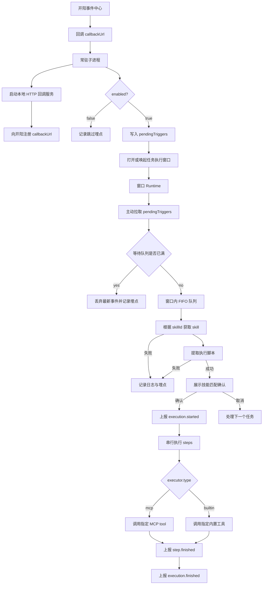

# 事件触发任务执行方案设计

## 1. 背景

当前系统已有本地定时任务执行能力，但定时任务只能基于时间触发，无法响应外部系统的实时状态变化。

开阳侧提供了事件中心，子进程需要向开阳提供回调 URL，并在本地启动 HTTP 服务接收事件回调。当用户在开阳侧打开特定业务菜单时，事件中心通过回调 URL 通知子进程。系统需要基于该事件触发一次自动化任务执行，并完成任务状态展示和执行结果上报。

本期优先落地场景是养老金菜单打开：

- 用户打开开阳侧养老金菜单。
- 开阳事件中心通过回调 URL 通知常驻子进程。
- 子进程在配置启用时按需打开任务执行窗口。
- 任务执行窗口根据事件携带的 `skillId` 获取 skill，并从 skill 中提取执行脚本。
- 任务执行窗口展示“匹配到 xx 技能，是否执行”，用户确认后开始执行。
- 任务执行窗口通过开阳 MCP 和内置工具执行脚本。
- 执行过程和最终结果上报服务端。

详细架构说明见：[event-triggered-task-architecture.md](C:/dev/projects/work/yxz-agent/docs/event-triggered-task-architecture.md)

脚本制作规范见：[event-task-script-authoring-guide.md](C:/dev/projects/work/yxz-agent/docs/event-task-script-authoring-guide.md)

## 2. 目标与边界

### 2.1 建设目标

本期建设目标是把“外部事件”纳入任务触发体系，让子进程可以在收到开阳事件后，拉起任务执行窗口并完成一次结构化脚本执行。

核心目标：

- 支持由开阳事件中心回调触发任务执行。
- 当前优先支持养老金菜单打开场景。
- 后续可扩展到其他事件类型。
- 用户可在任务执行窗口看到当前任务名称、执行状态，并可中止任务。
- 执行过程可观测、可上报、可排查。

### 2.2 一期边界

本期建设内容：

- 常驻子进程启动本地 HTTP 回调服务，并向开阳事件中心注册回调 URL。
- 初始化配置支持 `enabled` 和 `maxQueueSize`。
- 事件触发后写入子进程 `pendingTriggers`。
- 任务执行窗口按需打开。
- 窗口 Runtime 初始化完成后主动拉取 `pendingTriggers`。
- 窗口 Runtime 维护内存 FIFO 执行队列。
- 任务执行窗口根据 `skillId` 实时获取 skill 并提取执行脚本，不使用缓存。
- 脚本执行前需要用户确认。
- 脚本步骤串行执行，失败快速终止。
- 每个 step 执行完成后实时上报。
- execution 开始和结束分别上报。
- 用户可中止当前任务。
- 执行完成且队列为空后任务执行窗口自动关闭。

本期不建设内容：

- 脚本缓存。
- 执行重试。
- 条件分支。
- 并发执行。
- 队列持久化。
- callbackUrl 注册重试和回调服务健康检查。
- 运行时完整 schema 校验。
- 任务执行窗口展示队列长度。
- 任务执行窗口展示历史执行记录。
- 任务执行窗口展示 skill 获取失败或脚本提取失败。
- 用户未确认时绕过当前任务继续执行后续队列任务。

## 3. 设计思路

本方案采用“常驻子进程 + 按需任务执行窗口 + 窗口 Runtime 执行”的设计。

常驻子进程只承担轻量职责：拉取初始化配置、启动本地 HTTP 回调服务、向开阳注册回调 URL、接收事件回调、判断开关、暂存触发事件、按需打开任务执行窗口。实际任务编排放在任务执行窗口 Runtime 中完成，包括事件拉取、排队、skill 获取、脚本提取、工具调用、执行上报和中止控制。

这种拆分让事件接入和任务执行各自闭环。子进程保持常驻，不因任务窗口关闭而退出；任务执行窗口按需显示，窗口关闭时可以自然终止窗口内所有任务。开阳 MCP 调用依赖窗口上下文，执行流程放在窗口 Runtime 内也能减少跨进程往返和状态割裂。

触发事件会携带 `skillId`。任务执行窗口 Runtime 根据 `skillId` 向服务端获取 skill，并从 skill 中提取执行脚本。客户端不维护事件到脚本的绑定关系，也不做业务 action 到底层工具的映射。脚本在开发态直接确认 MCP、工具和参数，运行态只根据 `executor.type` 分发到 MCP 执行通道或内置工具执行通道。

## 4. 总体流程

```text
常驻子进程启动
  -> 拉取初始化配置
  -> 启动本地 HTTP 回调服务
  -> 向开阳事件中心注册 callbackUrl
  -> 接收开阳事件回调
  -> 判断 enabled
  -> 写入 pendingTriggers
  -> 打开或唤起任务执行窗口
  -> 窗口 Runtime 主动拉取 pendingTriggers
  -> 写入窗口内 FIFO 执行队列
  -> 根据 skillId 请求服务端获取 skill
  -> 从 skill 中提取执行脚本
  -> 展示“匹配到 xx 技能，是否执行”
  -> 用户确认
  -> 上报 execution.started
  -> 窗口展示 scriptName + 执行中
  -> 串行执行 steps
  -> 每步上报 step.finished
  -> 上报 execution.finished
  -> 队列为空时自动关闭窗口
```



## 5. 核心设计

### 5.1 子进程事件接入

常驻子进程负责事件接入和任务触发前的轻量处理。它在启动后拉取初始化配置，启动本地 HTTP 回调服务，并将本地回调 URL 注册给开阳事件中心。开阳事件中心后续通过该回调 URL 推送事件。

事件接入流程：

```text
子进程启动
  -> 启动本地 HTTP 服务
  -> 生成 callbackUrl
  -> 向开阳事件中心注册 callbackUrl
  -> 接收开阳事件回调
  -> 根据 enabled 判断是否触发任务执行
```

`enabled=false` 时，子进程仍然保留本地 HTTP 回调服务和开阳回调注册，但不会打开任务执行窗口，也不会获取 skill、提取脚本或上报 execution，只记录跳过埋点。这样可以保留事件接入链路的可观测性，同时通过配置开关控制任务触发能力。

子进程不负责 skill 获取、脚本提取和任务执行。这样可以避免常驻进程承担复杂执行状态，也能让任务执行窗口的关闭、中止和展示行为保持一致。

本地 HTTP 回调服务只负责接收事件、完成必要的请求解析和基础校验。事件通过基础校验后写入 `pendingTriggers`，后续仍由任务执行窗口 Runtime 主动拉取。

### 5.2 任务窗口执行容器

任务执行窗口是任务执行容器，不只是状态展示层。窗口内部拆分为 Runtime 和 UI。

Runtime 负责：

- 拉取 `pendingTriggers`。
- 维护窗口内 FIFO 队列。
- 根据 `skillId` 获取 skill。
- 从 skill 中提取执行脚本。
- 串行执行脚本。
- 调用 MCP 工具或内置工具。
- 上报 execution 和 step。
- 处理中止和关闭。

UI 负责：

- 展示当前任务名称。
- 展示执行状态。
- 展示执行前确认信息。
- 提供确认和取消入口。
- 提供中止按钮。
- 将用户操作转发给 Runtime。

任务执行窗口不展示队列长度、历史执行记录、skill 获取失败、脚本提取失败和队列满丢弃事件。任务执行完成后先展示最终状态；如果等待队列为空，窗口自动关闭；如果仍有等待任务，Runtime 继续执行下一个任务并刷新窗口状态。

脚本提取成功后，窗口先进入待确认状态，展示“匹配到「skillName」技能，是否执行”。用户确认后进入执行中状态；用户取消时不创建 execution，Runtime 继续处理下一个队列任务。

### 5.3 事件暂存与拉取

为避免任务执行窗口尚未初始化导致事件丢失，本期采用“子进程暂存、窗口 Runtime 主动拉取”的机制。

```text
子进程收到事件
  -> 生成 triggerId
  -> 写入 pendingTriggers
  -> 打开或唤起任务执行窗口

窗口 Runtime 初始化完成
  -> 主动拉取 pendingTriggers
  -> 子进程返回暂存事件
  -> 子进程移除已返回事件
  -> Runtime 写入窗口内执行队列
```

`pendingTriggers` 只是投递缓冲，不是执行队列，也不做持久化。它使用固定最大容量，不走配置；满了以后丢弃最新触发事件，并记录日志和埋点。

窗口已打开时，子进程写入 `pendingTriggers` 后必须发送 `TRIGGER_AVAILABLE`。该通知只表示有新触发事件可拉取，不携带完整事件。所有事件进入窗口的路径都统一为 Runtime 主动拉取。

子进程成功返回 `pendingTriggers` 后即视为投递成功。如果 Runtime 拉取成功后异常，本期接受该批触发事件丢失。

### 5.4 Skill 与脚本获取

触发事件会附带 `skillId`。任务执行窗口 Runtime 从触发事件中读取 `skillId`，并通过服务端获取对应 skill，再从 skill 中提取执行脚本。

处理链路：

```text
触发事件
  -> eventContext.skillId
  -> 服务端查询 skill
  -> Runtime 从 skill 中提取执行脚本
  -> 进入脚本执行流程
```

客户端不维护事件到脚本的绑定规则。事件与 skill 的绑定由事件生产方和服务端配置共同保证，任务执行窗口只消费事件中携带的 `skillId`。

失败分两类：

| 错误码 | 说明 |
|---|---|
| `SKILL_FETCH_FAILED` | skill 查询失败、服务端异常、网络异常或接口异常 |
| `SCRIPT_EXTRACT_FAILED` | skill 中不存在可执行脚本，或脚本结构无法提取 |

skill 获取失败或脚本提取失败时，不展示任务状态，不上报 `execution.started` 和 `execution.finished`，只记录日志和埋点。

脚本提取成功后不会立即执行。Runtime 先根据 skill 名称展示确认信息，等待用户确认。确认文案为：

```text
匹配到「skillName」技能，是否执行
```

### 5.5 脚本执行策略

本期采用串行执行和快速失败策略。脚本在开发态确认具体工具，运行态不做业务 action 映射。脚本只有在用户确认后才开始执行。

step 基本结构：

```json
{
  "stepId": "read-result",
  "executor": {
    "type": "mcp",
    "mcpName": "kaiyang",
    "toolName": "read"
  },
  "params": {
    "componentId": "pension.resultPanel"
  }
}
```

运行态只关心两类执行通道：

| executor.type | 说明 |
|---|---|
| `mcp` | 调用指定 MCP 的指定 tool |
| `builtin` | 调用指定内置工具 |

配置平台可以基于工具 schema 做参数校验，也减少运行态维护 action 映射表的复杂度。相应地，脚本会直接绑定 MCP tool 名和参数 schema，工具变更时需要服务端配置校验和兼容策略兜底。

执行规则：

- 窗口内 FIFO 队列。
- 同一时间只执行一个任务。
- 脚本提取成功后进入待确认状态，待确认期间阻塞后续队列任务。
- 用户确认后上报 `execution.started` 并开始执行 steps。
- 用户取消时不上报 execution，记录日志和埋点后处理下一个队列任务。
- steps 严格串行。
- 任一步失败，立即停止后续步骤。
- 每个 step 都上报 `step.finished`。
- 不支持 retry。
- 不支持条件分支。
- 不设置脚本级总超时。
- step 可传 `timeoutMs`，未传时使用底层工具超时逻辑。

这个策略能让一期执行行为更可预测，也能降低状态管理复杂度。复杂编排能力，如条件分支、重试、并发执行，留到后续版本再引入。

### 5.6 任务中止与窗口关闭

用户点击中止时，只中止当前 running execution，等待队列保留。中止采用软中止策略：当前 step 支持取消则尝试取消；不支持取消则等待当前 step 返回后停止后续步骤。中止时需要上报 `step.finished failed` 和 `execution.finished failed`，错误码为 `USER_CANCELED`。

用户在待确认状态点击取消时，当前任务不进入 execution，不上报 `execution.started` 或 `execution.finished`，只记录日志和埋点，然后继续处理队列中的下一个任务。

用户关闭任务执行窗口时，等同于终止所有任务。当前 running execution 按 `USER_CANCELED` 上报，等待队列全部丢弃，未开始任务不上报 execution。若当前处于待确认状态，则当前任务不上报 execution。子进程继续常驻。

### 5.7 执行记录回显

执行记录回显不属于任务执行窗口职责。任务执行窗口只展示当前任务实时状态，不展示历史执行记录，也不负责刷新历史记录列表。

执行记录展示作为独立能力提供：

- 数据来源为服务端。
- 展示组件独立封装。
- 由需要展示执行记录的页面或窗口按需引入。
- 不耦合任务执行窗口 Runtime。

## 6. 异常与降级

重点异常策略如下：

| 场景 | 策略 |
|---|---|
| 本地 HTTP 回调服务启动失败 | 子进程继续运行，记录日志和埋点，不触发任务 |
| callbackUrl 注册失败 | 子进程继续运行，记录日志和埋点，不触发任务 |
| 回调请求解析失败 | 丢弃该事件，记录日志和埋点 |
| `enabled=false` | 只记录跳过埋点，不触发任务 |
| `pendingTriggers` 满 | 丢弃最新触发事件，记录日志和埋点 |
| 窗口打开失败 | 清空本次相关 pending，记录日志和埋点，不上报 execution |
| skill 获取失败/脚本提取失败 | 不进入执行，不展示任务状态，不上报 execution |
| 用户取消执行确认 | 不进入执行，不上报 execution，继续处理下一个任务 |
| 队列满 | 丢弃最新事件，不破坏 FIFO |
| step 失败 | 快速失败，停止后续步骤 |
| 上报失败 | 记录日志和埋点，继续本地执行 |
| 用户中止 | 中止当前任务，等待队列保留 |
| 用户关闭窗口 | 终止当前任务并清空等待队列 |

本期明确接受的边界：

- `pendingTriggers` 不持久化，不作为可靠队列。
- 任务队列不持久化，窗口关闭或子进程退出后不恢复。
- 不做 callbackUrl 注册重试和回调服务健康检查。
- 不做脚本缓存和执行重试。

## 7. 观测与排查

本期重点观测这些事件：

```text
kaiyang_callback_server_started
kaiyang_callback_server_failed
kaiyang_callback_register_success
kaiyang_callback_register_failed
kaiyang_menu_event_received
event_callback_parse_failed
event_task_trigger_skipped
event_task_enqueue_failed
execution_confirm_shown
execution_confirmed
execution_confirm_canceled
skill_fetch_failed
script_extract_failed
execution_started
execution_finished
execution_canceled
report_event_failed
```

排查路径：

- 看不到任务触发时，先看本地 HTTP 回调服务是否启动、callbackUrl 是否注册成功、菜单事件埋点和 `enabled` 跳过埋点。
- 任务窗口没有执行时，检查 `pendingTriggers` 是否写入、窗口是否打开、Runtime 是否拉取。
- Runtime 拉取事件后没有开始执行时，检查事件是否携带 `skillId`、skill 是否获取成功、脚本是否提取成功。
- 脚本提取成功但未执行时，检查确认信息是否展示、用户是否确认或取消。
- 服务端没有执行记录时，检查 `execution_started`、`execution_finished` 和 `report_event_failed`。
- 任务失败时，优先看失败 step 的错误码和 MCP 或内置工具原始错误。

## 8. 风险与后续

| 风险 | 影响 | 应对 |
|---|---|---|
| 本地 HTTP 回调服务启动失败 | 无法接收开阳事件回调 | 记录埋点，子进程继续运行 |
| callbackUrl 注册失败 | 开阳无法回调子进程 | 记录埋点，子进程继续运行 |
| pendingTriggers 丢失 | 触发事件可能丢失 | 本期接受，后续需要时再做持久化或补偿 |
| 用户长时间不确认 | 当前任务阻塞后续队列 | 本期接受，后续可考虑确认超时或提醒 |
| 任务窗口被关闭 | 当前任务和等待队列被终止 | 明确关闭即终止，当前任务按中止上报 |
| 工具 schema 变化 | 已发布脚本可能失效 | 服务端发布前校验工具和参数 schema |
| 上报失败 | 服务端记录不完整 | 本地继续执行，记录 `report_event_failed` |

后续可演进方向：

- 引入 callbackUrl 注册重试和回调服务健康检查。
- 引入 `pendingTriggers` 或执行队列持久化。
- 支持 skill 或脚本缓存和兜底执行。
- 支持步骤重试、条件分支和更复杂编排。
- 支持工具版本管理和脚本批量迁移。

## 9. 结论

本方案采用常驻子进程接入事件、任务执行窗口 Runtime 承载执行的设计。常驻子进程保持轻量稳定，任务执行窗口在需要时出现并完成执行闭环。

通过 `pendingTriggers` 拉取机制，方案避免了窗口未初始化时直接投递事件的时序问题；通过开发态确认工具，方案降低了运行态映射复杂度；通过串行队列和快速失败，方案控制了一期实现复杂度。

该方案满足养老金菜单打开触发任务执行的一期需求，同时为后续扩展更多事件类型、更多 MCP 工具、执行记录展示和更强可靠性留出空间。
