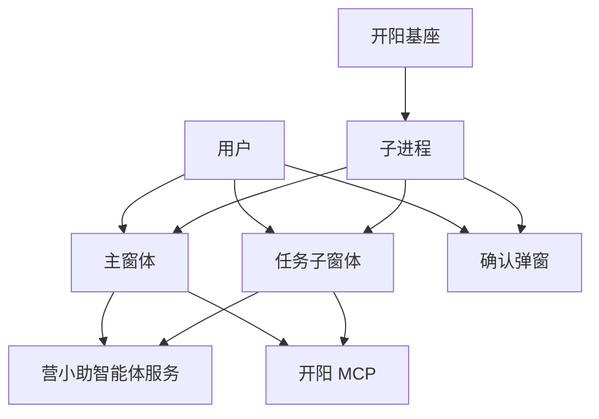

# 营小助产品设计文档

更新时间：2026-06-03

相关文档：

- 术语规范：[terminology.md](C:/dev/projects/work/yxz-agent/docs/terminology.md)
- 系统架构：[system-architecture.md](C:/dev/projects/work/yxz-agent/docs/system-architecture.md)
- 运行流程：[runtime-flows.md](C:/dev/projects/work/yxz-agent/docs/runtime-flows.md)

## 1. 产品定位

营小助是运行在开阳基座中的智能体产品。它面向用户提供人工对话、定时任务和事件触发任务能力，通过营小助智能体服务完成智能体编排，通过开阳 MCP 调用本地页面自动化和工具能力。

产品不是一个单页聊天工具，也不是一个完全在子进程中后台运行的自动化服务。当前正式设计采用“子进程常驻触发 + 业务窗体执行 + 展示层交互”的模式。

核心产品原则：

- 所有任务都有窗体承载。
- 子进程只负责常驻触发、状态和窗体唤起。
- 主窗体和任务子窗体负责智能体执行、MCP 工具调用和任务记录上传。
- 确认弹窗只负责确认或忽略，不执行任务。
- 用户能看到任务的来源、进度、结果和中止状态。

## 2. 产品对象

| 对象 | 产品含义 |
| --- | --- |
| 子进程 | 常驻基础设施，负责触发、唤起、平台接入和轻量状态 |
| 主窗体 | 用户主动发起人工对话的主业务窗体 |
| 任务子窗体 | 定时任务和事件触发任务的执行窗体 |
| 确认弹窗 | 轻量确认入口，只展示待确认任务项并收集确认或忽略 |
| 营小助智能体服务 | 远端智能体编排服务，接收任务记录和工具结果 |
| 开阳 MCP | 本地工具和页面自动化能力来源 |

## 3. 用户场景

### 3.1 人工对话

用户打开主窗体，输入问题或指令。主窗体执行层创建或继续业务会话，调用营小助智能体服务，并在需要时调用 MCP 工具。展示层展示消息、任务步骤、工具结果、人工接管提示和最终结果。

适用场景：

- 用户主动询问业务问题。
- 用户要求营小助执行某个页面操作。
- 用户需要查看执行步骤和工具结果。

### 3.2 定时任务

用户启用定时任务后，子进程在计划时间到达时创建待确认任务项，并打开确认弹窗。用户确认后，子进程唤起任务子窗体。任务子窗体执行层完成智能体调度、MCP 工具调用、结果展示和任务记录上传。

适用场景：

- 每日固定时间查询或处理业务。
- 用户希望任务到点提醒，但执行前仍需要确认。

### 3.3 事件触发任务

开阳侧业务事件到来后，子进程通过事件接入器接收事件，判断配置和触发源。需要执行时，进入确认弹窗或任务子窗体。任务子窗体负责后续执行。

适用场景：

- 用户在开阳侧打开特定业务菜单。
- 外部业务事件匹配某个技能，技能关联结构化脚本。
- 事件携带上下文，需要营小助继续处理。

事件触发任务可以通过技能关联结构化脚本。脚本描述任务子窗体执行层需要串行执行的工具步骤、变量引用、条件和循环；子进程只负责触发和唤起，不执行脚本。

## 4. 窗体设计

### 4.1 主窗体

主窗体承载人工对话类能力。

主要区域：

- 历史业务会话列表。
- 当前业务会话消息流。
- 用户输入区。
- 任务步骤区。
- 工具结果卡片。
- 人工接管和中止入口。
- 定时任务入口或轻量状态入口。

主窗体不直接承接定时任务和事件触发任务的执行，避免人工对话和非人工对话任务混在一个窗口中。

### 4.2 任务子窗体

任务子窗体承载定时任务和事件触发任务。

主要区域：

- 任务来源。
- 任务名称。
- 触发时间。
- 当前状态。
- 任务步骤。
- 工具结果。
- 中止入口。
- 完成、失败、已接管等结果状态。

定时任务和事件触发任务共用任务子窗体，但需要保留任务类型差异：

- 触发源不同。
- 上下文不同。
- 确认文案不同。
- 队列策略不同。
- 授权和权限要求可能不同。

### 4.3 确认弹窗

确认弹窗是轻量入口，只负责待确认任务项。

确认弹窗负责：

- 展示待确认任务项。
- 展示待确认任务概览。
- 支持用户确认执行。
- 支持用户忽略。
- 将确认或忽略结果发给子进程。

确认弹窗不负责：

- 不执行任务。
- 不调用 MCP。
- 不维护完整任务状态。
- 不上传任务记录。

## 5. 产品状态

| 状态 | 含义 | 展示位置 |
| --- | --- | --- |
| 未开始 | 任务或一次任务尚未开始 | 主窗体、任务子窗体 |
| 等待确认 | 已触发但等待用户确认 | 确认弹窗、任务子窗体 |
| 排队中 | 已确认但尚未开始执行 | 任务子窗体 |
| 执行中 | 正在运行智能体调度或工具调用 | 主窗体、任务子窗体 |
| 已完成 | 执行正常结束 | 主窗体、任务子窗体 |
| 已失败 | 执行发生业务或运行错误 | 主窗体、任务子窗体 |
| 已忽略 | 用户忽略待确认任务项 | 确认弹窗、任务摘要 |
| 已中止 | 用户主动中止当前执行 | 主窗体、任务子窗体 |
| 已接管 | 当前执行进入人工接管状态 | 主窗体、任务子窗体 |

## 6. 任务记录和任务摘要

任务记录和任务摘要是两个不同产品概念。

任务记录用于审计、回放和排查。所有任务记录都由业务窗体执行层直接上传营小助智能体服务。子进程不参与任务记录上传链路，也不负责上传重试。

任务摘要是轻量状态，例如成功、失败、忽略、完成时间。子进程可以保留任务摘要，用于常驻侧状态展示、确认弹窗刷新或后续唤起判断。

任务记录上传失败不阻塞一次任务完成。上传失败状态、日志和必要错误摘要由业务窗体执行层处理。

## 7. 产品边界

当前正式设计不包含以下能力：

- 没有后台执行方式。
- 子进程不执行 MCP 工具调用。
- 子进程不维护完整消息流。
- 子进程不上传任务记录。
- 确认弹窗不执行任务。
- 展示层组件不直接调用营小助智能体服务、开阳基座或开阳 MCP。

## 8. 待确认产品问题

- 用户关闭任务子窗体时，等待队列是否全部丢弃。
- 用户关闭正在执行的主窗体或任务子窗体时，是否需要二次确认。
- 主窗体和任务子窗体是否都需要并发运行提示。
- 多任务并发数是否允许用户在界面配置。
- 定时任务执行结果是否需要进入业务会话消息流，还是只在任务子窗体展示并上传任务记录。
