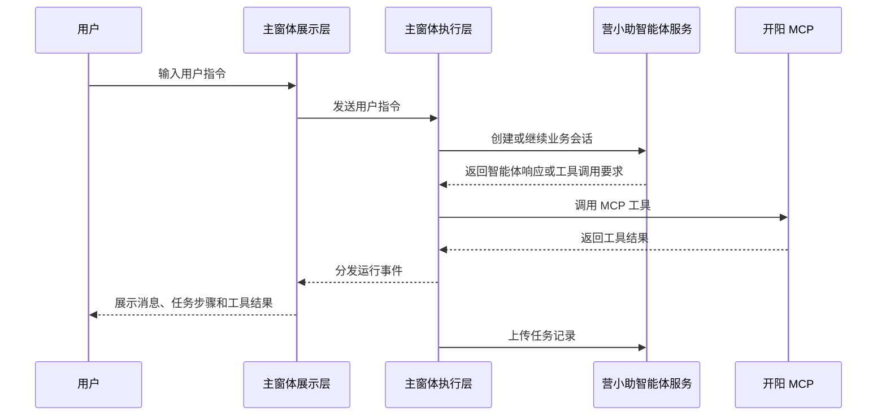
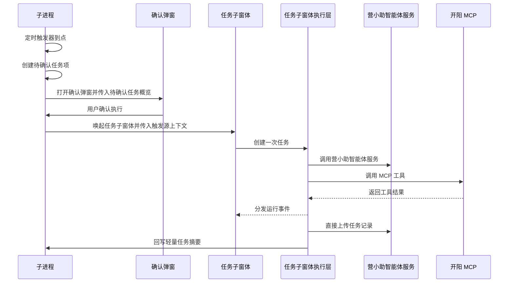
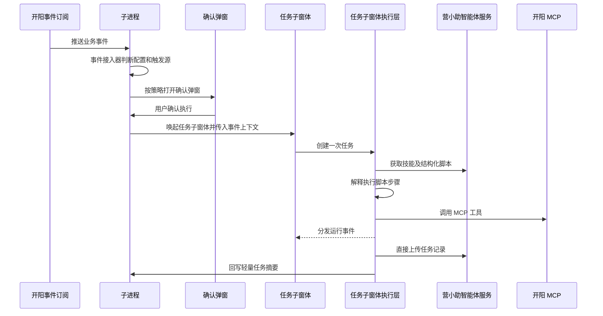

# 营小助运行流程文档

更新时间：2026-06-03

相关文档：

- 术语规范：[terminology.md](C:/dev/projects/work/yxz-agent/docs/terminology.md)
- 产品设计：[product-design.md](C:/dev/projects/work/yxz-agent/docs/product-design.md)
- 系统架构：[system-architecture.md](C:/dev/projects/work/yxz-agent/docs/system-architecture.md)

## 1. 流程总览

营小助有三类主要入口：

- 人工对话入口：用户通过主窗体主动发起。
- 定时任务入口：子进程通过定时触发器产生。
- 事件触发任务入口：子进程通过事件接入器产生。

所有入口最终都会进入业务窗体执行层。子进程只负责常驻触发、唤起和轻量状态，不负责执行 MCP 工具，也不上传任务记录。

## 2. 启动流程

```text
开阳基座启动
  -> 子进程初始化
  -> 加载配置和授权状态
  -> 恢复定时任务启用状态
  -> 初始化定时触发器
  -> 初始化事件接入器
  -> 注册窗体控制能力
  -> 等待主窗体、任务子窗体或确认弹窗交互
```

子进程启动完成后，可以在没有任何业务窗体打开的情况下继续监听定时触发和事件触发。

## 3. 人工对话流程



关键规则：

- 主窗体展示层不直接调用营小助智能体服务或 MCP。
- MCP 工具调用由主窗体执行层负责。
- 任务记录由主窗体执行层直接上传营小助智能体服务。
- 上传失败不阻塞一次任务完成。

## 4. 定时任务流程



关键规则：

- 子进程只负责触发、待确认和唤起。
- 确认弹窗只负责确认或忽略。
- 任务子窗体负责执行、展示和任务记录上传。
- 子进程不参与任务记录上传链路。

## 5. 事件触发任务流程



事件触发任务与定时任务共用任务子窗体，但必须保留触发源、上下文、确认文案、队列策略和授权策略差异。事件触发任务的结构化脚本由任务子窗体执行层解释执行，子进程不解释脚本、不调用 MCP。

## 6. 确认弹窗流程

```text
子进程创建待确认任务项
  -> 打开确认弹窗
  -> 确认弹窗展示待确认任务概览
  -> 用户点击执行或忽略
  -> 确认弹窗发送子进程指令
  -> 子进程更新待确认任务项
  -> 确认时唤起任务子窗体
  -> 忽略时只保留轻量任务摘要
```

确认弹窗不创建执行层，不调用 MCP，不上传任务记录。

## 7. 任务记录上传流程

```text
业务窗体执行层完成或中止一次任务
  -> 形成任务记录
  -> 直接上传营小助智能体服务
  -> 上传成功：任务记录由营小助智能体服务沉淀
  -> 上传失败：业务窗体执行层记录上传失败状态、日志和必要错误摘要
  -> 业务窗体执行层回写轻量任务摘要给子进程
```

规则：

- 子进程不上传任务记录。
- 子进程不负责任务记录上传重试。
- 上传失败不影响一次任务的业务完成状态。
- 是否需要业务窗体执行层本地重试策略仍待确认。

## 8. 窗体关闭流程

### 8.1 主窗体关闭

```text
用户关闭主窗体
  -> 主窗体展示层发出关闭操作
  -> 主窗体执行层中止或销毁当前运行
  -> 窗体临时状态销毁
  -> 已进入执行的一次任务形成任务记录并上传服务
  -> 子进程继续常驻
```

### 8.2 任务子窗体关闭

```text
用户关闭任务子窗体
  -> 任务子窗体执行层销毁
  -> 当前任务中止
  -> 窗体内临时状态销毁
  -> 已进入执行的一次任务形成任务记录并上传服务
  -> 子进程保留轻量任务摘要或必要失败状态
```

待确认：任务子窗体关闭时，等待队列是否全部丢弃。

### 8.3 确认弹窗关闭

确认弹窗关闭不等于任务执行。待确认任务项是否继续保留，由子进程的待确认任务项策略决定。

## 9. 人工接管流程

```text
MCP 或营小助智能体服务产生人工接管要求
  -> 业务窗体执行层接收并标准化为运行事件
  -> 展示层展示人工接管提示
  -> 当前一次任务进入已接管状态
  -> 任务记录上传营小助智能体服务
```

人工接管不是普通系统消息，必须进入业务会话或一次任务状态。

## 10. 错误处理

| 场景 | 处理规则 |
| --- | --- |
| MCP 工具调用失败 | 一次任务进入已失败或可恢复状态，由执行层决定是否继续 |
| 营小助智能体服务调用失败 | 展示失败状态，形成任务记录 |
| 任务记录上传失败 | 不阻塞一次任务完成，由业务窗体执行层记录上传失败状态、日志和错误摘要 |
| 子进程唤起窗体失败 | 子进程记录轻量失败状态，任务不进入窗体执行层 |
| 用户主动中止 | 当前一次任务进入已中止，形成任务记录 |
| 用户忽略待确认任务项 | 不进入执行层，只保留轻量摘要 |

## 11. 待确认流程问题

- 任务子窗体关闭时，等待队列是否全部丢弃。
- 确认弹窗关闭后，待确认任务项是否保留、过期或自动忽略。
- 任务记录上传失败是否需要业务窗体执行层重试。
- 主窗体关闭时是否需要二次确认。
- 多任务并发时，任务执行顺序和容量控制策略如何定义。
