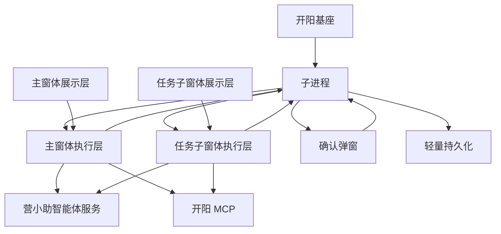

# 营小助系统架构文档

更新时间：2026-06-03

相关文档：

- 术语规范：[terminology.md](C:/dev/projects/work/yxz-agent/docs/terminology.md)
- 产品设计：[product-design.md](C:/dev/projects/work/yxz-agent/docs/product-design.md)
- 运行流程：[runtime-flows.md](C:/dev/projects/work/yxz-agent/docs/runtime-flows.md)

## 1. 架构总览

系统采用“子进程 + 业务窗体执行层 + 业务窗体展示层”的架构。



核心分工：

- 子进程负责常驻能力和平台接入。
- 主窗体执行层负责人工对话类业务会话。
- 任务子窗体执行层负责定时任务和事件触发任务。
- 展示层负责 UI 展示、用户输入、状态呈现和用户操作入口。
- 确认弹窗负责待确认任务项的确认或忽略。

## 2. 分层职责

### 2.1 子进程

子进程是常驻基础设施层。

负责：

- 生命周期初始化。
- 开阳基座接入。
- 开阳事件订阅接入。
- 定时触发器。
- 事件接入器。
- 窗体控制。
- 开阳基座通信。
- 配置、授权状态、任务启用状态、待确认任务项、触发源、任务摘要的轻量持久化。

不负责：

- 不承担 MCP 工具能力。
- 不执行智能体调度。
- 不维护业务会话消息流。
- 不展示用户界面。
- 不上传任务记录。
- 不做后台执行。

### 2.2 业务窗体执行层

业务窗体执行层存在于主窗体和任务子窗体内部。

负责：

- 创建和推进一次任务。
- 调用营小助智能体服务。
- 调用开阳 MCP。
- 管理 MCP 会话。
- 接收和处理工具结果。
- 在任务子窗体内解释执行事件触发任务结构化脚本。
- 处理人工接管。
- 产生运行事件。
- 上传任务记录。
- 将轻量任务摘要回写子进程。

主窗体执行层偏向人工对话，任务子窗体执行层偏向非人工对话任务，但二者应尽量复用基础能力。

### 2.3 展示层

展示层存在于主窗体和任务子窗体内部。

负责：

- 展示消息、任务步骤、工具结果和状态。
- 收集用户输入。
- 发出用户指令。
- 展示确认、中止、人工接管等入口。
- 订阅运行事件并更新组件状态。

不负责：

- 不直接调用营小助智能体服务。
- 不直接调用开阳 MCP。
- 不直接调用开阳基座通信实现细节。
- 不决定任务调度策略。

### 2.4 确认弹窗

确认弹窗是独立轻量窗体。

负责：

- 读取初始化的待确认任务概览。
- 展示待确认任务项。
- 发送确认或忽略的子进程指令。

不负责：

- 不创建执行层。
- 不执行任务。
- 不上传任务记录。
- 不调用 MCP。

## 3. 通信模型

系统中使用四类通信语义。

| 通信语义 | 方向 | 说明 |
| --- | --- | --- |
| 子进程指令 | 业务窗体或确认弹窗到子进程 | 例如确认执行、忽略、启用定时任务、唤起窗体 |
| 子进程通知 | 子进程到业务窗体或确认弹窗 | 例如初始化状态、待确认任务概览、触发源上下文 |
| 用户指令 | 展示层到执行层 | 例如发送消息、中止任务、确认执行 |
| 运行事件 | 执行层到展示层和状态管理 | 例如一次任务开始、任务步骤完成、工具结果返回、人工接管 |

开阳基座通信只用于子进程与窗体之间的子进程指令和子进程通知，不作为泛化事件总线。

业务窗体内部使用运行事件分发，让不同展示组件订阅执行层状态变化。

## 4. 状态和持久化

### 4.1 子进程持久化

子进程只保留轻量状态：

- 授权状态。
- 任务启用状态。
- 待确认任务项。
- 触发源摘要。
- 任务摘要。
- 必要失败状态。

子进程不保存完整任务记录，不保存完整业务会话消息流。

### 4.2 窗体临时状态

业务窗体保存窗体生命周期内的临时状态：

- 当前业务会话。
- 当前一次任务。
- 任务步骤。
- 工具结果。
- MCP 会话状态。
- 人工接管状态。
- 队列状态。

窗体销毁时，窗体临时状态销毁。已进入执行的一次任务需要形成任务记录，并由业务窗体执行层上传营小助智能体服务。

### 4.3 服务端记录

营小助智能体服务保存任务记录。任务记录由业务窗体执行层直接上传。

上传失败不改变一次任务的业务完成状态。上传失败状态、日志和必要错误摘要由业务窗体执行层处理。

## 5. MCP 工具能力归属

MCP 工具能力归属业务窗体执行层。

原因：

- 工具调用通常需要和具体窗体、业务会话或一次任务绑定。
- 工具结果需要即时展示给用户。
- 人工接管状态需要落到当前执行上下文。
- 子进程承担 MCP 工具能力会导致状态、展示和执行链路分裂。

子进程不承担 MCP 工具能力。事件触发任务脚本同样遵守该归属边界：子进程只负责事件接入、待确认任务项和任务子窗体唤起；脚本解释、变量解析、条件循环、MCP 调用、执行记录生成和任务记录上传均由任务子窗体执行层负责。

未来如果出现必须在无窗体状态下执行 MCP 工具的需求，需要重新评审是否引入新的执行模式。

## 6. 目录建议

```text
yxz-agent/
  share/
    protocol.ts
    hostTypes.ts
    hostRoutes.ts
    dateTime.ts

  subprocess/
    resident/
      lifecycle/
      schedule-source/
      event-source/
      window-orchestrator/
      storage/
      host-controller/
    adapters/
      host/
      storage/
      kaiyang-event/
      config/

  webapp/
    src/
      assistant/
        execution-layer/
          mcp/
          chat/
          local-agent-events/
        components/
        stores/
        services/
      windows/
        schedule-confirmation-popup/
        task-window/

  devtools/
    mock-backend/
    mock-mcp/
    fixtures/
```

## 7. 架构约束

- `share` 只放共享协议和共享类型，不放业务实现。
- 子进程不依赖 React、DOM 或展示组件。
- 展示层不直接调用开阳、营小助智能体服务或 MCP。
- 窗体之间不互相导入业务实现。
- 确认弹窗不依赖任务子窗体执行层。
- mock server、simulator 和 demo fixture 不进入正式运行链路。
- 历史 DCF、Runtime、Channel 口径不作为正式架构术语。

## 8. 待确认架构问题

- 主窗体和任务子窗体是否共用同一套执行层基础库。
- MCP 会话是否必须绑定具体窗口上下文。
- 任务子窗体关闭时，等待队列是否全部丢弃。
- 子进程常驻能力是否还需要健康检查以外的能力。
- 任务记录上传失败是否需要窗体执行层本地重试策略。
