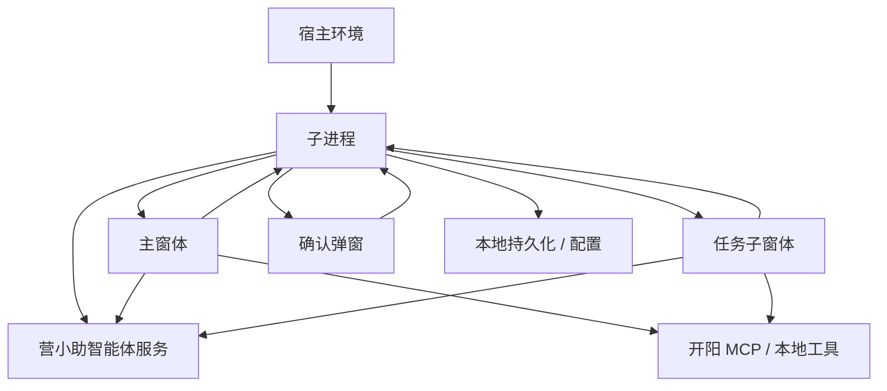

# 子进程与窗体执行层架构设计

更新时间：2026-06-03

术语规范：[terminology.md](C:/dev/projects/work/yxz-agent/docs/terminology.md)

## 1. 核心方向

本设计采用“子进程 + 窗体执行层 + 窗体展示层”的架构。

核心判断：

- 子进程只承担必须常驻、必须脱离窗体生命周期、必须由宿主集中管理的能力。
- 业务窗体承担大部分营小助智能体核心交互能力，包括任务调度、运行状态、MCP 工具调用、人工接管处理和工具结果回显。
- 主窗体负责人工对话类能力；定时任务和事件触发任务进入任务子窗体，由任务子窗体负责后续交互与执行。
- `C:\dev\projects\work\yxz-agent-webapp` 已经具备较完整的智能体前端运行能力，应作为窗体执行层和展示层的主要设计来源。

这意味着后续重构不应继续把子进程设计成“完整执行层”。更合理的方向是：子进程负责常驻基础设施，业务窗体负责智能体产品体验和运行编排。

## 1.1 已确认决策

以下决策已确认，后续设计按此执行：

- 定时任务到来时，子进程唤起任务子窗体；任务子窗体负责后续交互、执行和状态展示。
- 子进程移除 MCP 工具调用能力，不再作为工具执行中心。
- 用户关闭承载执行层的业务窗体时，当前运行和窗体内状态销毁。
- 定时任务与事件触发任务合并进入任务子窗体，确认弹窗保持独立。
- 所有任务记录都由业务窗体执行层直接上传营小助智能体服务；子进程不参与任务记录上传链路。
- 任务记录上传失败不阻塞一次任务完成，上传失败状态、日志和必要错误摘要由业务窗体执行层处理。

## 2. 为什么子进程要保持轻量

子进程适合承载以下特征的能力：

- 需要在窗体关闭后继续存在。
- 需要启动时初始化并保持宿主连接。
- 需要监听外部事件或定时触发。
- 需要负责打开或唤起窗体。
- 需要作为宿主 API、窗口 API、本地配置和持久化的适配层。

子进程不适合承载以下能力：

- 复杂 UI 交互状态。
- 对话过程中的实时消息拼接和用户反馈。
- 智能体执行中的步骤展示、工具卡片和人工接管提示。
- 与用户强交互绑定的 MCP 工具调用体验。
- 多业务会话并发、切换等前端体验。

如果子进程做得太厚，会出现几个问题：

- 对话 UI 只能被动展示子进程状态，难以发挥现有 `yxz-agent-webapp` 的能力。
- 子进程需要理解过多产品交互语义，测试和演进成本变高。
- MCP 工具调用、人工接管和结果回显会被拆散在子进程和窗体两侧。
- 窗体关闭、重开、多个窗体之间的状态边界会变得复杂。

## 3. 总体分层

目标分层如下：



说明：

- 子进程保留常驻能力和宿主适配能力。
- 主窗体和任务子窗体都包含执行层和展示层。
- MCP 工具能力归属业务窗体执行层。
- 子进程不再保留 MCP 工具调用能力。

## 4. 子进程职责

子进程建议保留以下职责。

### 4.1 宿主生命周期

- 启动时初始化。
- 注册宿主 `requestEvent`。
- 管理子进程在线状态。
- 提供基础健康状态。
- 在宿主环境中打开、唤起、关闭指定窗体。

### 4.2 常驻事件监听

- 监听开阳事件中心或宿主事件。
- 接收事件触发任务的原始事件。
- 在配置启用时唤起任务子窗体或主窗体。
- 在窗体尚未初始化时暂存轻量触发源。

### 4.3 定时触发基础设施

- 维护定时任务启用状态。
- 维护自动执行授权状态。
- 计算下一次触发时间。
- 到点后创建待确认执行项。
- 打开右下角确认弹窗。

这里需要注意：子进程只负责“触发”和“待确认”。确认后唤起任务子窗体，由窗体执行层执行。

### 4.4 窗体通信和唤起

- 向主窗体发送初始化状态。
- 向右下角弹窗发送待确认概览。
- 向任务子窗体发送或提供触发源上下文。
- 将子进程指令转交到对应常驻功能。

### 4.5 轻量持久化

- 自动执行授权状态。
- 定时任务启用状态。
- 待确认执行项。
- 事件触发源暂存。
- 任务摘要或必要的失败状态。

子进程不负责持久化完整对话消息流，也不保存完整任务记录。所有任务记录由业务窗体执行层直接上传到营小助智能体服务；子进程仅保留轻量任务摘要或必要的失败状态。

## 5. 子进程不承担的职责

子进程不建议承担：

- 完整智能体对话调度。
- 业务会话消息流管理。
- 前端消息气泡构造。
- 工具结果卡片构造。
- 用户侧人工接管状态展示。
- 多任务并发 UI 控制。
- 复杂 MCP Session 生命周期展示。
- 大部分 MCP 工具调用体验。

这些能力放在业务窗体的执行层中。

## 6. 主窗体职责

主窗体是人工对话类智能体产品体验和运行编排的核心。

建议主窗体承担：

- 业务会话创建和切换。
- 用户消息发送。
- 远端智能体流式响应解析。
- 本地智能体 action 分发。
- MCP 工具调用。
- 工具结果回显。
- 人工接管事件处理。
- 当前任务中止。
- 多任务并发控制。
- 消息、步骤、工具卡片和状态展示。

这些能力在 `yxz-agent-webapp` 中已经有较多实现基础：

- `src/stores/useChatStore.ts`：业务会话、一次任务、工具调用、人工接管的集中状态。
- `src/components/chat/ChatWorkspace.tsx`：消息流、输入框、工具结果卡片。
- `src/components/layout/AppShell.tsx`：旧 demo 的并发提示体验，可作为主窗体运行提示参考。
- `src/lib/chat/chatClient.ts`：对话创建、流式请求、工具结果回传。
- `src/lib/chat/streamParser.ts`：远端流解析。
- `src/lib/mcp/localMcpClient.ts`：MCP SSE 连接、工具调用和通知接收。
- `src/lib/localAgent/localAgentEventBus.ts`：运行事件分发。

后续重构应优先把这些能力作为正式窗体执行层和展示层的基础，而不是迁回子进程。

## 6.1 任务子窗体职责

任务子窗体是定时任务和事件触发任务到来后的交互和执行容器。

建议任务子窗体承担：

- 展示本次定时任务来源、任务名称和触发时间。
- 展示执行前确认、执行中、执行完成、执行失败和人工接管状态。
- 管理本次任务对应的执行层。
- 调用营小助智能体服务或本地 MCP 工具能力。
- 展示工具结果和步骤进度。
- 处理中止、人工接管和窗口关闭。
- 将任务记录直接上传营小助智能体服务，并将轻量任务摘要回写子进程。
- 任务记录上传失败时，不回滚或阻塞一次任务完成，由业务窗体执行层记录上传失败状态、日志和必要错误摘要。

任务子窗体关闭语义：

- 用户关闭窗体时，当前任务执行层销毁。
- 当前任务执行中止。
- 窗体内等待队列和临时状态销毁。
- 当前已进入执行的一次任务需要形成任务记录并上传营小助智能体服务。
- 子进程仅保留必要的任务摘要或失败状态。
- 任务记录上传失败不影响当前任务的业务完成状态。

## 7. 确认弹窗和任务子窗体职责

### 7.1 右下角确认弹窗

右下角弹窗只负责确认。

职责：

- 展示待确认执行项。
- 用户点击执行或忽略。
- 将确认结果发给子进程。

不职责：

- 不执行 Agent 任务。
- 不维护完整定时任务状态。
- 不调用 MCP。

### 7.2 任务子窗体

任务子窗体是已确认需要的任务执行窗体，定时任务和事件触发任务共用。

推荐方向：

- 定时任务到来后，先由子进程打开右下角确认弹窗。
- 用户确认后，子进程唤起任务子窗体。
- 任务子窗体承担本次任务执行层。
- 主窗体不直接承接定时任务和事件触发任务，避免人工对话和自动任务交互混在一个窗口中。

暂定原则：

- 人工对话走主窗体。
- 定时任务和事件触发任务走任务子窗体。
- 确认弹窗保持独立，只负责确认或忽略。

## 8. MCP 工具能力归属

新的倾向是：MCP 工具能力归属业务窗体执行层。

理由：

- 工具调用结果需要即时回显给用户。
- 人工接管和工具通知通常需要落到具体业务会话。
- MCP 会话与当前运行窗体、当前任务状态紧密相关。
- `yxz-agent-webapp` 已经有 `localMcpClient` 和事件总线雏形。

子进程不再保留 MCP 工具调用能力。

如果未来出现必须常驻执行且不能打开窗体的任务，应先重新评估是否违反当前架构方向，而不是默认把 MCP 能力加回子进程。

需要确认：

- 开阳 MCP 调用是否必须绑定具体窗口上下文。
- 主窗体和任务子窗体是否共用同一套 MCP 工具调用实现。

## 9. 定时任务新链路

在子进程保持轻量的设计下，定时任务建议拆成两段。

### 9.1 常驻触发段

位于子进程：

```text
启用任务
  -> 子进程注册 cron
  -> 到点创建 pending execution
  -> 打开右下角确认弹窗
  -> 用户确认
```

### 9.2 Agent 执行段

位于任务子窗体：

```text
用户确认
  -> 子进程唤起任务子窗体
  -> 任务子窗体创建本次任务执行层
  -> 执行层调用营小助智能体服务 / MCP
  -> 步骤、消息流和工具结果回显
  -> 执行结果上报
```

子进程不执行定时任务的 MCP 工具链路。

## 10. 事件触发任务新链路

事件触发任务也建议拆成两段。

### 10.1 常驻接入段

位于子进程：

```text
开阳事件中心
  -> 子进程接收事件
  -> 判断配置 enabled
  -> 写入待处理触发源
  -> 唤起主窗体或任务子窗体
```

### 10.2 Agent 执行段

由任务子窗体承担：

```text
窗体执行层拉取触发源上下文
  -> 解析为一次任务
  -> 用户确认或自动进入执行
  -> 执行层调用营小助智能体服务 / MCP
  -> 结果回显和上报
```

## 10.1 定时任务与事件触发任务合并说明

定时任务和事件触发任务已确认合并进入任务子窗体。任务子窗体统一承载由子进程唤起的非人工对话任务。

### 合并的收益

- 统一任务执行 UI：定时任务和事件触发任务都展示任务来源、确认、执行中、结果和中止。
- 统一执行层：都由窗体调用营小助智能体服务 / MCP，不把执行能力放回子进程。
- 统一窗体生命周期：关闭即销毁当前执行层和等待队列。
- 统一子进程职责：子进程只负责触发、暂存、唤起和摘要回写。
- 降低重复实现：无需维护两套任务窗口、两套进度展示和两套中止逻辑。

### 合并的问题

- 触发语义不同：定时任务来自 cron，事件触发任务来自外部业务事件，任务来源、说明文案和确认策略不同。
- 队列语义不同：定时任务通常按计划点产生待确认项，事件触发任务可能短时间高频进入，需要容量控制和去重。
- 用户确认不同：定时任务可能是“是否执行本次计划任务”，事件触发任务可能是“匹配到某技能是否执行”。
- 上下文不同：事件触发任务通常携带业务事件上下文，定时任务通常携带 schedule 定义和触发时间。
- 关闭后果不同：关闭定时任务窗口可能只销毁当前计划执行；关闭事件任务窗口是否丢弃后续事件队列需要另行定义。
- 展示名称不同：原“定时任务子窗体”无法自然覆盖事件触发任务，合并后统一称为“任务子窗体”。
- 权限与授权不同：定时任务依赖自动执行授权，事件触发任务可能还需要事件来源授权、技能确认或用户二次确认。

### 暂定建议

可以合并执行层和组件骨架，但保留任务类型分支：

```text
TaskWindow
  taskType = "schedule" | "event"
  sourcePayload = ScheduleContext | EventContext
  confirmationPolicy = schedule confirmation | skill match confirmation
  queuePolicy = schedule queue | event queue
```

也就是说，合并“窗体框架、执行层能力、步骤展示、MCP 调用、中止和销毁语义”，但不要合并“触发模型、确认文案、队列策略和业务上下文”。

## 11. 调整后的目录建议

```text
yxz-agent/
  share/
    protocol.ts
    hostTypes.ts
    hostRoutes.ts
    dateTime.ts

  subprocess/
    resident/
      lifecycle/
      schedule-source/
      event-source/
      window-orchestrator/
      storage/
      host-controller/
    adapters/
      host/
      storage/
      kaiyang-event/
      config/

  webapp/
    src/
      assistant/
        execution-layer/
          mcp/
          chat/
          local-agent-events/
        components/
        stores/
        services/
      windows/
        schedule-confirmation-popup/
        task-window/

  devtools/
    mock-backend/
    mock-mcp/
    fixtures/
```

与上一版分层文档相比，这个目录变化的重点是：

- `subprocess/core` 改为更薄的 `subprocess/resident`。
- 执行层、MCP 和业务会话能力明确放到业务窗体。
- 子进程只保留常驻触发源、窗体控制、平台接入和轻量持久化。

## 12. 与现有文档的关系

本文是当前正式架构的支撑设计，正式入口见：

- [formal-docs-index.md](C:/dev/projects/work/yxz-agent/docs/formal-docs-index.md)
- [product-design.md](C:/dev/projects/work/yxz-agent/docs/product-design.md)
- [system-architecture.md](C:/dev/projects/work/yxz-agent/docs/system-architecture.md)
- [runtime-flows.md](C:/dev/projects/work/yxz-agent/docs/runtime-flows.md)

历史分层草案和旧 DCF 文档已归档到 [archive](C:/dev/projects/work/yxz-agent/docs/archive/README.md)。

## 13. 待确认问题

### 13.1 子进程常驻能力

1. 子进程只保留定时触发、事件接入、窗口唤起、授权状态和轻量持久化，这个边界是否还需要补充其他常驻能力？
2. 子进程移除 MCP 工具调用能力后，是否还需要保留开阳事件订阅或健康检查能力？
3. 子进程是否需要在没有任何窗体打开时自动执行任务？当前倾向是不需要。

### 13.2 业务窗体执行层

1. 任务子窗体是否复用 `yxz-agent-webapp` 的执行层能力作为基础？
2. `yxz-agent-webapp` 的 `useChatStore` 是否作为第一版主窗体执行层的基础？
3. MCP 会话生命周期是否由窗体执行层管理？

### 13.3 用户体验

1. 主窗体和任务子窗体是否都需要并发运行提示，还是只在主窗体保留？
2. 定时任务执行结果是否必须出现在业务会话消息流中，还是只在任务子窗体展示和上报？
3. 用户关闭主窗体或任务子窗体时，已确认对应窗体执行层销毁；是否需要给用户二次确认？
4. 多任务并发数是否允许用户在界面配置？

### 13.4 任务子窗体

1. 任务子窗体关闭已确认销毁当前执行层；等待队列是否也全部丢弃？
2. 确认弹窗是否始终保持独立，不并入任务子窗体？

## 14. 暂定设计结论

在上述问题确认前，可以先采用以下暂定结论：

- 子进程做薄，只保留常驻基础设施。
- 主窗体和任务子窗体是执行层的主要承载方。
- MCP 工具调用放在业务窗体执行层，子进程移除 MCP 工具调用。
- 定时任务确认后唤起任务子窗体执行。
- 右下角弹窗只负责待执行确认。
- `yxz-agent-webapp` 是正式主窗体重构的主要能力来源。
