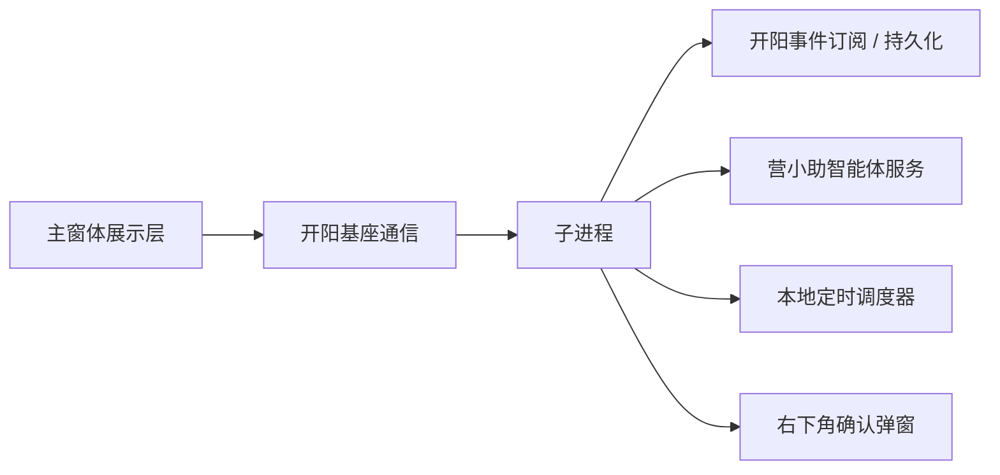

# 营小助前端设计方案整合说明

更新时间：2026-06-03

## 1. 文档目的

本文档用于说明 `C:\dev\projects\work\yxz-agent-webapp` 中的智能体前端设计方案，如何整合进当前 `yxz-agent` 的正式设计体系。

本文只整合设计口径，不要求立即迁移代码。后续代码迁移应以本文作为前端体验、状态模型、模块边界和执行层接入的依据。

相关文档：

- 术语规范：[terminology.md](C:/dev/projects/work/yxz-agent/docs/terminology.md)
- 正式产品设计：[product-design.md](C:/dev/projects/work/yxz-agent/docs/product-design.md)
- 正式系统架构：[system-architecture.md](C:/dev/projects/work/yxz-agent/docs/system-architecture.md)
- 正式运行流程：[runtime-flows.md](C:/dev/projects/work/yxz-agent/docs/runtime-flows.md)
- 当前 React 接入说明：[react-ui-integration.md](C:/dev/projects/work/yxz-agent/docs/react-ui-integration.md)
- 方案仓库产品设计：[product-design-agent-skill-mcp.md](C:/dev/projects/work/yxz-agent-webapp/docs/product-design-agent-skill-mcp.md)
- 方案仓库对话流程：[conversation-flow.md](C:/dev/projects/work/yxz-agent-webapp/docs/conversation-flow.md)
- 方案仓库状态机：[local-agent-state-machine.md](C:/dev/projects/work/yxz-agent-webapp/docs/local-agent-state-machine.md)
- 方案仓库事件总线：[local-agent-event-bus-design.md](C:/dev/projects/work/yxz-agent-webapp/docs/local-agent-event-bus-design.md)

## 2. 整合结论

`yxz-agent-webapp` 不应作为独立产品另起一套执行体系，而应作为当前 `yxz-agent` 主窗体执行层、展示层和前端状态设计来源。

整合原则如下：

- 当前 `yxz-agent` 的子进程负责常驻触发、宿主适配、窗口唤起、轻量持久化和必要的基础通信，不承担 MCP 工具执行。
- `yxz-agent-webapp` 的主对话工作台、并发任务体验、本地智能体状态机、MCP 工具调用和事件总线设计，作为主窗体执行层和展示层的主要来源。
- `yxz-agent-webapp` 中的 mock server、独立 MCP simulator、浏览器直连 chat client，只作为开发验证材料，不进入正式运行链路。
- 后续代码迁移时，应优先迁移 UI 结构、状态模型和展示组件，再逐步替换 demo 数据与 mock 接口。

一句话：子进程保持轻量，业务窗体承载执行层和展示层，用方案仓库的设计补齐正式主窗体，并为任务子窗体提供执行层基础。

## 3. 两套设计的角色定位

| 设计来源 | 当前定位 | 整合后定位 |
| --- | --- | --- |
| `yxz-agent` 正式设计 | 定义子进程、开阳、营小助智能体服务、定时任务、弹窗确认和开阳基座通信 | 继续作为常驻基础设施、平台接入和协议标准 |
| `yxz-agent-webapp` 产品设计 | 定义本地智能体产品体验、业务会话流程、MCP 工具回显、人工接管、多任务并发 | 作为主窗体执行层、展示层与前端状态模型补充 |
| `yxz-agent-webapp` mock 服务 | 独立演示远端 Agent 和 MCP 行为 | 仅保留为开发调试参考 |
| 当前 `webapp/src/pages/Assistant` | 最小授权、调度状态和操作面板 | 后续演进为完整主窗体和任务入口 |
| 当前 `webapp/src/pages/Popup` | 定时任务待确认弹窗 | 保持独立弹窗入口，视觉可跟随新主题升级 |

## 4. 信息架构整合

当前正式设计中的主窗体信息架构为：

- 历史对话栏
- 主对话区
- 步骤区
- 定时任务入口区
- 右下角执行确认弹窗
- 智能体区

`yxz-agent-webapp` 已实现的设计可映射为：

| 正式设计区域 | 方案仓库设计对应 | 整合说明 |
| --- | --- | --- |
| 历史对话栏 | `DashboardPage` 左侧历史对话 | 可作为历史会话栏的视觉和交互基础 |
| 主对话区 | `ChatWorkspace` 消息列表与输入框 | 可作为主对话区基础，但数据来源需改为子进程通知和运行事件 |
| 步骤区 | 当前以系统消息和菜单卡片表达 | 后续应从消息流中拆出独立步骤区 |
| 定时任务入口区 | `DashboardPage` 测试定时任务按钮 | 测试按钮不进入正式设计；旧 demo 的并发提示仅作为体验参考 |
| 右下角执行确认弹窗 | 当前 `yxz-agent` 的 `ScheduleConfirmationPopup` | 保留当前业务逻辑，视觉可复用新主题 |
| 智能体区 | 当前方案仓库暂未完整实现正式智能体列表 | 继续按正式设计由子进程提供 `AGENT_SNAPSHOT` |

整合后的首屏建议为：

```text
主窗体
  左侧：历史会话 + 新建会话 + 智能体选择 + 定时任务入口
  中间：当前业务会话消息流
  右侧：最近一次任务的任务步骤区
  右上：并发运行轻提示
  右下：独立定时任务确认弹窗
```

## 5. 运行时边界

正式运行链路必须沿用当前 `yxz-agent` 的子进程与窗体通信设计：



方案仓库中的以下链路需要在正式整合时替换：

| 方案仓库链路 | 正式替换目标 |
| --- | --- |
| `chatClient.createConversation` | `FrontendCreateSessionEvent -> 子进程 -> 营小助智能体服务` |
| `chatClient.streamConversation` | `USER_MESSAGE -> 子进程 -> 营小助智能体服务 HTTP + SSE -> 子进程通知` |
| `reportToolExecuteResults` | 业务窗体执行层或子进程按最终链路向营小助智能体服务回传工具结果 |
| `localMcpClient` 直连 MCP simulator | 业务窗体执行层负责调用正式 MCP 工具能力 |
| `mock-chat-server.cjs` | 营小助智能体服务 |
| `mock-mcp-sse-server.cjs` | 开阳 MCP |
| 浏览器事件 `yxz-background-task` | 任务子窗体触发源或运行事件 |

展示层不应直接调用开阳、营小助智能体服务或 MCP simulator；MCP 工具能力由窗体执行层封装。

## 6. 状态模型整合

当前正式设计要求前端拆为：

- `chat.store`
- `run.store`
- `schedule.store`

方案仓库当前的 `useChatStore` 已经包含：

- 业务会话列表
- 当前激活业务会话
- 草稿输入
- 旧 demo 并发任务列表
- 活跃运行任务
- 最大并发数
- 流式消息
- 本地工具结果回显
- 人工接管处理

整合后建议拆分如下：

| 目标 store | 来源设计 | 主要职责 |
| --- | --- | --- |
| `chat.store` | 正式设计 + `useChatStore` 会话部分 | 智能体、历史会话、当前会话、消息缓存 |
| `run.store` | 正式设计 + 状态机文档 | 当前业务会话的一次任务、任务步骤流、运行状态 |
| `schedule.store` | 当前 `Assistant/runtime.ts` | 自动执行授权、定时任务状态、轻量面板 |
| `background-task.store` | `yxz-agent-webapp` 旧 demo 并发任务体验 | 暂不进入正式设计 |
| `local-agent-event-bus` | 方案仓库事件总线 | MCP 或子进程通知的标准化运行事件分发 |

正式设计暂不引入后台任务术语或后台执行方式。`yxz-agent-webapp` 中的并发提示仅作为旧 demo 能力参考。

## 7. 业务会话与 MCP 会话术语统一

方案仓库已经明确区分：

- `Conversation`：用户与智能体的业务会话边界
- `MCP Session`：MCP 通信层技术资源

当前正式设计中仍大量使用 `sessionId` 表示业务会话。整合后建议采用以下口径：

| 术语 | 说明 |
| --- | --- |
| 业务会话 | 产品语义上的一次业务对话，可对应协议中的 `sessionId` |
| 会话标识 | 当前 `share/protocol.ts` 中的 `sessionId` 字段，短期不改 |
| MCP 会话 | 开阳或 MCP 工具调用的技术连接，不等同于业务会话 |
| 一次任务 | 一次用户消息、定时任务或事件触发任务启动后的完整执行过程，可对应 `runId` |
| 任务步骤 | 一次任务内的单个步骤，可对应 `stepId` |

短期内不建议修改协议字段名。文档正文使用“业务会话”，代码和协议继续使用 `sessionId`。

## 8. 营小助智能体状态机整合

方案仓库的状态机文档可作为正式设计补充。建议纳入以下四层状态：

1. 业务会话状态
2. 一次任务状态
3. MCP 会话状态
4. 工具调用与人工接管状态

与当前正式协议的映射如下：

| 状态层 | 正式事件来源 | 前端展示用途 |
| --- | --- | --- |
| 业务会话状态 | `SESSION_SNAPSHOT`、`SESSION_DETAIL`、`RUN_STARTED`、`RUN_FAILED`、`RUN_CANCELLED` | 历史会话状态、当前会话状态 |
| 一次任务状态 | `RUN_STARTED`、`STEP_STARTED`、`STEP_FINISHED`、`ASSISTANT_DONE` | 任务步骤区、处理中态、取消态 |
| MCP 会话状态 | 当前主要由业务窗体执行层维护 | 原则上不直接展示，仅用于诊断和埋点 |
| 工具调用状态 | `STEP_STARTED`、`STEP_FINISHED`、工具结果事件 | 步骤详情、工具结果卡片 |
| 人工接管状态 | 开阳事件订阅或 MCP 通知经业务窗体执行层标准化后推送 | 当前业务会话终止态和提示 |

整合时优先把业务会话状态和一次任务状态做成正式前端状态。MCP 会话状态先保留在业务窗体执行层，不进入普通用户界面。

## 9. 事件总线整合

方案仓库中的 `LocalAgentEventBus` 设计适合纳入正式前端，但正式语义应收敛为运行事件分发，事件来源需要从 MCP simulator 调整为子进程通知和窗体执行层运行事件。

目标链路：

```text
子进程通知 / 窗体执行层运行事件
  -> 开阳基座通信接入
  -> event-dispatcher
  -> local-agent-event-bus
  -> chat.store / run.store / schedule.store / 埋点订阅者
```

事件总线职责：

- 分发标准化事件
- 提供订阅过滤
- 处理重复事件去重
- 隔离订阅者错误

事件总线不负责：

- 直接调用开阳基座通信实现细节
- 决定任务是否终止
- 修改 DOM
- 直接调用营小助智能体服务、开阳或 MCP

第一阶段可只接入人工接管和营小助智能体状态事件：

- `HumanTakeoverReceived`
- `AgentStatusChanged`
- `AgentWarningReceived`

后续再扩展工具进度、授权请求、任务暂停恢复等事件。

## 10. 定时任务与任务子窗体体验整合

当前正式设计中的定时任务由子进程负责触发，触发后通过确认弹窗等待确认。

正式设计暂不引入后台执行方式。定时任务和事件触发任务确认后进入任务子窗体，由任务子窗体承载执行层和展示层。

建议规则：

- `ScheduleConfirmationPopup` 继续表示“确认弹窗”。
- 确认弹窗只消费待确认任务概览。
- 用户确认后，子进程唤起任务子窗体。
- 任务子窗体负责一次任务的执行层和展示层。
- 旧 demo 的并发提示暂不进入正式设计。

## 11. 视觉设计整合

方案仓库当前使用深色主题、玻璃质感面板、圆角消息气泡和强调色按钮。正式整合时建议保留整体方向，但需收敛为更稳定的企业工具界面。

建议保留：

- 左侧历史栏 + 主对话区的工作台结构
- 消息气泡与菜单结果卡片
- 并发执行状态提示
- `styled-components` 与 `antd` 主题封装方式

建议调整：

- 减少纯装饰性渐变，优先保障长时间办公可读性
- 将过大的圆角收敛到 8 到 16px 范围，弹窗和消息气泡可略大
- 把 `测试定时任务` 从正式页面移除或隐藏到开发模式
- 将步骤区独立出来，不长期混在系统消息中
- 定时任务入口使用正式文案，不使用 demo 触发按钮

## 12. 文档迁移建议

建议后续将 `yxz-agent-webapp/docs` 中的内容按主题并入当前仓库：

| 源文档 | 处理方式 |
| --- | --- |
| `product-design-agent-skill-mcp.md` | 摘要并入当前正式设计的“营小助智能体产品语义”章节 |
| `conversation-flow.md` | 改写为当前开阳基座通信和子进程链路后并入 React 接入说明 |
| `local-agent-state-machine.md` | 作为独立状态机设计文档迁入当前 `docs` |
| `local-agent-event-bus-design.md` | 作为事件总线设计文档迁入当前 `docs` |
| `standalone-mcp-simulator.md` | 保留在方案仓库或放入开发调试资料，不作为正式设计 |
| `change-summary-2026-05-11.md` | 作为历史变更记录，不进入正式设计主链路 |

## 13. 分阶段落地建议

### 阶段 1：文档对齐

- 完成本文档评审。
- 明确 `yxz-agent-webapp` 只作为体验层和状态模型来源。
- 将状态机、事件总线和业务会话术语纳入正式设计。

### 阶段 2：前端骨架对齐

- 在当前项目引入 Vite/React 应用骨架。
- 建立 `/`、`/assistant`、`/popup/schedule-confirmation` 三类入口。
- 保留当前 `AssistantWindowService` 和 `PopupPageService` 的业务逻辑。

### 阶段 3：状态与事件对齐

- 拆分 `chat.store`、`run.store`、`schedule.store`。
- 建立开阳基座通信接入与 `event-dispatcher`。
- 将子进程通知和运行事件转换为前端状态更新。

### 阶段 4：体验升级

- 迁移 `DashboardPage`、`ChatWorkspace`、`AppShell` 的视觉结构。
- 替换 demo 数据和 mock API。
- 将任务步骤区、并发运行提示、人工接管提示与正式事件打通。

### 阶段 5：联调与收敛

- 联调人工对话 3040 查询。
- 联调定时任务授权、启用、待确认、执行。
- 联调人工接管事件。
- 移除或隔离 demo-only 入口。

## 14. 待确认问题

- 是否在正式 UI 中保留多任务最大并发数配置入口，还是作为后台配置。
- 主窗体和任务子窗体是否都需要并发运行提示，还是只在主窗体保留。
- 人工接管事件由运行事件分发转换为 `HumanTakeoverReceived` 后，是否需要同步上报营小助智能体服务。
- “业务会话”是否进入界面文案，还是仅保留在设计和代码注释中。
- MCP 会话生命周期是否短期仍由窗体执行层内部收口，不在展示层建模。

## 15. 设计准则

后续迁移代码时应遵守以下准则：

- 不让展示层组件直接调用开阳、营小助智能体服务或 MCP。
- 不把 demo mock server 作为正式依赖。
- 不为视觉迁移改变 `share/protocol.ts` 字段语义。
- 不把定时任务和旧 demo 并发任务体验混成同一个领域对象。
- 不把人工接管只当作一条系统消息，应进入业务会话或一次任务状态。
- UI 组件负责展示，运行决策由状态管理、运行事件分发、执行层或子进程完成。
